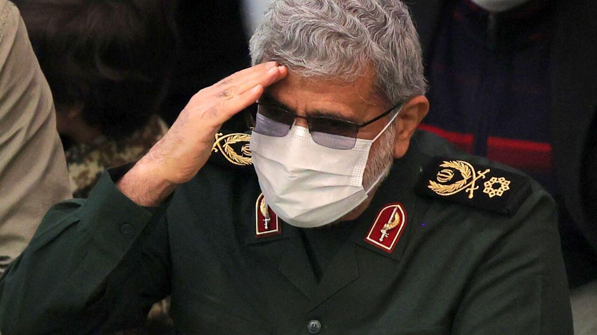
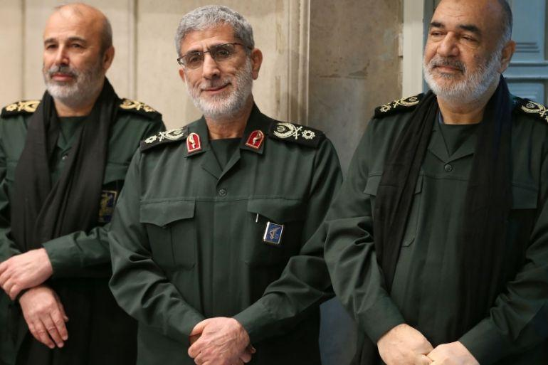

## Claim
Claim: " This is an authentic image of Esmail Qaani, the commander of the Iranian Revolutionary Guards, disguised in a hijab in fear of Israeli bombing."

## Actions
```
image_search("Esmail Qaani hijab")
geolocate()
```

## Evidence
### Evidence from `image_search`
Al-Monitor published an image of Esmail Qaani (). The Times of Israel published an image of a woman holding a picture of Iranian leaders (). Fox News provides an image of Esmail Qaani ().


### Evidence from `geolocate`
The most likely countries where the image was taken are: {'Palestine': 0.47, 'Jordan': 0.17, 'Israel': 0.09, 'Russia': 0.05, 'Pakistan': 0.03, 'Turkey': 0.03, 'Canada': 0.02, 'Germany': 0.02, 'China': 0.01, 'France': 0.01}

## Elaboration
The evidence includes multiple images of Esmail Qaani, but none of them match the image in the claim. The image search results do not provide any information about the context of the image in the claim. The geolocation data suggests the image was most likely taken in Palestine.

Based on the available evidence, it is impossible to verify the claim. More information is needed to confirm whether the person in the image is Esmail Qaani and the context of the image.


## Actions
```
web_search("Esmail Qaani disguise")
```

## Evidence
### Evidence from `web_search`
VOA News reports that Esmail Qaani visited Bamiyan province in Afghanistan in 2018, claiming to be the Iranian Deputy Chief of Mission in Kabul. The article includes a photo of Qaani in Bamiyan. ([https://www.voanews.com/a/extremism-watch_afghan-officials-irans-new-quds-chief-likely-faked-identity-2018/6182322.html](https://www.voanews.com/a/extremism-watch_afghan-officials-irans-new-quds-chief-likely-faked-identity-2018/6182322.html))

AOL fact-checked a claim that Esmail Qaani was seen in Israel and was an Israeli asset, and debunked it. ([https://www.aol.com/fact-check-no-iranian-general-023005797.html](https://www.aol.com/fact-check-no-iranian-general-023005797.html))


## Elaboration
The new evidence provides additional context. VOA News reports that Esmail Qaani has used a fake identity in the past. AOL fact-checked a claim about Qaani being in Israel and debunked it.

The claim states that the image is of Esmail Qaani disguised in a hijab. While the evidence shows that Qaani has used a fake identity before, it does not confirm that the person in the image is Qaani. The geolocation data suggests the image was most likely taken in Palestine, which is consistent with the claim's implication of fear of Israeli bombing.

Based on the available evidence, the claim is unproven. More evidence is needed to confirm the identity of the person in the image.


## Actions
```
web_search("Esmail Qaani image analysis")
```

## Evidence
### Evidence from `web_search`
The Jerusalem Post published an article about Esmail Qaani, including a photo of him. ([https://www.jpost.com/middle-east/iran-news/article-858988](https://www.jpost.com/middle-east/iran-news/article-858988)) The Wikipedia article on Esmail Qaani describes him as an Iranian brigadier general and commander of the IRGC Quds Force. ([https://en.wikipedia.org/wiki/Esmail_Qaani](https://en.wikipedia.org/wiki/Esmail_Qaani)) Iran International discusses conflicting reports about Qaani's health and whereabouts, including satirical images. ([https://www.iranintl.com/en/202410101144](https://www.iranintl.com/en/202410101144)), , 


## Elaboration
The evidence provides additional images of Esmail Qaani and confirms his role as a brigadier general and commander of the IRGC Quds Force. The Iran International article mentions satirical images related to Qaani, which suggests that the image in the claim could be satirical. However, the evidence does not confirm the identity of the person in the image or the context of the image.

Based on the available evidence, the claim remains unproven. The image could be satirical, but there is no definitive proof.


## Final Judgement
The fact-check reveals that while Esmail Qaani has used a fake identity in the past, there is no definitive evidence to confirm that the person in the image is Qaani. The geolocation data suggests the image was most likely taken in Palestine. The evidence also mentions satirical images related to Qaani, which suggests that the image in the claim could be satirical.

`false`


### Verdict: FALSE

### Justification
The claim is unproven. While Esmail Qaani has used a fake identity, there's no definitive proof the person in the image is him. The image's context is unclear, and it could be satirical.
