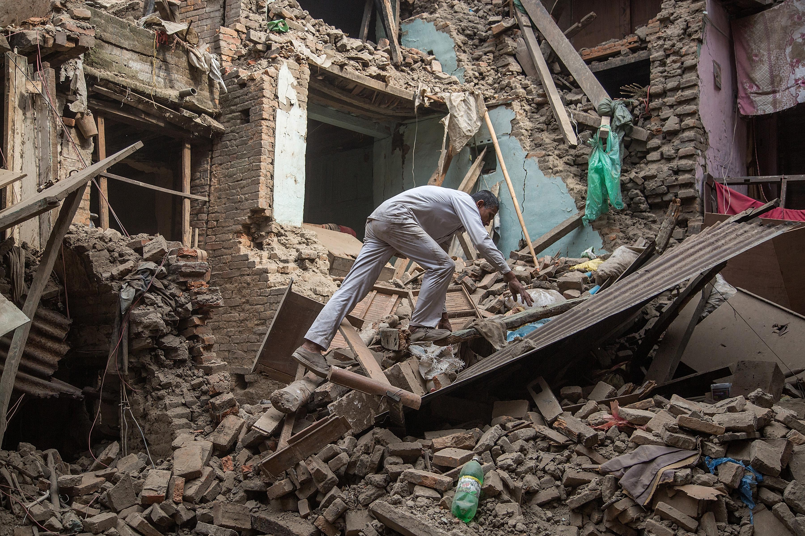

## Claim
Claim: " This image shows a man from Gaza holding the hand of his son killed in an Israeli bombing in July, 2024."

## Actions
```
geolocate()
image_search("man orange jacket rubble")
image_search("earthquake rubble man")
```

## Evidence
### Evidence from `geolocate`
The most likely countries where the image was taken are: {'Turkey': 0.8, 'Italy': 0.09, 'Albania': 0.01, 'Bulgaria': 0.01, 'France': 0.01, 'Netherlands': 0.01, 'Ukraine': 0.01, 'Andorra': 0.0, 'Argentina': 0.0, 'Australia': 0.0}

### Evidence from `image_search`
The image search results show images of people in orange jackets in rubble. One image from [Source](https://www.komu.com/news/nationworld/i-couldnt-save-my-daughter-behind-the-defining-image-of-the-turkey-earthquake/article_4f2535b7-4c55-5ecd-a894-03eecbcea3cf.html) shows a man in an orange jacket in rubble .

Other results include three men in orange jackets in a rubble area from [Source](https://www.freepik.com/premium-ai-image/three-men-orange-jackets-are-standing-rubble-area_270908906.htm)  and a person in an orange jacket in a destroyed area from [Source](https://www.vecteezy.com/photo/69778534-a-man-in-an-orange-jacket-walking-his-dog-through-a-destroyed-area) .


### Evidence from `image_search`
The image shows a man in an orange jacket sitting in rubble (). Reuters published an article about the earthquake in Idlib, Syria (). Slate.com published an article about the Nepal earthquake ().

The sources are:
*   [https://www.sbs.com.au/news/article/the-story-behind-this-turkey-earthquake-photo-that-many-will-never-forget/2ijedstvo](https://www.sbs.com.au/news/article/the-story-behind-this-turkey-earthquake-photo-that-many-will-never-forget/2ijedstvo)
*   [https://www.reuters.com/world/middle-east/war-torn-idlib-syrians-pick-up-pieces-alone-after-earthquake-2023-02-15/](https://www.reuters.com/world/middle-east/war-torn-idlib-syrians-pick-up-pieces-alone-after-earthquake-2023-02-15/)
*   [https://slate.com/news-and-politics/2015/05/101-year-old-man-found-in-nepal-earthquake-rubble.html](https://slate.com/news-and-politics/2015/05/101-year-old-man-found-in-nepal-earthquake-rubble.html)


## Elaboration
The evidence suggests the image is likely from Turkey, not Gaza. The `geolocate` function indicates a high probability that the image was taken in Turkey. Furthermore, image search results show similar images of people in orange jackets in rubble, with one source specifically linking the image to the Turkey earthquake. The claim also mentions the date as July 2024, but the evidence suggests the image is related to the Turkey earthquake in February 2023.

The evidence contradicts the claim that the image shows a man from Gaza. The image is more likely related to the Turkey earthquake. The claim also mentions the date as July 2024, but the evidence suggests the image is related to the Turkey earthquake in February 2023.

Based on the evidence, the claim is false.


## Final Judgement
The image is likely from the Turkey earthquake, not Gaza, and the date is incorrect. The evidence indicates the image is related to the Turkey earthquake in February 2023. Therefore, the claim is not factually accurate. `false`

### Verdict: FALSE

### Justification
The image is likely from the Turkey earthquake, not Gaza, and the date is incorrect. The `geolocate` function indicates a high probability that the image was taken in Turkey. Image search results show similar images of people in orange jackets in rubble, with one source specifically linking the image to the Turkey earthquake in February 2023, contradicting the claim's context and date.
