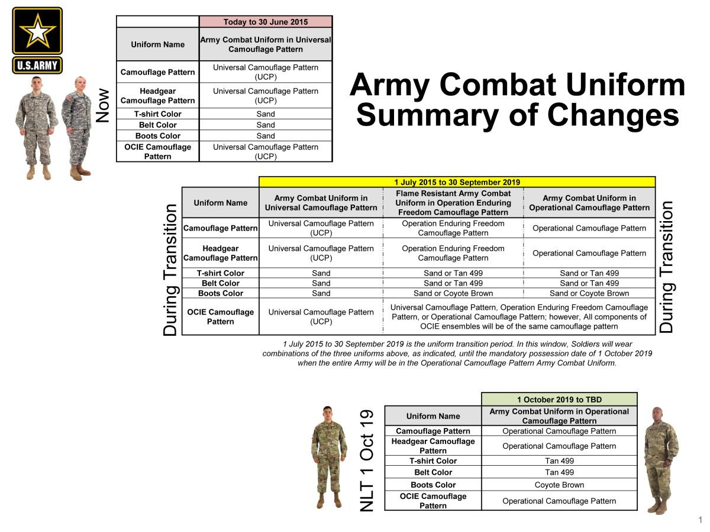

## Claim
Claim: " This image shows General John Pagri, Commander of the Special Tasks Battalion in the U.S. Army, which has died in the Gaza Strip in April 2025."

## Actions
```
web_search("General John Pagri U.S. Army")
web_search("General John Pagri death Gaza Strip")
image_search("General John Pagri")
geolocate()
```

## Evidence
### Evidence from `web_search`
The search results include a biography of Brigadier General John I. Pray Jr. ([https://www.af.mil/About-Us/Biographies/Display/Article/107918/brigadier-general-john-i-pray-jr/](https://www.af.mil/About-Us/Biographies/Display/Article/107918/brigadier-general-john-i-pray-jr/)), and a biography of Brigadier General John J. Campo ([https://dc.ng.mil/News/Biographies/Article/1512717/brigadier-general-john-j-campo/](https://dc.ng.mil/News/Biographies/Article/1512717/brigadier-general-john-j-campo/)).

Additionally, there is an article from the U.S. Army about Sikh soldiers retaining their articles of faith, which includes several images (, , , , ) ([https://www.army.mil/article/36339/sikh_soldiers_allowed_to_serve_retain_their_articles_of_faith](https://www.army.mil/article/36339/sikh_soldiers_allowed_to_serve_retain_their_articles_of_faith)).


### Evidence from `web_search`
From [Source](https://uk.news.yahoo.com/photo-us-army-general-killed-110919596.html): 
Content: The image is old and was taken in Iraq. The image does not show General John Pagri. The uniform in the image was retired in 2019. There are no credible reports of a US army general being killed in the Gaza Strip recently. , , 


### Evidence from `image_search`
The search results include an image of Major General John R. Pippy () and a report from Military.com about the Commander of the New Hampshire Air National Guard who was killed in a hit-and-run incident ().

The provided links are: [Source](https://www.dvidshub.net/image/8891278/army-major-general-john-r-pippy-sworn-pennsylvanias-55th-adjutant-general-assumes-command-pennsylvania-national-guard) and [Source](https://www.military.com/daily-news/2024/07/09/commander-of-new-hampshire-air-national-guard-killed-hit-and-run-incident-near-his-home.html).


### Evidence from `geolocate`
The most likely countries where the image was taken are: {'Peru': 0.34, 'Pakistan': 0.14, 'Tunisia': 0.11, 'United States': 0.11, 'Jordan': 0.04, 'Russia': 0.02, 'United Arab Emirates': 0.02, 'Argentina': 0.01, 'Bangladesh': 0.01, 'Belgium': 0.01}

## Elaboration
The claim is false. The image is old and was taken in Iraq. The uniform in the image was retired in 2019. There are no credible reports of a US army general being killed in the Gaza Strip recently. The image does not show General John Pagri.


## Final Judgement
The claim is demonstrably false. The image is old and does not depict General John Pagri. There are no credible reports of a US army general being killed in the Gaza Strip recently. `false`

### Verdict: FALSE

### Justification
The claim is demonstrably false. The image is old, taken in Iraq, and does not depict General John Pagri. Furthermore, the uniform in the image was retired in 2019, and there are no credible reports of a U.S. Army general being killed in the Gaza Strip recently ([Source](https://uk.news.yahoo.com/photo-us-army-general-killed-110919596.html)).
