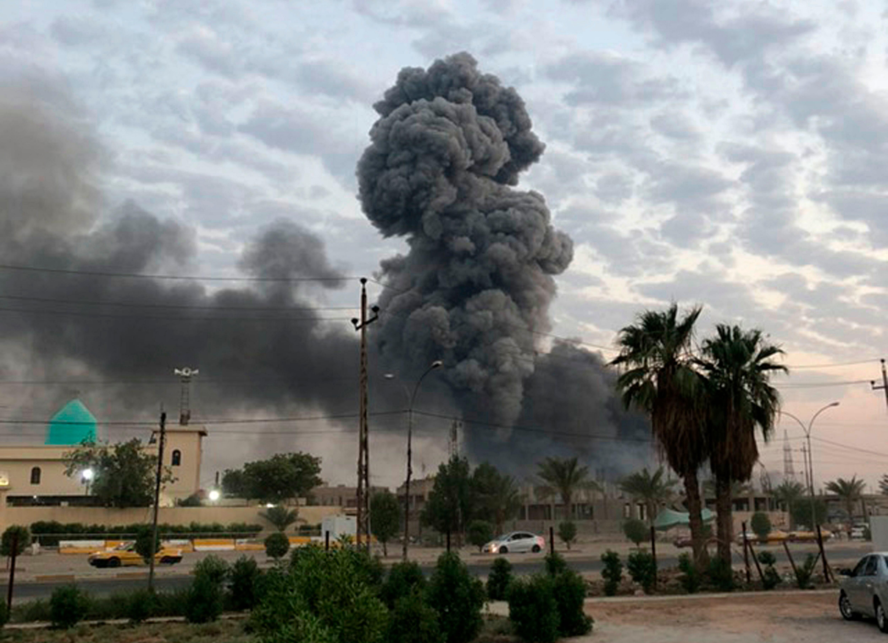
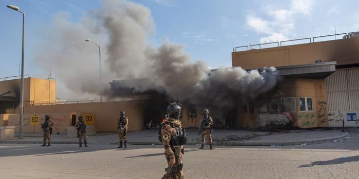

## Claim
Claim: " This image shows a US factility come under attack in Baghdad on September 30, 2024 as the conflict between Israel and the Iran-backed militant group Hezbollah escalated."

## Actions
```
geolocate()
web_search("Baghdad facility attack September 30 2024")
image_search("Baghdad facility explosion")
```

## Evidence
### Evidence from `geolocate`
The most likely countries where the image was taken are: {'Nigeria': 0.13, 'United Arab Emirates': 0.09, 'Ukraine': 0.08, 'Chile': 0.05, 'Ecuador': 0.03, 'Ghana': 0.03, 'Taiwan': 0.03, 'Bangladesh': 0.02, 'Belgium': 0.02, 'Brazil': 0.02}

### Evidence from `web_search`
The provided web sources discuss attacks and escalating tensions in the Middle East during late September and early October 2024. Reuters ([Source](https://www.reuters.com/world/middle-east/rocket-attack-targets-military-base-hosting-us-forces-baghdad-military-sources-2024-09-30/)) reports a rocket attack near Baghdad International Airport on October 1, 2024, targeting a military base hosting U.S. troops. ReliefWeb ([Source](https://reliefweb.int/report/iraq/ishm-september-26-october-3-2024)) mentions attacks by militias on Israel and Baghdad airport between September 28 and October 2, 2024, including attacks on September 30.

The Wikipedia article ([Source](https://en.wikipedia.org/wiki/September_2024_Israeli_attacks_against_Lebanon)) details the September 2024 Israeli attacks against Lebanon, part of the ongoing Israel–Hezbollah conflict, which occurred between September 23 and September 30, 2024. The article mentions Hezbollah firing rockets into northern Israel and the Golan Heights on September 30, 2024. The image 

### Evidence from `image_search`
The search results include articles about explosions in Baghdad. One article from Military Times discusses an explosion in an arms depot north of the Iraqi capital, and another from Iranpress.com reports an explosion at a military base in Taji, north of Baghdad. , 

The provided sources do not contain information about a US facility coming under attack in Baghdad on September 30, 2024, or the conflict between Israel and Hezbollah.


## Elaboration
The claim that the image shows a US facility under attack in Baghdad on September 30, 2024, cannot be verified. While the evidence confirms attacks in Baghdad around that time, including a rocket attack on a military base hosting US forces on October 1, 2024 ([Source](https://www.reuters.com/world/middle-east/rocket-attack-targets-military-base-hosting-us-forces-baghdad-military-sources-2024-09-30/)), the provided sources do not specify that the image depicts a US facility.

The image search results show explosions in Baghdad, but the specific context of the image in the claim is not confirmed. The evidence also mentions the escalation of the conflict between Israel and Hezbollah, but it does not directly link this conflict to the Baghdad attacks.

Therefore, the claim's veracity is uncertain due to the lack of direct evidence linking the image to a US facility attack in Baghdad on the specified date and the conflict between Israel and Hezbollah.


## Actions
```
web_search("US facility Baghdad attack September 30 2024")
image_search("US facility Baghdad explosion")
```

## Evidence
### Evidence from `web_search`
From [Source](https://understandingwar.org/backgrounder/iran-update-september-13-2024): 
Content: The Institute for the Study of War (ISW) published an "Iran Update" on September 13, 2024, discussing attacks on a US diplomatic compound near Baghdad International Airport on September 10, 2024, which the US Embassy assessed were likely conducted by Iranian-backed Iraqi militias.  The update also mentions the IDF killing senior PIJ fighters in a drone strike on September 11, 2024, in the West Bank. The update also discusses the objectives of the Axis of Resistance, including deterring Israel from conducting a ground operation into Lebanon and preparing for an expanded conflict. The update also mentions that Iranian-backed militias, including Hezbollah, have conducted at least 11 attacks into northern Israel since September 12, 2024. 


### Evidence from `image_search`
The web sources discuss attacks on US facilities in Baghdad. One source from Stripes.com ([Source](https://www.stripes.com/theaters/middle_east/2021-06-01/Militia-attack-on-U.S.-Embassy-in-Baghdad-caused-35-million-in-fire-damage-in-2019-1616430.html)) mentions a militia attack on the U.S. Embassy in 2019, causing significant damage. Another source from Business Insider ([Source](https://www.businessinsider.com/us-embassy-rocket-attack-baghdad-2020-1)) reports on a rocket attack on the US embassy. , 


## Elaboration
The evidence indicates that attacks on US facilities in Baghdad occurred, including an attack on a US diplomatic compound near Baghdad International Airport on September 10, 2024, which was likely conducted by Iranian-backed Iraqi militias ([Source](https://understandingwar.org/backgrounder/iran-update-september-13-2024)). However, the provided sources do not confirm that the image depicts a US facility under attack on September 30, 2024. The evidence also mentions the ongoing conflict between Israel and Hezbollah, but it does not directly link this conflict to the Baghdad attacks.

Therefore, the claim remains unverified due to the lack of specific evidence connecting the image to a US facility attack in Baghdad on September 30, 2024, and the conflict between Israel and Hezbollah.


## Final Judgement
The fact-check reveals that while attacks on US facilities in Baghdad have occurred, and there was an escalation of conflict between Israel and Hezbollah, there is no direct evidence to confirm that the image depicts a US facility under attack in Baghdad on September 30, 2024, as the claim states. Therefore, the claim is not factually accurate. `false`

### Verdict: FALSE

### Justification
The claim is **false**. While there were attacks on US facilities in Baghdad and escalating tensions between Israel and Hezbollah, there is no evidence to confirm that the image depicts a US facility under attack in Baghdad on September 30, 2024. The provided sources mention attacks on a US diplomatic compound near Baghdad International Airport on September 10, 2024, and the ongoing conflict between Israel and Hezbollah ([Source](https://understandingwar.org/backgrounder/iran-update-september-13-2024)).
