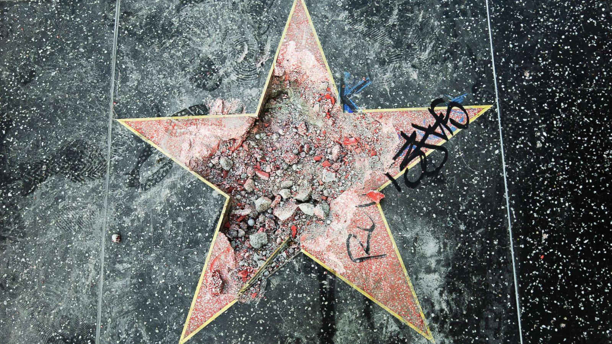

## Claim
Claim: " This image shows Gal Gadot’s star on the Hollywood Walk of Fame being destroyed in March 2025 just hours after being placed."

## Actions
```
image_search("Hollywood Walk of Fame star damage")
web_search("Gal Gadot Hollywood Walk of Fame star damage")
```

## Evidence
### Evidence from `image_search`
ABC News published an article about the vandalism of Donald Trump's star on the Hollywood Walk of Fame.  The Hollywood Reporter published an article about the Hollywood Walk of Fame. 

The provided sources do not contain any information about Gal Gadot's star being destroyed.


### Evidence from `web_search`
Entertainment Weekly reports that Gal Gadot's Hollywood Walk of Fame star ceremony was disrupted by protestors, and the image of a vandalized star is of unknown origin. The article was published on March 18, 2025. FOX 11 reports that Gal Gadot's star was vandalized with the words "baby killer" and a sticker. The American Jewish Committee posted a photo of the vandalized star online.

The image of the damaged star () was a marketing move by singer Tate McRae, according to an article published on March 20, 2025.

*   [https://ew.com/fact-check-was-gal-gadot-s-hollywood-star-destroyed-11700747?srsltid=AfmBOoookYM2dMEeENpB8mXewNFNCfRHYSyCutz18PvD3UMpYrniFpy-](https://ew.com/fact-check-was-gal-gadot-s-hollywood-star-destroyed-11700747?srsltid=AfmBOoookYM2dMEeENpB8mXewNFNCfRHYSyCutz18PvD3UMpYrniFpy-)
*   [https://www.foxla.com/news/gal-gadot-star-walk-of-fame-vandalized](https://www.foxla.com/news/gal-gadot-star-walk-of-fame-vandalized)
*   [https://tribune.com.pk/story/2535393/fact-checking-viral-image-was-gal-gadots-walk-of-fame-star-destroyed-after-protests-at-her-ceremony](https://tribune.com.pk/story/2535393/fact-checking-viral-image-was-gal-gadots-walk-of-fame-star-destroyed-after-protests-at-her-ceremony)


## Elaboration
The claim that the image shows Gal Gadot's star being destroyed is false. The evidence indicates that the image was a marketing move by singer Tate McRae. While Gal Gadot's star was vandalized, the provided image is not related to that event.


## Final Judgement
The image in the claim is not of Gal Gadot's star being destroyed. The image was used for marketing purposes by singer Tate McRae. While Gal Gadot's star was vandalized, the image in the claim is not related to that event.

`false`

### Verdict: FALSE

### Justification
The image in the claim does not depict Gal Gadot's star being destroyed. According to an article by Entertainment Weekly ([https://ew.com/fact-check-was-gal-gadot-s-hollywood-star-destroyed-11700747?srsltid=AfmBOoookYM2dMEeENpB8mXewNFNCfRHYSyCutz18PvD3UMpYrniFpy-](https://ew.com/fact-check-was-gal-gadot-s-hollywood-star-destroyed-11700747?srsltid=AfmBOoookYM2dMEeENpB8mXewNFNCfRHYSyCutz18PvD3UMpYrniFpy-)), the image was a marketing move by singer Tate McRae.
