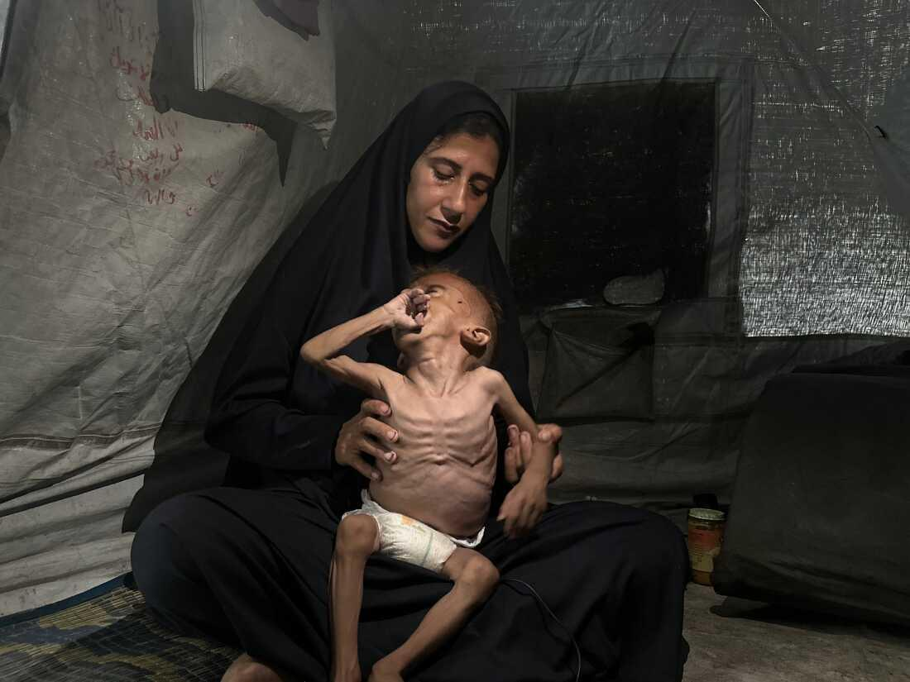

## Claim
Claim: " This is an authentic image of a mother holding the bones of her son in Gaza in March 2025. After more than a year and a half of searching for him under the rubble of their bombed-out house."

## Actions
```
web_search("mother holding skeleton Gaza")
image_search("woman holding skeleton Gaza")
```

## Evidence
### Evidence from `web_search`
The web sources discuss images of emaciated children in Gaza. One article from ABC News, published on July 31, 2025, focuses on an image of an emaciated Gazan boy, Muhammad Zakariya Ayyoub al-Matouq, held by his mother, and mentions his health deteriorated due to a shortage of food and medicine. ([https://www.abc.net.au/news/2025-07-31/controversy-over-image-of-a-skeletal-one-year-old-gazan-boy/105596198](https://www.abc.net.au/news/2025-07-31/controversy-over-image-of-a-skeletal-one-year-old-gazan-boy/105596198))

Middle East Eye published an article on August 1, 2025, about parents struggling with child starvation in Gaza, including the case of Mohammed al-Mutawaq. ([https://www.middleeasteye.net/news/gaza-parents-struggle-against-child-starvation-and-israel-war-crimes-denial](https://www.middleeasteye.net/news/gaza-parents-struggle-against-child-starvation-and-israel-war-crimes-denial)) NPR published an article on August 5, 2025, discussing images of an emaciated baby in Gaza, Mohammad Al-Motawaq, and his mother, Hidayat Al-Motawaq. ([https://www.npr.org/2025/08/05/nx-s1-5488798/gaza-baby-starvation-update](https://www.npr.org/2025/08/05/nx-s1-5488798/gaza-baby-starvation-update)) , , , 


### Evidence from `image_search`
The image of a woman holding a skeleton, which is claimed to be from Gaza, is AI-generated or digitally generated, according to multiple sources. One source provides an analysis of the image, highlighting its artificial nature. Another source mentions an article in the Daily Mail with a different image from Gaza.

The sources include: [https://kashif.ps/ai-generated-image-of-woman-hugging-skeleton-goes-viral-as-from-gaza/](https://kashif.ps/ai-generated-image-of-woman-hugging-skeleton-goes-viral-as-from-gaza/), [https://www.dailymail.co.uk/news/article-14969115/Gaza-skeleton-Palestinian-girl-skin-bone-food-crisis-Israel-hostage-video.html](https://www.dailymail.co.uk/news/article-14969115/Gaza-skeleton-Palestinian-girl-skin-bone-food-crisis-Israel-hostage-video.html), and [https://news.abplive.com/fact-check/viral-image-of-gazan-woman-golding-child-s-remains-is-digitally-generated-1760363](https://news.abplive.com/fact-check/viral-image-of-gazan-woman-golding-child-s-remains-is-digitally-generated-1760363).   


## Elaboration
The claim is false. The image of the woman holding a skeleton is AI-generated or digitally created. Multiple sources confirm the image's artificial nature.


## Final Judgement
The evidence indicates that the image is AI-generated and not an authentic photograph. Therefore, the claim that it is an authentic image is false. `false`

### Verdict: FALSE

### Justification
The image in the claim is not authentic. Multiple sources, including [kashif.ps](https://kashif.ps/ai-generated-image-of-woman-hugging-skeleton-goes-viral-as-from-gaza/), confirm that the image is AI-generated or digitally created, making the claim false.
