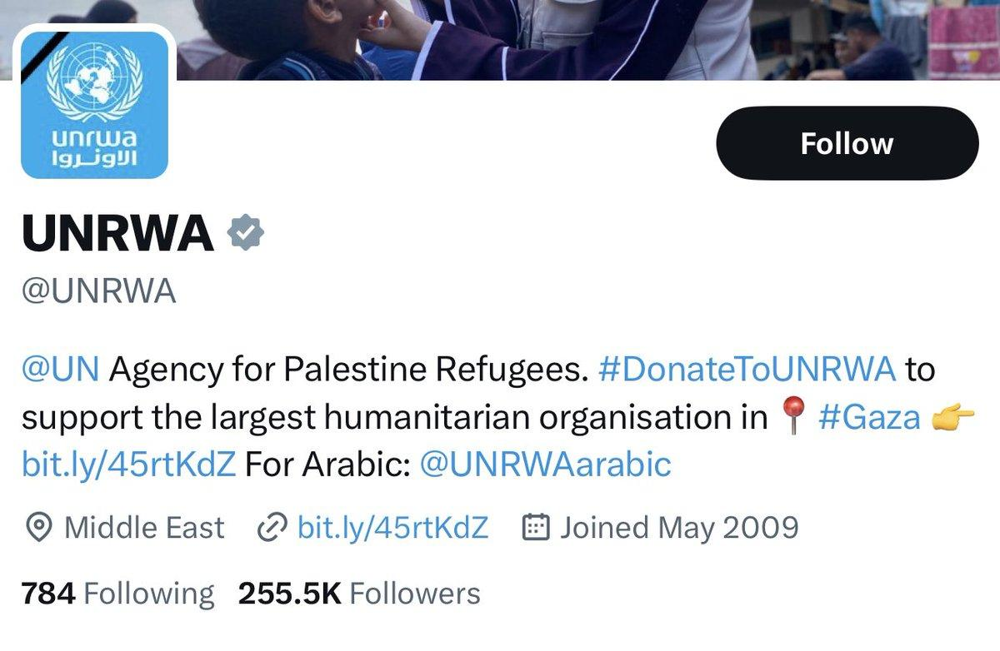
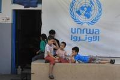

## Claim
Claim: " This image shows a screenshot of the X profile of UNRWA which has placed a black band over its profile photo in mourning for the death of Yahya Sinwar, Hamas leader in the Gaza Strip, in October 2024."

## Actions
```
web_search("UNRWA profile Yahya Sinwar")
```

## Evidence
### Evidence from `web_search`
The provided sources fact-check the claim that UNRWA added a black band to its profile picture to mourn the death of Yahya Sinwar. The articles from DW ([https://www.dw.com/en/fact-check-black-ribbon-on-unrwa-logo-does-not-show-mourning-for-sinwar/a-70532996](https://www.dw.com/en/fact-check-black-ribbon-on-unrwa-logo-does-not-show-mourning-for-sinwar/a-70532996)) and The Canadian Press News ([https://www.thecanadianpressnews.ca/fact_checking/black-band-on-unrwas-social-media-profiles-appeared-before-yahya-sinwars-death/article_33032eb2-f64b-55c6-8a57-3289e6a014cf.html](https://www.thecanadianpressnews.ca/fact_checking/black-band-on-unrwas-social-media-profiles-appeared-before-yahya-sinwars-death/article_33032eb2-f64b-55c6-8a57-3289e6a014cf.html)) state that the black band was added before Sinwar's death. PesaCheck ([https://pesacheck.org/false-unrwa-didnt-update-its-profile-photo-to-mourn-the-death-of-hamas-leader-yahya-sinwar-f8219db942b5](https://pesacheck.org/false-unrwa-didnt-update-its-profile-photo-to-mourn-the-death-of-hamas-leader-yahya-sinwar-f8219db942b5)) also rates the claim as false, stating the black ribbon is a tribute to UNRWA team members killed in Gaza and was updated on October 18, 2023.

The articles include screenshots of UNRWA's social media profiles with the black band.   


## Elaboration
The claim is false. The evidence indicates that the black band on UNRWA's profile picture was added before the death of Yahya Sinwar. The black band was added as a tribute to UNRWA team members killed in Gaza.


## Final Judgement
The fact-check reveals that the black band on UNRWA's profile picture was added before the death of Yahya Sinwar and was a tribute to UNRWA team members killed in Gaza. Multiple sources confirm this, making the claim inaccurate.

The claim is demonstrably false as it is disproven by evidence from multiple and reliable sources. `false`


### Verdict: FALSE

### Justification
The claim is false. Fact-checks from DW ([https://www.dw.com/en/fact-check-black-ribbon-on-unrwa-logo-does-not-show-mourning-for-sinwar/a-70532996](https://www.dw.com/en/fact-check-black-ribbon-on-unrwa-logo-does-not-show-mourning-for-sinwar/a-70532996)), The Canadian Press News ([https://www.thecanadianpressnews.ca/fact_checking/black-band-on-unrwas-social-media-profiles-appeared-before-yahya-sinwars-death/article_33032eb2-f64b-55c6-8a57-3289e6a014cf.html](https://www.thecanadianpressnews.ca/fact_checking/black-band-on-unrwas-social-media-profiles-appeared-before-yahya-sinwars-death/article_33032eb2-f64b-55c6-8a57-3289e6a014cf.html)), and PesaCheck ([https://pesacheck.org/false-unrwa-didnt-update-its-profile-photo-to-mourn-the-death-of-hamas-leader-yahya-sinwar-f8219db942b5](https://pesacheck.org/false-unrwa-didnt-update-its-profile-photo-to-mourn-the-death-of-hamas-leader-yahya-sinwar-f8219db942b5)) show that the black band was added before Sinwar's death and was a tribute to UNRWA team members killed in Gaza.
