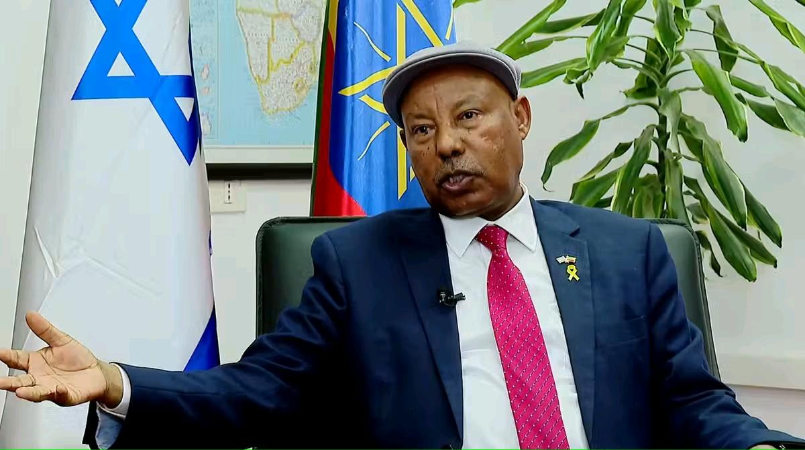

## Claim
Claim: "Ethiopia has expelled Israel's ambassador in April 2025."

## Actions
```
web_search("Ethiopia Israel ambassador expelled")
web_search("Ethiopia Israel relations April 2025")
```

## Evidence
### Evidence from `web_search`
Multiple sources report that Israel's ambassador to Ethiopia, Avraham Neguise, was removed from an event in Addis Ababa in April 2025. The Times of Israel ([https://www.timesofisrael.com/liveblog_entry/israeli-ambassador-to-ethiopia-expelled-from-conference-on-rwandan-genocide/](https://www.timesofisrael.com/liveblog_entry/israeli-ambassador-to-ethiopia-expelled-from-conference-on-rwandan-genocide/)) and Anadolu Agency ([https://www.aa.com.tr/en/africa/israeli-ambassador-to-ethiopia-expelled-from-rwanda-genocide-conference/3530926](https://www.aa.com.tr/en/africa/israeli-ambassador-to-ethiopia-expelled-from-rwanda-genocide-conference/3530926)) state that the removal occurred during a conference on the Rwandan genocide. Tasnim News Agency ([https://www.tasnimnews.com/en/news/2025/04/07/3286985/israeli-ambassador-removed-from-african-union-meeting](https://www.tasnimnews.com/en/news/2025/04/07/3286985/israeli-ambassador-removed-from-african-union-meeting)) also reported the removal from an African Union meeting.

The Anadolu Agency article was published on April 7, 2025. Neguise has been the Israeli ambassador to Ethiopia since August 2024. <image:k> <image:k> 


### Evidence from `web_search`
On April 2, 2025, the Ethiopian News Agency (ENA) reported that the Israeli Ambassador to Ethiopia, Abraham Negussie, expressed Israel's commitment to strengthening economic and social ties with Ethiopia (). On April 3, 2025, Fana Media Corporation S.C. also reported on the same topic, with the same ambassador emphasizing Israel's commitment to strengthening ties ().

The Wikipedia article "Ethiopia–Israel relations" discusses the diplomatic relations between the two countries, including historical context, the presence of embassies, and military assistance provided by Israel to Ethiopia (<image:i>, <image:j>). It also mentions that Ethiopia broke diplomatic relations with Israel in 1973.


## Elaboration
The evidence indicates that Israel's ambassador to Ethiopia, Avraham Neguise, was removed from an event in Addis Ababa in April 2025. Multiple sources, including The Times of Israel ([https://www.timesofisrael.com/liveblog_entry/israeli-ambassador-to-ethiopia-expelled-from-conference-on-rwandan-genocide/](https://www.timesofisrael.com/liveblog_entry/israeli-ambassador-to-ethiopia-expelled-from-conference-on-rwandan-genocide/)) and Anadolu Agency ([https://www.aa.com.tr/en/africa/israeli-ambassador-to-ethiopia-expelled-from-rwanda-genocide-conference/3530926](https://www.aa.com.tr/en/africa/israeli-ambassador-to-ethiopia-expelled-from-rwanda-genocide-conference/3530926/)), reported this. However, the term "expelled" is not used in the provided sources.

The evidence also shows that on April 2 and 3, 2025, the same ambassador, Abraham Negussie, expressed Israel's commitment to strengthening ties with Ethiopia, as reported by the Ethiopian News Agency and Fana Media Corporation S.C. This suggests that while there was a removal from an event, it might not necessarily equate to an expulsion.

Therefore, the claim is partially supported. While the ambassador was removed from an event, the evidence does not explicitly state that he was expelled.


## Final Judgement
The evidence confirms that the Israeli ambassador to Ethiopia was removed from an event in April 2025. However, the claim states that the ambassador was expelled, which is not explicitly supported by the provided sources.

`false`

### Verdict: FALSE

### Justification
Multiple sources, including The Times of Israel ([https://www.timesofisrael.com/liveblog_entry/israeli-ambassador-to-ethiopia-expelled-from-conference-on-rwandan-genocide/](https://www.timesofisrael.com/liveblog_entry/israeli-ambassador-to-ethiopia-expelled-from-conference-on-rwandan-genocide/)) and Anadolu Agency ([https://www.aa.com.tr/en/africa/israeli-ambassador-to-ethiopia-expelled-from-rwanda-genocide-conference/3530926](https://www.aa.com.tr/en/africa/israeli-ambassador-to-ethiopia-expelled-from-rwanda-genocide-conference/3530926/)), report that the Israeli ambassador to Ethiopia was removed from an event in April 2025. However, the claim that the ambassador was expelled is not explicitly supported by the provided sources.
