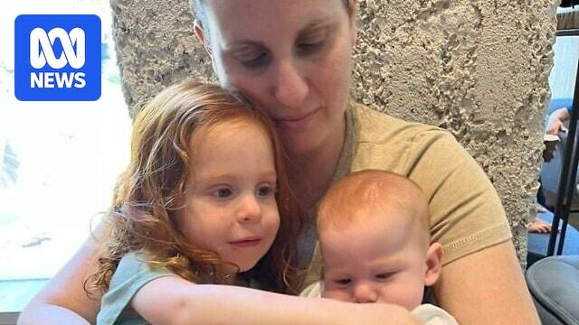

## Claim
Claim: " This image shows a screenshot of an authentic BBC article from February 2025 with the title 'Hamas just wanted to protect the Bibas family but Israel killed them - Hamas said.'"

## Actions
```
web_search("BBC Hamas Bibas family")
image_search("BBC Hamas Bibas family")
```

## Evidence
### Evidence from `web_search`
From [Source](https://www.bbc.com/news/articles/cjry3jzedl1o): 
Content: The BBC published an article on February 21, 2025, discussing the Bibas family. The article states that Israel said forensic testing showed that the body handed over by Hamas was not Shiri Bibas. , . The article also mentions that Shiri Bibas and her two children were kidnapped during the Hamas attacks on Israel on October 7, 2023.


### Evidence from `image_search`
The BBC News website features an image of the Bibas family. ([https://www.bbc.com/news/articles/ckgznx04kgko](https://www.bbc.com/news/articles/ckgznx04kgko))  ABC News published an article on February 19, 2025, about Hamas releasing the remains of the Bibas family. ([https://www.abc.net.au/news/2025-02-19/hamas-to-release-remains-of-bibas-family-israel/104953098](https://www.abc.net.au/news/2025-02-19/hamas-to-release-remains-of-bibas-family-israel/104953098)) 

Al Jazeera published an article on February 21, 2025, about the Bibas family. ([https://www.aljazeera.com/news/liveblog/2025/2/21/live-israel-ramps-up-west-bank-assault-after-bus-blasts-near-tel-aviv](https://www.aljazeera.com/news/liveblog/2025/2/21/live-israel-ramps-up-west-bank-assault-after-bus-blasts-near-tel-aviv)) 


## Elaboration
The BBC did publish an article about the Bibas family on February 21, 2025, as indicated by the search results. The article discusses the family's kidnapping and the release of remains by Hamas. However, the evidence does not confirm the exact wording or title of the article as presented in the claim.

The image search results show that other news outlets, such as ABC News and Al Jazeera, also covered the Bibas family. The BBC article mentioned in the evidence states that Israel said forensic testing showed that the body handed over by Hamas was not Shiri Bibas.

Therefore, while the BBC did report on the Bibas family, the claim's specific title and wording require further verification.


## Actions
```
web_search("BBC Bibas family article title")
image_search("BBC Bibas family article screenshot")
```

## Evidence
### Evidence from `web_search`
The BBC published an article on February 3, 2025, titled "Israeli hostage's family demand answers over fate of his wife and children," discussing the Bibas family and the uncertainty surrounding the fate of Shiri Bibas and her children, who were kidnapped by Hamas. The article also mentions that Hamas claimed in November 2023 that Shiri and her two children were killed in an Israeli air strike, without providing evidence. Another BBC article discusses the kidnapping of Shiri Bibas and her children and that Israel said forensic testing showed that the body handed over by Hamas was not Shiri Bibas. (, , , )


### Evidence from `image_search`
The BBC published an article about the Bibas family, which included an image with the family members' names (). ABC News also published an article on February 22, 2025, about the Bibas family ().


## Elaboration
The claim is not entirely accurate. While the BBC did report on the Bibas family, the exact title presented in the claim is not confirmed by the evidence. The BBC published an article on February 3, 2025, titled "Israeli hostage's family demand answers over fate of his wife and children." The evidence also shows that the BBC published an article that included an image with the family members' names.


## Final Judgement
The BBC did publish articles about the Bibas family, but the exact title presented in the claim is not confirmed by the evidence. The evidence shows that the BBC published an article on February 3, 2025, titled "Israeli hostage's family demand answers over fate of his wife and children."

`false`

### Verdict: FALSE

### Justification
The claim is **false**. While the BBC did report on the Bibas family, the exact title presented in the claim is not confirmed by the evidence. The BBC published an article on February 3, 2025, titled "Israeli hostage's family demand answers over fate of his wife and children" ([Source](https://www.bbc.com/news/articles/cjry3jzedl1o)).
