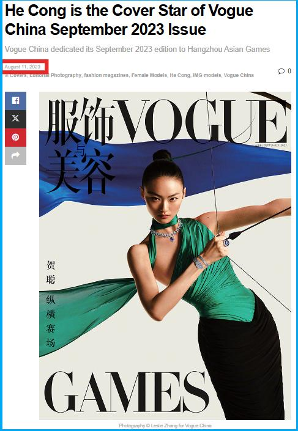

## Claim
Claim: " This image shows an athlete of China which has chosen a design of the Palestinian flag for the Paris 2024 Olympics."

## Actions
```
web_search("China Paris 2024 Olympics Palestinian flag design")
image_search("China Olympics design Palestinian flag")
```

## Evidence
### Evidence from `web_search`
The image in the claim is from the September 2023 issue of Vogue China Magazine and was taken for the promotion of the Hangzhou Asian Games held between September 23 to October 8, 2023, not for the Paris 2024 Olympics. The articles from [Fact Crescendo](https://srilanka.factcrescendo.com/english/china-has-not-chosen-a-design-inspired-by-the-palestinian-flag-for-the-paris-olympics-2024/) and [Factly.in](https://factly.in/an-old-photo-from-vogue-china-magazine-is-being-falsely-shared-as-showing-chinese-athletes-wearing-the-colours-of-the-palestinian-flag/) confirm this. The image is labeled as "Misleading" and does not show China’s Olympic uniform for the 2024 Olympic Games.        


## Elaboration
The claim is false. The image is from the September 2023 issue of Vogue China Magazine and was taken for the promotion of the Hangzhou Asian Games, not the Paris 2024 Olympics. The image is labeled as "Misleading" by fact-checkers.


## Final Judgement
The claim is demonstrably false. The image is from Vogue China Magazine and was taken for the Hangzhou Asian Games, not the Paris 2024 Olympics. The image is also miscaptioned. `false`

### Verdict: FALSE

### Justification
The claim is false. The image in the claim is from the September 2023 issue of Vogue China Magazine and was taken for the promotion of the Hangzhou Asian Games, not the Paris 2024 Olympics, as confirmed by [Fact Crescendo](https://srilanka.factcrescendo.com/english/china-has-not-chosen-a-design-inspired-by-the-palestinian-flag-for-the-paris-olympics-2024/) and [Factly.in](https://factly.in/an-old-photo-from-vogue-china-magazine-is-being-falsely-shared-as-showing-chinese-athletes-wearing-the-colours-of-the-palestinian-flag/).
