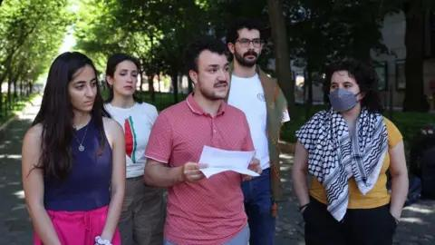

## Claim
Claim: "In March 2025, U.S. Immigration and Customs Enforcement (ICE) agents arrested and detained Palestinian activist Mahmoud Khalil, a lawful permanent resident of the U.S."

## Actions
```
web_search("Mahmoud Khalil ICE arrest March 2025")
web_search("Mahmoud Khalil Palestinian activist ICE detention")
```

## Evidence
### Evidence from `web_search`
According to a Wikipedia article, Mahmoud Khalil, a Palestinian activist, was arrested and detained by ICE officers on March 8, 2025, in the lobby of his apartment building. The ACLU published a press release stating that ICE arrested Mahmoud Khalil in March 2025, and Khalil's legal team said that ICE arrested Khalil in retaliation for his advocacy for Palestinian rights. CNN published an article on July 11, 2025, discussing the ICE detention of Mahmoud Khalil, mentioning his arrest in March, his detention in various facilities, and his claims against the Trump administration.

The ACLU also published press releases about the case in May and July 2025. The Wikipedia article mentions an online campaign against Khalil before his arrest and demonstrations protesting his detention in New York City. The CNN article includes Khalil's statements about the conditions of his detention and the reasons for his arrest.

*   [https://en.wikipedia.org/wiki/Detention_of_Mahmoud_Khalil](https://en.wikipedia.org/wiki/Detention_of_Mahmoud_Khalil)
*   [https://www.aclu.org/press-releases/new-footage-confirms-ice-lied-and-had-no-reason-to-detain-mahmoud-khalil](https://www.aclu.org/press-releases/new-footage-confirms-ice-lied-and-had-no-reason-to-detain-mahmoud-khalil)
*   [https://www.cnn.com/2025/07/11/world/mahmoud-khalil-ice-detention-amanpour-interview-intl-hnk](https://www.cnn.com/2025/07/11/world/mahmoud-khalil-ice-detention-amanpour-interview-intl-hnk)


### Evidence from `web_search`
From [Source](https://www.bbc.com/news/articles/cgj5nlxz44yo): 
Content: The BBC published an article on June 20, 2025, about Mahmoud Khalil, a Palestinian activist and Columbia University graduate, facing deportation from the U.S. , , . Khalil's arrest by immigration agents was linked to Trump's promise to crack down on student demonstrators. Khalil was arrested and detained for three months before a judge ruled he must be released. The article mentions Khalil's role in protests at Columbia University in the spring of 2024.


## Elaboration
The evidence confirms that Mahmoud Khalil, a Palestinian activist, was arrested by ICE in March 2025. The Wikipedia article states he was arrested on March 8, 2025, and the ACLU and CNN also report his arrest in March 2025. The BBC article mentions that Khalil was facing deportation. However, the evidence does not explicitly state that Khalil was a lawful permanent resident of the U.S.

The evidence suggests that Khalil's arrest was related to his activism and protests. The ACLU and Khalil's legal team claim the arrest was in retaliation for his advocacy for Palestinian rights. The BBC article links the arrest to Trump's promise to crack down on student demonstrators.

To fully verify the claim, information about Khalil's immigration status at the time of his arrest is missing.


## Actions
```
web_search("Mahmoud Khalil lawful permanent resident ICE arrest")
```

## Evidence
### Evidence from `web_search`
NPR reported on June 23, 2025, that Mahmoud Khalil, a legal permanent resident, was released on bail after being detained for 104 days in a Louisiana immigration detention center. The article mentions his arrest in early March. The ACLU published a press release stating that Khalil, a Columbia University graduate student and lawful permanent resident, was targeted for deportation by the Trump administration because of his Palestinian rights advocacy. The press release mentions that Khalil was arrested in early March and was detained in a remote ICE detention facility in Jena, Louisiana.

*   [https://www.npr.org/2025/06/23/nx-s1-5441691/mahmoud-khalil-interview](https://www.npr.org/2025/06/23/nx-s1-5441691/mahmoud-khalil-interview)
*   [https://www.aclu.org/press-releases/mahmoud-khalil-free-bail](https://www.aclu.org/press-releases/mahmoud-khalil-free-bail)


## Elaboration
The evidence confirms that Mahmoud Khalil, a Palestinian activist, was arrested and detained by ICE in March 2025. The NPR and ACLU articles explicitly state that Khalil was a legal permanent resident of the U.S. at the time of his arrest.


## Final Judgement
The evidence confirms that Mahmoud Khalil, a Palestinian activist, was arrested and detained by ICE in March 2025. The NPR and ACLU articles explicitly state that Khalil was a legal permanent resident of the U.S. at the time of his arrest.

The claim is factually accurate as it is confirmed by evidence from multiple and reliable sources. `true`


### Verdict: TRUE

### Justification
The claim is accurate. Multiple sources, including NPR ([https://www.npr.org/2025/06/23/nx-s1-5441691/mahmoud-khalil-interview](https://www.npr.org/2025/06/23/nx-s1-5441691/mahmoud-khalil-interview)) and the ACLU ([https://www.aclu.org/press-releases/mahmoud-khalil-free-bail](https://www.aclu.org/press-releases/mahmoud-khalil-free-bail)), confirm that Mahmoud Khalil, a Palestinian activist and lawful permanent resident, was arrested and detained by ICE in March 2025.
