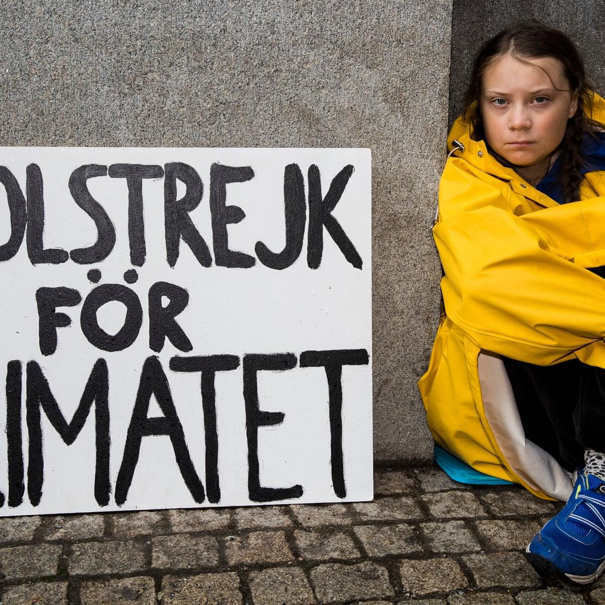
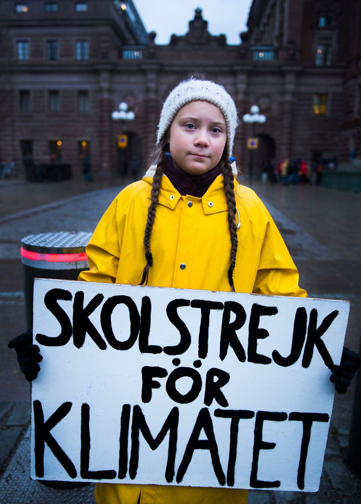

## Claim
Claim: " This is an authentic image of Greta Thunberg from November 2024 holding a sign reading, 'Fuck Israel'."

## Actions
```
web_search("Greta Thunberg sign Fuck Israel")
image_search("Greta Thunberg sign")
```

## Evidence
### Evidence from `web_search`
The New York Post ([Source](https://nypost.com/2024/12/09/world-news/greta-thunberg-bursts-into-laughter-as-she-declares-f-k-israel-at-rally/)) and Yahoo News ([Source](https://www.yahoo.com/news/greta-thunberg-giggles-while-saying-095000750.html)) report that Greta Thunberg declared "f–k Israel" at an anti-Israel rally in Germany. The Telegraph ([Source](https://www.telegraph.co.uk/world-news/2024/12/10/watch-greta-thunberg-declares-f-israel-german-demonstration/)) also reported on the event. The Telegraph article mentions Thunberg was accused of being a "Hamas shill".

The New York Post and Yahoo News articles include images of Thunberg at the rally (, , , ). The Telegraph article also includes a photo of Thunberg at the event ().


### Evidence from `image_search`
The Guardian published an article on November 26, 2018, featuring an image of Greta Thunberg holding a sign (). Britannica provides an image of Greta Thunberg holding a sign that reads "SKOLSTREJK FÖR KLIMATET" ().

The search results also include a link to a Wikimedia Commons page, but the content is not specified.


## Elaboration
The evidence confirms that Greta Thunberg declared "f–k Israel" at an anti-Israel rally in Germany. However, the evidence does not show Thunberg holding a sign that reads "Fuck Israel." The provided evidence includes images of Thunberg at the rally, but none of them show her holding a sign with the specific phrase.

Therefore, the claim is not supported by the evidence.


## Final Judgement
The evidence confirms that Greta Thunberg made the statement "f–k Israel" at a rally. However, there is no evidence to support the claim that she held a sign with the phrase "Fuck Israel." The provided evidence includes images of Thunberg at the rally, but none of them show her holding a sign with the specific phrase.

`false`

### Verdict: FALSE

### Justification
While Greta Thunberg did declare "f–k Israel" at a rally, as reported by the New York Post ([Source](https://nypost.com/2024/12/09/world-news/greta-thunberg-bursts-into-laughter-as-she-declares-f-k-israel-at-rally/)) and Yahoo News ([Source](https://www.yahoo.com/news/greta-thunberg-giggles-while-saying-095000750.html)), there is no evidence to support the claim that she held a sign with the phrase "Fuck Israel."
