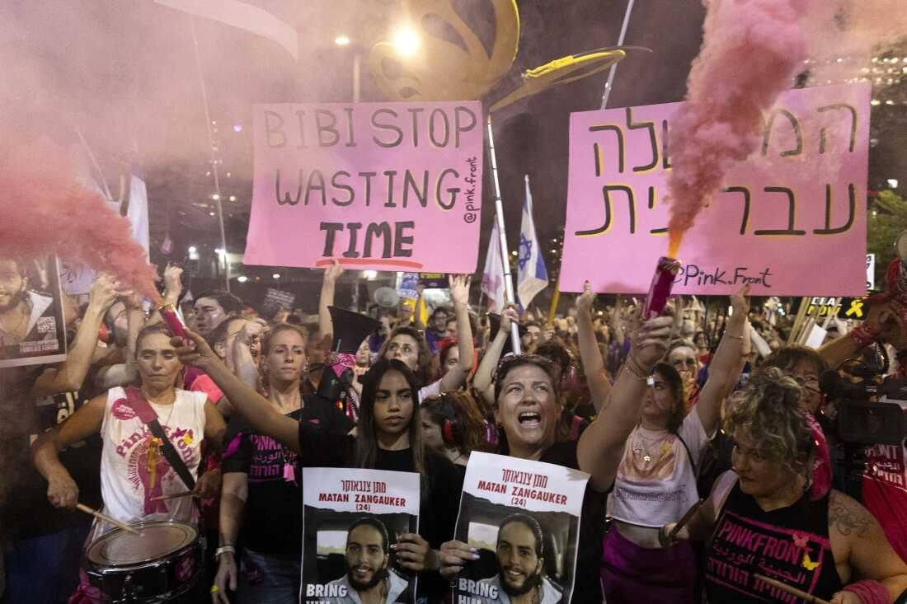

## Claim
Claim: "In a phone call with Benjamin Netanyahu on August 14, 2024, Donald Trump told the Israeli prime minister to stop a Gaza ceasefire deal because it would help Vice President Kamala Harris' 2024 presidential campaign."

## Actions
```
web_search("Donald Trump Benjamin Netanyahu phone call August 14 2024 Gaza ceasefire")
```

## Evidence
### Evidence from `web_search`
Reuters reports that Donald Trump and Benjamin Netanyahu spoke on August 14, 2024, and discussed the Gaza ceasefire and hostage release deal (). The article does not mention Trump telling Netanyahu to stop the deal because it would help Kamala Harris' 2024 presidential campaign. The article was published on August 15, 2024, and can be found here: [Source](https://www.reuters.com/world/trump-netanyahu-speak-about-gaza-hostage-ceasefire-deal-axios-reports-2024-08-15/).

Newsweek published an article discussing allegations that Donald Trump called Benjamin Netanyahu on August 14 to discuss a ceasefire deal (, , ). The article states that Trump and Netanyahu denied the call took place. The article mentions that the call was reported by PBS host Judy Woodruff, who said that Trump urged Netanyahu not to cut a deal because it would help the Harris campaign. The article can be found here: [Source](https://www.newsweek.com/donald-trump-accused-crime-benjamin-netanyahu-call-ceasefire-hamas-1942248). NPR published an article on August 14, 2024, discussing the resumption of Gaza cease-fire talks (, ).


## Elaboration
The evidence suggests that Donald Trump and Benjamin Netanyahu spoke on August 14, 2024, and discussed the Gaza ceasefire. However, the Reuters article does not mention the specific reason for Trump's alleged request. The Newsweek article mentions that Trump and Netanyahu denied the call took place. The article also mentions that PBS host Judy Woodruff reported that Trump urged Netanyahu not to cut a deal because it would help the Harris campaign.

Based on the evidence, the claim is not fully verifiable. While there is evidence of a phone call, the specific details of the conversation, as stated in the claim, are disputed.


## Final Judgement
The claim is not factually accurate. While there is evidence of a phone call between Trump and Netanyahu, the specific details of the conversation, as stated in the claim, are disputed. The claim is disproven by the fact that Trump and Netanyahu denied the call took place.

`false`

### Verdict: FALSE

### Justification
While Reuters reports a phone call between Donald Trump and Benjamin Netanyahu on August 14, 2024, discussing the Gaza ceasefire, the claim that Trump told Netanyahu to stop the deal to hurt Kamala Harris's campaign is disputed. Newsweek reports that both Trump and Netanyahu denied the call took place, and the specific details of the conversation are not confirmed by the available evidence.
