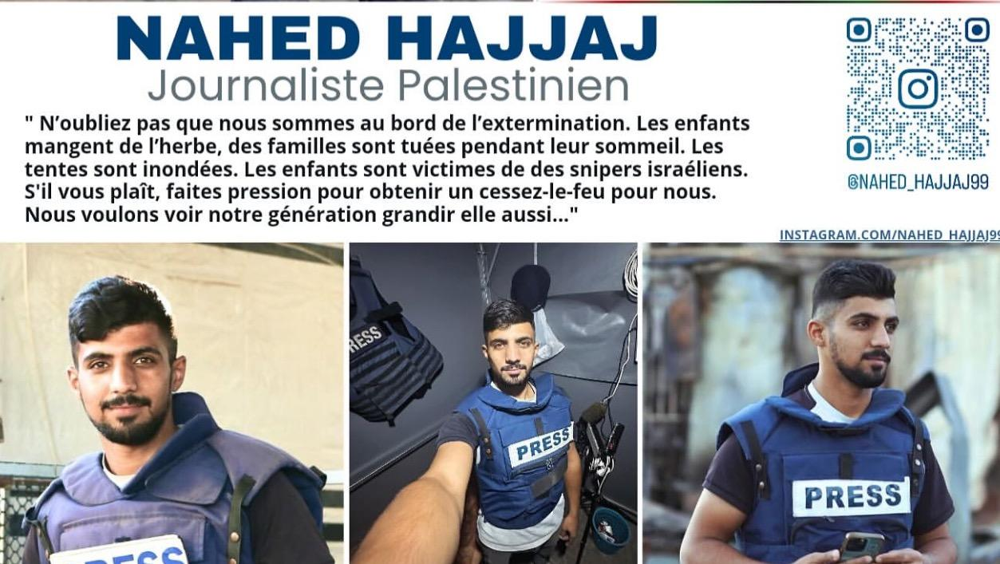
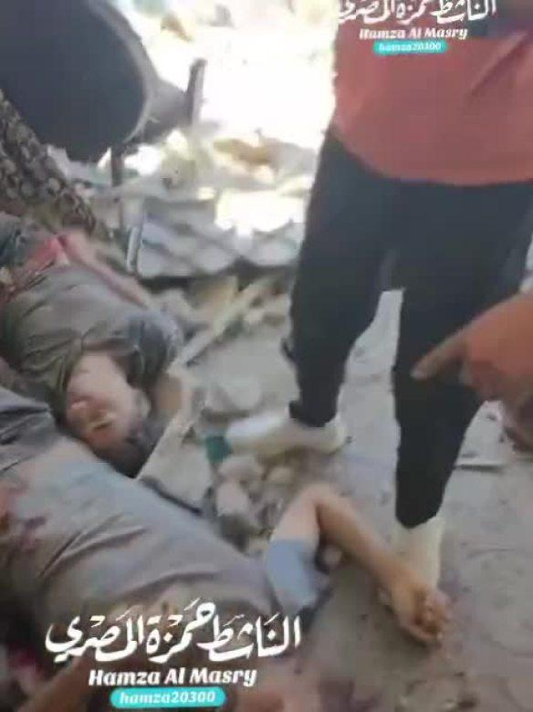
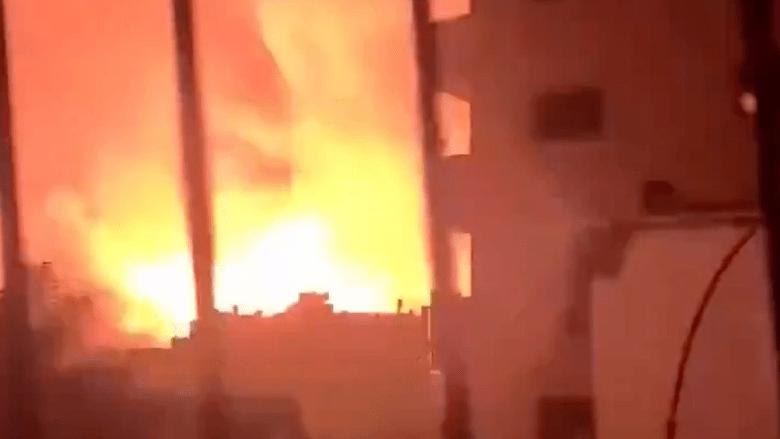
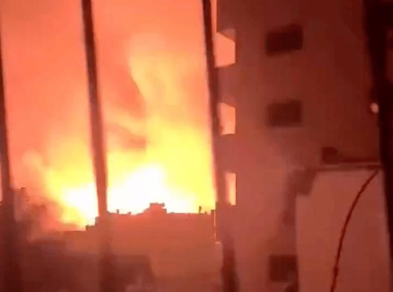

## Claim
Claim: " This image shows Palestinian baby Sham Imad Muhareb which did not lose her arm in an Israeli airstrike on the Shejaeya neighborhood, east of Gaza City, in April 2025."

## Actions
```
web_search("Sham Imad Muhareb Israeli airstrike Gaza")
image_search("Sham Imad Muhareb baby injury")
```

## Evidence
No new evidence found.

## Elaboration
There is no new evidence to analyze the claim. The claim states that the image shows a Palestinian baby, Sham Imad Muhareb, who did not lose her arm in an Israeli airstrike. Without additional information, it is impossible to verify the claim.


## Actions
```
web_search("Nahed Hajjaj")
image_search("Nahed Hajjaj baby")
```

## Evidence
### Evidence from `web_search`
The first web source is a GoFundMe page created to raise funds for Nahed Hajjaj, a Palestinian journalist from Gaza, with his Instagram accounts listed as @NAHED\_HAJJAJ99 and @NAHED\_HAJJAJ.05. The page was updated on May 20, 2025, and includes an image of Nahed Hajjaj . The second source from SKWAWKBOX, published on June 30, 2025, discusses the ongoing conflict in Gaza, with Nahed Hajjaj reporting on the situation, and includes images of destruction , , .

The URLs are:
*   [https://www.gofundme.com/f/emergency-fundraiser-Nahed-Hajjaj](https://www.gofundme.com/f/emergency-fundraiser-Nahed-Hajjaj)
*   [https://skwawkbox.org/tag/nahed-hajjaj/feed/](https://skwawkbox.org/tag/nahed-hajjaj/feed/)


## Elaboration
The new evidence identifies Nahed Hajjaj as a Palestinian journalist from Gaza. The GoFundMe page and SKWAWKBOX articles mention Nahed Hajjaj reporting on the conflict in Gaza. The image in the claim has the name "Nahed Hajjaj" on it. This suggests a connection between the journalist and the image. However, the evidence does not confirm the image's authenticity or the details of the baby's injuries.

The evidence does not provide information about the baby in the image, Sham Imad Muhareb, or the circumstances of her injuries. Therefore, the claim cannot be verified.

To verify the claim, additional information is needed, such as confirmation of the baby's identity, the cause of her injuries, and the date and location of the incident.


## Actions
```
web_search("Sham Imad Muhareb injury details")
image_search("Sham Imad Muhareb Gaza injury")
```

## Evidence
### Evidence from `web_search`
From [Source](https://t.me/s/QudsNen?before=158681): 
Content: Quds News Network reports that Palestinian infant Sham, daughter of Dr. Imad Muharab, died from injuries sustained in an Israeli bombing of her grandfather's house in the Al-Shujaiya neighborhood of Gaza City, which resulted in the amputation of her right hand.


## Elaboration
The new evidence from Quds News Network contradicts the claim. The source states that Sham Imad Muhareb died from injuries sustained in an Israeli bombing, and that she lost her right hand. The claim states that Sham did not lose her arm. Therefore, the claim is false.


## Final Judgement
The evidence from Quds News Network indicates that Sham Imad Muhareb died from injuries sustained in an Israeli bombing and lost her right hand. This directly contradicts the claim that she did not lose her arm.

`false`


### Verdict: FALSE

### Justification
The claim is false. Evidence from the Quds News Network ([Source](https://t.me/s/QudsNen?before=158681)) indicates that Sham Imad Muhareb died from injuries sustained in an Israeli bombing and lost her right hand, directly contradicting the claim.
