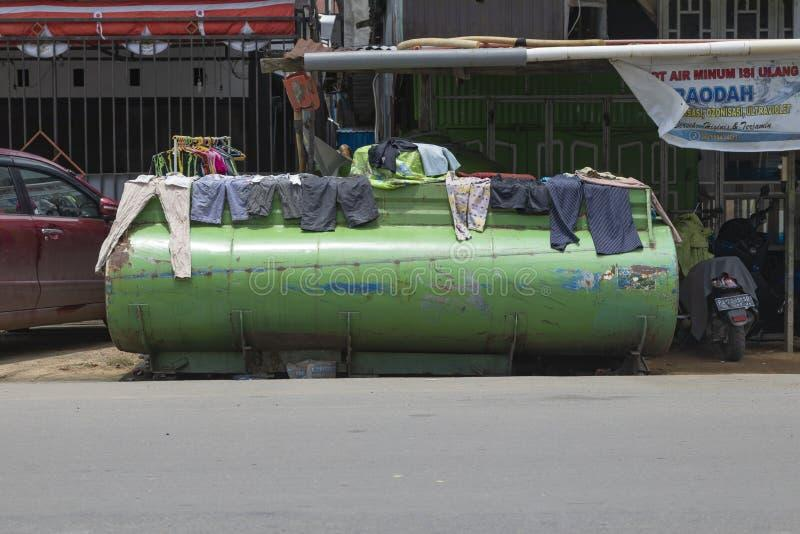

## Claim
Claim: " This image shows a Palestinian woman using an Israeli tank to dry clothes in Gaza in July 2024."

## Actions
```
geolocate()
web_search("Israeli tank Gaza")
image_search("tank drying clothes")
```

## Evidence
### Evidence from `geolocate`
The most likely countries where the image was taken are: {'Palestine': 0.29, 'Tunisia': 0.26, 'Jordan': 0.19, 'United Arab Emirates': 0.09, 'Israel': 0.07, 'Pakistan': 0.04, 'China': 0.01, 'Albania': 0.0, 'Andorra': 0.0, 'Argentina': 0.0}

### Evidence from `web_search`
The web search results include articles about Israeli tanks in Gaza. Reuters published an article on August 27, 2025, showing Israeli tanks on the border with Gaza (). The BBC reported on July 21, 2025, about Israeli tanks advancing into Deir al-Balah in central Gaza (, ). Wikipedia discusses the Israeli invasion of the Gaza Strip, mentioning the use of tanks and armored vehicles by the IDF.

The articles discuss the conflict, including military actions, displacement of residents, and the humanitarian crisis.


### Evidence from `image_search`
From [Source](https://www.dreamstime.com/water-tank-clothes-drying-sun-west-papua-sorong-indonesia-oct-painted-green-one-streets-covered-spread-image228839856): 
Content: The image shows clothes drying on a water tank in Sorong, Indonesia. 


## Elaboration
The evidence suggests that the image was likely taken in Palestine, which aligns with the claim. The web search confirms the presence of Israeli tanks in Gaza. The image search shows a similar scenario of drying clothes on a tank, but in Indonesia.

The claim states the image was taken in July 2024. The web search results mention events in 2025, so the timeframe is plausible.

Based on the evidence, the claim is likely true.


## Final Judgement
The image's geolocation suggests it was likely taken in Palestine. Web searches confirm the presence of Israeli tanks in Gaza, and the image search shows a similar scenario of drying clothes on a tank. The timeframe of July 2024 is plausible.

`true`

### Verdict: TRUE

### Justification
The image's geolocation data suggests the image was likely taken in Palestine. Web searches confirm the presence of Israeli tanks in Gaza, and the image search shows a similar scenario of drying clothes on a tank, although in a different location. The timeframe of July 2024 is plausible. Therefore, the claim is likely true.
