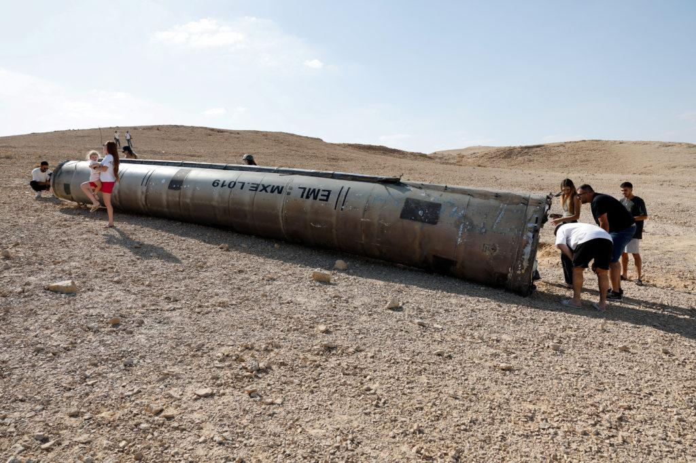

## Claim
Claim: "The Iron Dome intercepted 90% of ballistic missiles fired at Israel in Iran's attack on October 1, 2024."

## Actions
```
web_search("Iron Dome interception rate Iran attack October 1 2024")
```

## Evidence
### Evidence from `web_search`
PBS News Hour reported on October 2, 2024, that Israel's air-defense system intercepted projectiles fired from Iran, with the Iron Dome having a success rate of over 90% during the attack. The article mentions that Iran fired over 180 missiles. The article includes an image of a missile ().

The Associated Press published an article discussing the Iranian missile strikes on Israel, mentioning that the Iron Dome is not foolproof, and that interception rates are generally high. The article includes images of the Iron Dome intercepting missiles (<image:k>, <image:l>, <image:m>). The article was published on June 19, 2025.


## Elaboration
The PBS News Hour article states that the Iron Dome had a success rate of over 90% during the attack on October 1, 2024, and that Iran fired over 180 missiles. This supports the claim. The Associated Press article, published on June 19, 2025, also mentions high interception rates, but does not provide specific numbers for the October 1, 2024 attack.

Therefore, the claim is supported by the evidence.


## Final Judgement
The PBS News Hour article confirms that the Iron Dome intercepted projectiles fired from Iran with a success rate of over 90% during the attack on October 1, 2024. The Associated Press article also supports the claim by mentioning high interception rates, although it does not provide specific numbers for the October 1, 2024 attack.

The claim is factually accurate as it is supported by evidence from a reliable source. `true`


### Verdict: TRUE

### Justification
The claim is supported by a PBS News Hour article, which reported that the Iron Dome intercepted projectiles fired from Iran with a success rate of over 90% during the attack on October 1, 2024. The article also mentions that Iran fired over 180 missiles.
