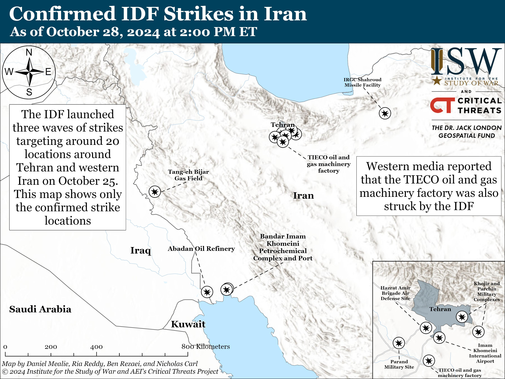

## Claim
Claim: " This image shows Israel launching several waves of revengeful attacks on Iranian military targets on October 26, 2024."

## Actions
```
geolocate()
web_search("Israel attacks Iranian military targets October 26 2024")
image_search("Israel attacks Iranian military targets October 26 2024")
```

## Evidence
### Evidence from `geolocate`
The most likely countries where the image was taken are: {'Palestine': 0.4, 'Israel': 0.3, 'Bangladesh': 0.04, 'Taiwan': 0.04, 'Ukraine': 0.04, 'China': 0.02, 'Pakistan': 0.02, 'Bulgaria': 0.01, 'Jordan': 0.01, 'Malta': 0.01}

### Evidence from `web_search`
The web sources discuss the Israeli strikes on Iran on October 26, 2024, in retaliation for Iranian attacks. The strikes, also known as "Operation Days of Repentance," targeted military sites in Iran, Iraq, and Syria, resulting in 42 deaths. The Guardian reports explosions in Tehran and other cities, while CNN shows a general view of Tehran after the explosions.

The sources include: a Wikipedia article ([https://en.wikipedia.org/wiki/October_2024_Israeli_strikes_on_Iran](https://en.wikipedia.org/wiki/October_2024_Israeli_strikes_on_Iran)), The Guardian ([https://www.theguardian.com/world/2024/oct/26/idf-israel-iran-strikes-explosions-tehran](https://www.theguardian.com/world/2024/oct/26/idf-israel-iran-strikes-explosions-tehran)), and CNN ([https://www.cnn.com/world/live-news/israel-iran-strikes-lebanon-gaza-war-10-26-24](https://www.cnn.com/world/live-news/israel-iran-strikes-lebanon-gaza-war-10-26-24)). The image 

### Evidence from `image_search`
On October 26, 2024, Al Jazeera ([https://www.aljazeera.com/news/2024/10/26/condemnation-calls-for-restraint-world-reacts-to-israeli-strikes-on-iran](https://www.aljazeera.com/news/2024/10/26/condemnation-calls-for-restraint-world-reacts-to-israeli-strikes-on-iran)) and CNN ([https://www.cnn.com/2024/10/26/middleeast/israel-strikes-iran-explainer-intl-hnk](https://www.cnn.com/2024/10/26/middleeast/israel-strikes-iran-explainer-intl-hnk)) reported on Israeli strikes on military targets in Iran. The Institute for the Study of War and Critical Threats reported that the IDF launched three waves of strikes targeting around 20 locations around Tehran and western Iran on October 25 ([https://www.understandingwar.org/backgrounder/iran-update-october-28-2024](https://www.understandingwar.org/backgrounder/iran-update-october-28-2024)).

The strikes occurred in the provinces of Ilam, Khuzestan, and Tehran. , , and 


## Elaboration
The evidence confirms that Israel launched strikes on Iranian military targets on October 26, 2024. The strikes targeted locations in Tehran and other provinces. The image search results include maps and reports from Al Jazeera and CNN, confirming the attacks. The geolocation data suggests the image could have been taken in Israel or Palestine.

Based on the evidence, the claim is likely true.


## Final Judgement
The evidence confirms that Israel launched strikes on Iranian military targets on October 26, 2024, as the claim states. The image search results include maps and reports from Al Jazeera and CNN, confirming the attacks. The geolocation data suggests the image could have been taken in Israel or Palestine.

`true`

### Verdict: TRUE

### Justification
The claim is supported by evidence from multiple sources, including reports from The Guardian ([https://www.theguardian.com/world/2024/oct/26/idf-israel-iran-strikes-explosions-tehran](https://www.theguardian.com/world/2024/oct/26/idf-israel-iran-strikes-explosions-tehran)), CNN ([https://www.cnn.com/world/live-news/israel-iran-strikes-lebanon-gaza-war-10-26-24](https://www.cnn.com/world/live-news/israel-iran-strikes-lebanon-gaza-war-10-26-24)), and Al Jazeera ([https://www.aljazeera.com/news/2024/10/26/condemnation-calls-for-restraint-world-reacts-to-israeli-strikes-on-iran](https://www.aljazeera.com/news/2024/10/26/condemnation-calls-for-restraint-world-reacts-to-israeli-strikes-on-iran)), which confirm that Israel launched strikes on Iranian military targets on October 26, 2024.
