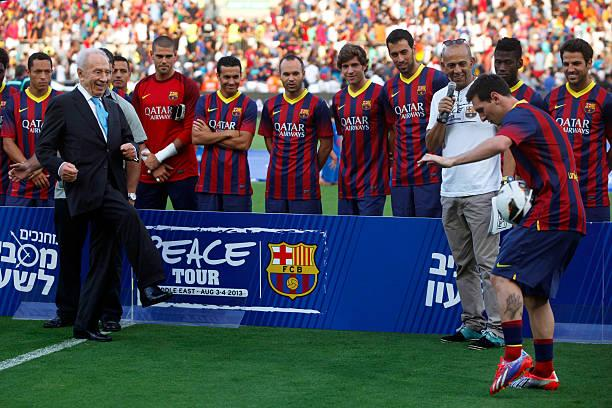
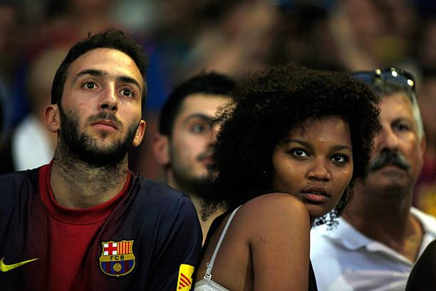

## Claim
Claim: " This image shows the President of FC Barcelona with Israel Embassy Representatives in September 2024 during the ongoing Gaza war."

## Actions
```
web_search("FC Barcelona Israel flag")
web_search("FC Barcelona President Israel Embassy")
```

## Evidence
### Evidence from `web_search`
The Jerusalem Post published an article stating that FC Barcelona's president Joan Laporta was presented with an Israeli flag by Israeli diplomats on February 16, 2023 (<image:527630>). The New Arab discussed Barcelona's decision to reverse its decision to cut ties with Israel, mentioning the ongoing conflict in Gaza and including . Getty Images contains photos of FC Barcelona players visiting Israel and the West Bank in August 2013, including images with Israeli Prime Minister Benjamin Netanyahu (, , , , , , ).

The articles can be found at: [https://www.jpost.com/international/article-731893](https://www.jpost.com/international/article-731893), [https://www.newarab.com/analysis/why-barcelona-reversed-its-decision-cut-ties-israel](https://www.newarab.com/analysis/why-barcelona-reversed-its-decision-cut-ties-israel), and [https://www.gettyimages.com/photos/barcelona-visit-the-west-bank-and-israel](https://www.gettyimages.com/photos/barcelona-visit-the-west-bank-and-israel).


### Evidence from `web_search`
FC Barcelona's president, Joan Laporte, invited representatives from the Israeli Embassy in Spain to a soccer match and was presented with an Israeli flag  after Barcelona ended its twin-city partnership with Tel Aviv. This event was reported by i24NEWS ([https://www.i24news.tv/en/news/israel/diplomacy/1676623454-barcelona-soccer-team-sends-message-of-support-for-israel](https://www.i24news.tv/en/news/israel/diplomacy/1676623454-barcelona-soccer-team-sends-message-of-support-for-israel)) on February 16, 2023.

The Times of Israel ([https://www.timesofisrael.com/spanish-fm-swipes-at-barcelona-for-cutting-ties-with-israel/](https://www.timesofisrael.com/spanish-fm-swipes-at-barcelona-for-cutting-ties-with-israel/)) also reported on the event, noting that the Spanish government criticized Barcelona's mayor for cutting ties with Israel. The article includes a photo of Spain's Foreign Minister .


## Elaboration
The image shows FC Barcelona's president, Joan Laporta, with Israeli diplomats holding an Israeli flag. This event occurred on February 16, 2023, as reported by multiple sources, including The Jerusalem Post and i24NEWS. The claim that the image was taken in September 2024 is therefore incorrect. The evidence also mentions the ongoing Gaza war, but it does not specify the exact dates of the conflict.


## Final Judgement
The image depicts FC Barcelona's president with Israeli diplomats holding an Israeli flag. This event occurred on February 16, 2023, not in September 2024 as the claim states.

`false`

### Verdict: FALSE

### Justification
The image shows FC Barcelona's president with Israeli diplomats holding an Israeli flag, which occurred on February 16, 2023, as reported by the [Jerusalem Post](https://www.jpost.com/international/article-731893) and i24NEWS, contradicting the claim that it was taken in September 2024.
