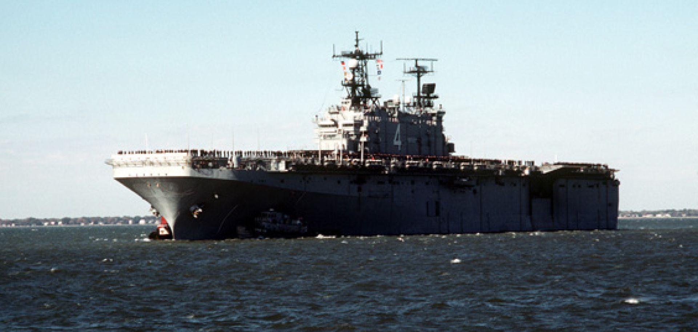

## Claim
Claim: " This image shows U.S. warships being en route to the Lebanon coast in August 2024 to support the Israel Defence Forces (IDF)."

## Actions
```
web_search("US warships Lebanon coast August 2024")
image_search("US warships Lebanon coast")
```

## Evidence
### Evidence from `web_search`
NPR reported on August 3, 2024, that the U.S. is sending more warships to the Middle East as Israel steps up attacks, with Israel anticipating an attack by Iran and its allies. The USNI News article from August 2, 2024, states that the USS Abraham Lincoln is heading to the Middle East to bolster military presence in the Eastern Mediterranean and the Middle East. The article also mentions the three-ship Wasp Amphibious Ready Group with the embarked 24th Marine Expeditionary Unit is currently in the Eastern Mediterranean.

Military.com reported on September 20, 2024, about the increased U.S. military presence in the Middle East, with approximately 40,000 forces, a dozen warships, and four Air Force fighter jet squadrons. The article mentions that the U.S. has warships in the eastern Mediterranean Sea, including the USS Wasp, due to the conflict between Israel and Lebanon. , , , 


### Evidence from `image_search`
The web search results discuss U.S. warships en route to Lebanon. One article, from L'Orient-Le Jour, focuses on this topic and includes an image of a warship (). Another article, from the Associated Press, also discusses U.S. warships and includes an image of a warship ().

A search result from worldview.stratfor.com also contains an image of a U.S. warship ().


## Elaboration
The evidence confirms that U.S. warships were deployed to the Eastern Mediterranean in August 2024. The evidence also suggests that the U.S. military presence was increased due to the conflict between Israel and Lebanon. However, the evidence does not explicitly state that the warships were en route to the Lebanon coast to support the IDF.

Therefore, the claim is partially supported, but the specific reason for the deployment (supporting the IDF) is not directly confirmed by the provided evidence.


## Actions
```
geolocate()
```

## Evidence
### Evidence from `geolocate`
The most likely countries where the image was taken are: {'Singapore': 0.32, 'Malta': 0.15, 'France': 0.1, 'South Korea': 0.07, 'Malaysia': 0.06, 'Taiwan': 0.04, 'Monaco': 0.03, 'Croatia': 0.02, 'Turkey': 0.02, 'Bermuda': 0.01}

## Elaboration
The geolocation analysis of the image suggests that it was most likely taken in Singapore, Malta, or France. This contradicts the claim that the image shows warships en route to the Lebanon coast. The evidence indicates that the image's location is not consistent with the claim.


## Final Judgement
The evidence indicates that the image was not taken near the Lebanon coast, as the geolocation analysis suggests locations like Singapore, Malta, or France. While there is evidence of U.S. warships in the Eastern Mediterranean in August 2024, the image's location contradicts the claim.

`false`

### Verdict: FALSE

### Justification
The claim is false. While U.S. warships were deployed to the Eastern Mediterranean in August 2024, the image's geolocation analysis suggests it was taken in locations like Singapore, Malta, or France, not near the Lebanon coast.
