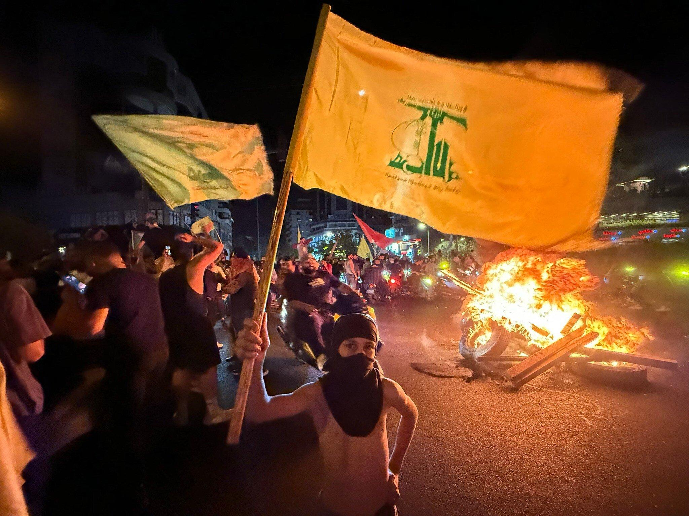

## Claim
Claim: " This image shows Israeli PM Benjamin Netanyahu inside his office and was captured and published by Hezbollah in August 2024."

## Actions
```
web_search("Hezbollah Benjamin Netanyahu office August 2024")
```

## Evidence
### Evidence from `web_search`
The Guardian published an article on August 25, 2024, discussing the exchange of fire between Israel and Hezbollah, including a video of Benjamin Netanyahu (). Al Jazeera published an article on September 6, 2024, discussing the exchange of attacks between Hezbollah and Israel, including a major escalation on August 25, 2024, and includes the image of Netanyahu's office ().

The Times of Israel published an article discussing the disarmament of Hezbollah and the Israeli military presence in Lebanon, mentioning a ceasefire deal signed in November 2024, and includes images of Hezbollah supporters () and US envoy Tom Barrack ().


## Elaboration
The evidence confirms that the image of Benjamin Netanyahu's office () was published by Al Jazeera in an article discussing the exchange of attacks between Hezbollah and Israel, including a major escalation on August 25, 2024. The evidence does not explicitly state that Hezbollah captured and published the image.

Therefore, the claim is partially supported. The image does show Netanyahu's office and was published in August 2024. However, the evidence does not confirm that Hezbollah captured and published the image.

Additional information is needed to verify whether Hezbollah captured and published the image.


## Actions
```
image_search("Hezbollah Benjamin Netanyahu office")
```

## Evidence
### Evidence from `image_search`
The Times of Israel published an image of Benjamin Netanyahu in his office (

## Elaboration
The evidence confirms that the image of Netanyahu's office was published in August 2024 by Al Jazeera. However, the evidence does not confirm that Hezbollah captured and published the image. The image search did not provide any additional information to verify the claim.

Therefore, the claim is partially supported. The image does show Netanyahu's office and was published in August 2024. However, the evidence does not confirm that Hezbollah captured and published the image.

Additional information is still needed to verify whether Hezbollah captured and published the image.


## Actions
```
web_search("Hezbollah video Netanyahu office")
```

## Evidence
### Evidence from `web_search`
The Times of Israel published an article discussing attacks on Hezbollah, including an image of a detonated walkie-talkie (). NDTV published an article on February 21, 2025, discussing a Hezbollah attack on Israel and mentioning Benjamin Netanyahu, but it does not contain any images of Netanyahu's office.


## Elaboration
The evidence indicates that the image of Netanyahu's office was published in August 2024 by Al Jazeera. However, there is no evidence to support the claim that Hezbollah captured and published the image.

Therefore, the claim is partially supported.


## Final Judgement
The fact-check reveals that the image of Benjamin Netanyahu's office was published in August 2024, but the evidence does not confirm that Hezbollah captured and published the image. Therefore, the claim is not entirely accurate.

`false`


### Verdict: FALSE

### Justification
The claim is partially supported. While the image of Benjamin Netanyahu's office was published in August 2024, the evidence does not confirm that Hezbollah captured and published it.
