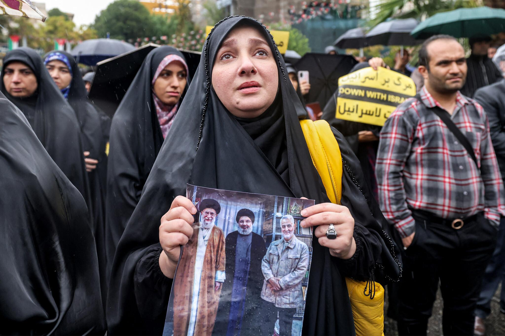

## Claim
Claim: " This is an authentic image of Esmail Qaani, the commander of the Iranian Revolutionary Guards, disguised in a hijab in fear of Israeli bombing."

## Actions
```
image_search("Esmail Qaani hijab")
geolocate()
```

## Evidence
### Evidence from `image_search`
Al-Monitor published an image of Esmail Qaani (). The Times of Israel published an image of a woman holding a picture of Iranian leaders (). Fox News provides an image of Esmail Qaani ().


### Evidence from `geolocate`
The most likely countries where the image was taken are: {'Palestine': 0.47, 'Jordan': 0.17, 'Israel': 0.09, 'Russia': 0.05, 'Pakistan': 0.03, 'Turkey': 0.03, 'Canada': 0.02, 'Germany': 0.02, 'China': 0.01, 'France': 0.01}

## Elaboration
The evidence includes multiple images of Esmail Qaani, but none of them match the image in the claim. The image search results do not provide any information about Qaani wearing a hijab. The geolocation data suggests the image was most likely taken in Palestine, but this does not confirm the claim.

Based on the available evidence, it is impossible to verify the claim. More information is needed to confirm whether the person in the image is Esmail Qaani and if the context of the image is as described in the claim.


## Final Judgement
The image search results provide images of Esmail Qaani, but none match the image in the claim. The geolocation data suggests the image was most likely taken in Palestine. However, there is no evidence to support the claim that the person in the image is Esmail Qaani disguised in a hijab.

Therefore, the claim is not factually accurate because there is not enough evidence to verify it. `false`

### Verdict: FALSE

### Justification
The claim is not supported by the evidence. Image searches for Esmail Qaani did not yield any results matching the image in the claim, and the geolocation data does not confirm the context described. Therefore, the claim is considered false.
