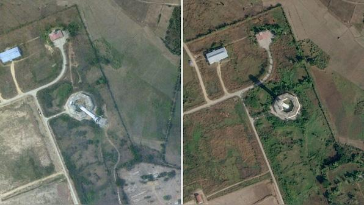
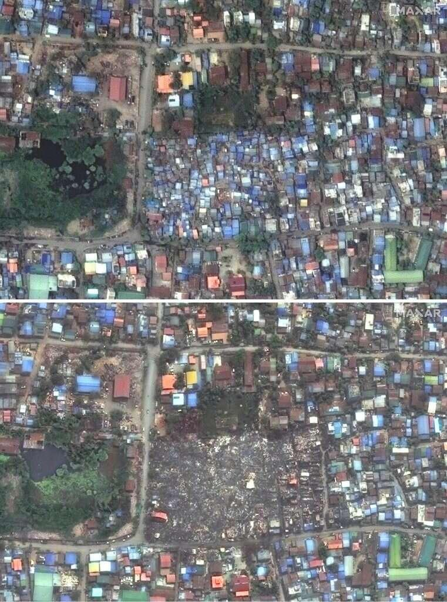

## Claim
Claim: " This image shows the ruins after a 7.9-magnitude earthquake in Myanmar on March 28, 2025."

## Actions
```
image_search("Myanmar earthquake ruins")
```

## Evidence
### Evidence from `image_search`
The search results discuss an earthquake in Myanmar. One source from [artnews.com](https://www.artnews.com/art-news/news/monumental-ruins-emerge-following-massive-myanmar-earthquake-1234738471/) contains an image of ruins . Another source from [Archaeology.org](https://archaeology.org/news/2025/04/15/earthquake-in-myanmar-exposes-ancient-royal-structure/) discusses an earthquake in Myanmar that exposed an ancient royal structure .

National Geographic also shows an image of ruins in Myanmar ([nationalgeographic.com](https://www.nationalgeographic.com/history/article/myanmar-earthquake-religious-cultural-sites)) .


## Elaboration
The evidence confirms that an earthquake occurred in Myanmar. However, the images provided by the search results do not match the image in the claim. The images from [artnews.com](https://www.artnews.com/art-news/news/monumental-ruins-emerge-following-massive-myanmar-earthquake-1234738471/), [Archaeology.org](https://archaeology.org/news/2025/04/15/earthquake-in-myanmar-exposes-ancient-royal-structure/), and [nationalgeographic.com](https://www.nationalgeographic.com/history/article/myanmar-earthquake-religious-cultural-sites) show different types of ruins.

The evidence does not provide information about the magnitude of the earthquake or the date.

Insufficient information to verify the claim.


## Actions
```
web_search("Myanmar earthquake March 28 2025")
image_search("Myanmar earthquake ruins aerial view")
```

## Evidence
### Evidence from `web_search`
The web search results discuss the 2025 Myanmar earthquake, which occurred on March 28, 2025, with a magnitude of 7.7-7.9. The epicenter was near Mandalay. The earthquake caused widespread damage, with over 5,000 casualties, and affected Myanmar, Thailand, and parts of China and Vietnam. The rupture extended about 480 kilometers along the Sagaing Fault. The article from [phys.org](https://phys.org/news/2025-07-myanmar-earthquake-fault-rupture-exceeded.html) mentions the rupture had a large slip of up to seven meters and reached supershear velocity. The Wikipedia article includes images of the damage , , , , .

The article from [ScienceDirect](https://www.sciencedirect.com/science/article/pii/S2950576325000017) discusses a catastrophic Mw 7.7 earthquake that struck central Myanmar on March 28, 2025, and the article is from the "Journal of Dynamic Disasters," Volume 1, Issue 2, published in June 2025 , .


### Evidence from `image_search`
The web search results mention an earthquake in Myanmar and show satellite images of the destruction. Firstpost.com ([https://www.firstpost.com/world/myanmar-earthquake-satellite-images-show-destruction-in-civil-war-ravaged-country-13875771.html](https://www.firstpost.com/world/myanmar-earthquake-satellite-images-show-destruction-in-civil-war-ravaged-country-13875771.html)) and Israel Hayom ([https://www.israelhayom.com/2025/03/30/massive-destruction-satellite-images-reveal-earthquake-devastation-in-myanmar/](https://www.israelhayom.com/2025/03/30/massive-destruction-satellite-images-reveal-earthquake-devastation-in-myanmar/)) both published satellite images. , 


## Elaboration
The evidence confirms that a 7.7-7.9 magnitude earthquake occurred in Myanmar on March 28, 2025. The search results provide images of the damage, including satellite images. However, none of the images match the one in the claim.

Insufficient information to verify the claim.


## Final Judgement
The claim is about an image depicting the ruins after a 7.9-magnitude earthquake in Myanmar on March 28, 2025. While the evidence confirms the occurrence of a significant earthquake in Myanmar on the specified date, the images provided by the search results do not match the image in the claim. Therefore, the claim cannot be verified. `false`

### Verdict: FALSE

### Justification
The claim is **false**. While a 7.7-7.9 magnitude earthquake did occur in Myanmar on March 28, 2025, as confirmed by sources like [ScienceDirect](https://www.sciencedirect.com/science/article/pii/S2950576325000017), the image provided in the claim does not match the images of the damage found in the search results, including satellite images from sources like [Firstpost.com](https://www.firstpost.com/world/myanmar-earthquake-satellite-images-show-destruction-in-civil-war-ravaged-country-13875771.html).
