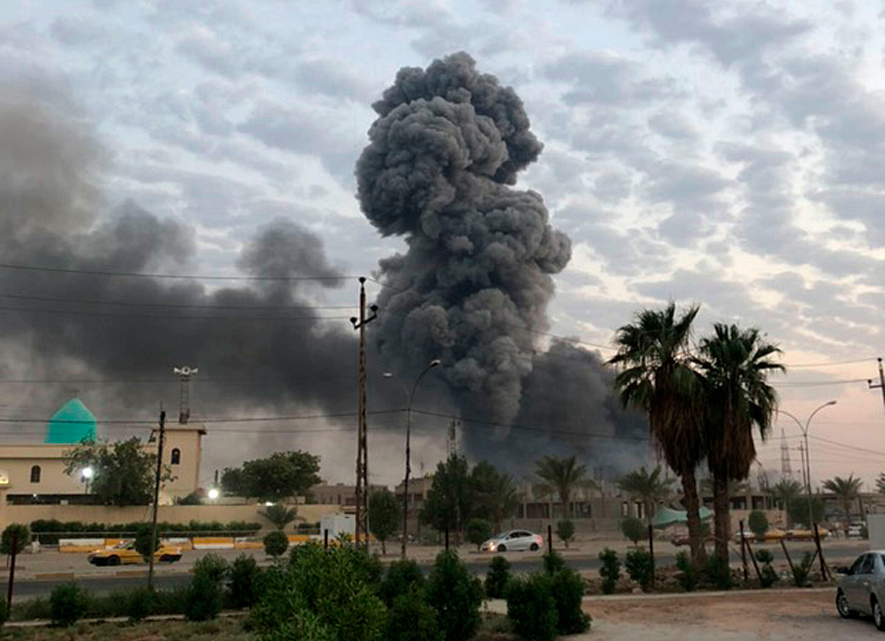
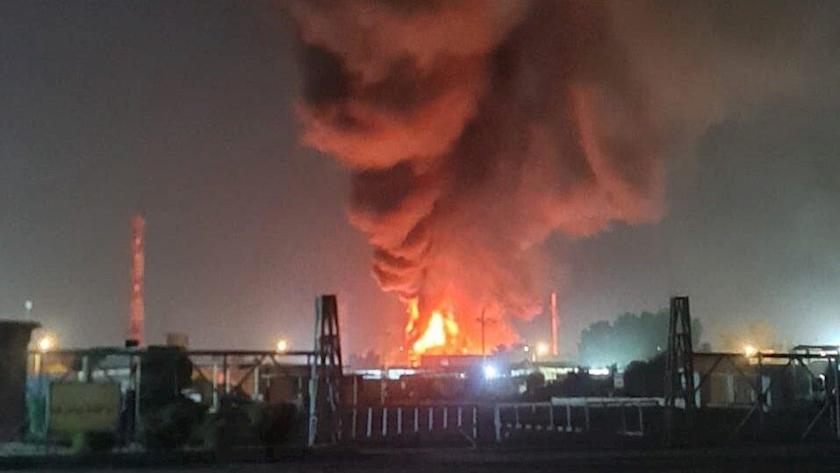
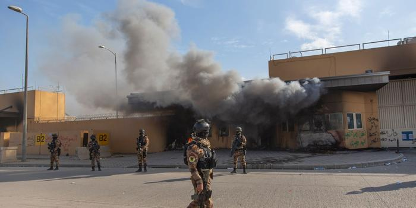

## Claim
Claim: " This image shows a US factility come under attack in Baghdad on September 30, 2024 as the conflict between Israel and the Iran-backed militant group Hezbollah escalated."

## Actions
```
geolocate()
web_search("Baghdad facility attack September 30 2024")
image_search("Baghdad facility explosion")
```

## Evidence
### Evidence from `geolocate`
The most likely countries where the image was taken are: {'Nigeria': 0.13, 'United Arab Emirates': 0.09, 'Ukraine': 0.08, 'Chile': 0.05, 'Ecuador': 0.03, 'Ghana': 0.03, 'Taiwan': 0.03, 'Bangladesh': 0.02, 'Belgium': 0.02, 'Brazil': 0.02}

### Evidence from `web_search`
The provided web sources discuss attacks and escalating tensions in the Middle East during late September and early October 2024. Reuters ([Source](https://www.reuters.com/world/middle-east/rocket-attack-targets-military-base-hosting-us-forces-baghdad-military-sources-2024-09-30/)) reports a rocket attack near Baghdad International Airport on October 1, 2024, targeting a military base hosting U.S. troops. ReliefWeb ([Source](https://reliefweb.int/report/iraq/ishm-september-26-october-3-2024)) mentions attacks by militias on Israel and Baghdad airport between September 28 and October 2, 2024, including attacks on September 30.

The Wikipedia article ([Source](https://en.wikipedia.org/wiki/September_2024_Israeli_attacks_against_Lebanon)) details the September 2024 Israeli attacks against Lebanon, part of the ongoing Israel–Hezbollah conflict, which occurred between September 23 and September 30, 2024. The article mentions Hezbollah firing rockets into northern Israel and the Golan Heights on September 30, 2024. The image 

### Evidence from `image_search`
The search results include articles about explosions in Baghdad. One article from Military Times discusses an explosion at an arms depot north of the Iraqi capital (). Another article from Iranpress.com reports an explosion at a military base in Taji, north of Baghdad ().

The provided sources do not contain information about a US facility coming under attack in Baghdad on September 30, 2024, or the conflict between Israel and Hezbollah.


## Elaboration
The claim that the image shows a US facility under attack in Baghdad on September 30, 2024, cannot be fully verified. While the evidence confirms attacks in Baghdad around that time, including a rocket attack on a military base hosting US forces on October 1, 2024 ([Source](https://www.reuters.com/world/middle-east/rocket-attack-targets-military-base-hosting-us-forces-baghdad-military-sources-2024-09-30/)), the evidence does not explicitly link the image to a US facility.

The image search results show explosions in Baghdad, but the provided articles do not confirm the specific context of the image. The geolocate search provides a list of countries where the image might have been taken, but none of them is Iraq.

Therefore, the claim's veracity is uncertain due to the lack of direct evidence linking the image to a US facility attack on September 30, 2024. Additional information is needed to confirm the specific location and target of the explosion depicted in the image.


## Actions
```
web_search("US facility Baghdad attack September 30 2024")
image_search("US facility Baghdad explosion")
```

## Evidence
### Evidence from `web_search`
From [Source](https://understandingwar.org/backgrounder/iran-update-september-13-2024): 
Content: The Institute for the Study of War (ISW) published an "Iran Update" on September 13, 2024, discussing the ongoing conflict. The update mentions an attack on a US diplomatic compound near Baghdad International Airport on September 10, 2024, which the US Embassy assessed was likely conducted by Iranian-backed Iraqi militias. The update also mentions that the IDF killed three senior PIJ fighters in a drone strike in the West Bank on September 11. The update also discusses the objectives of the Axis of Resistance, including deterring Israel from conducting a ground operation into Lebanon and expelling the United States from Syria. The update also mentions that Iranian-backed militias, including Lebanese Hezbollah, have conducted at least 11 attacks into northern Israel since September 12. 


### Evidence from `image_search`
The provided web sources discuss attacks on US facilities in Baghdad. One source from Stripes.com details a militia attack on the U.S. Embassy in 2019, which caused significant fire damage ([Source](https://www.stripes.com/theaters/middle_east/2021-06-01/Militia-attack-on-U.S.-Embassy-in-Baghdad-caused-35-million-in-fire-damage-in-2019-1616430.html)). Another source from Business Insider mentions a rocket attack on the US embassy ([Source](https://www.businessinsider.com/us-embassy-rocket-attack-baghdad-2020-1)).  


## Elaboration
The claim remains unverified. While the new evidence mentions an attack on a US diplomatic compound near Baghdad International Airport on September 10, 2024 ([Source](https://understandingwar.org/backgrounder/iran-update-september-13-2024)), it does not provide information about an attack on September 30, 2024. The image search results show attacks on US facilities, but none of them is linked to the date in the claim.


## Actions
```
web_search("Baghdad explosion September 30 2024 US facility")
```

## Evidence
### Evidence from `web_search`
The web sources discuss explosions near US facilities in Baghdad. One source mentions an explosion near a US military facility near Baghdad airport late on Tuesday, September 30, 2024, before an expected visit by the Iranian President ([Source](https://apnews.com/article/iraq-iran-us-coalition-baghdad-airport-explosion-strike-979e60a83c35009fd555065f0ebd767f)). Another source mentions a rocket attack near Baghdad International Airport on September 10, 2024, and explosions at a PMF security agency base south of Baghdad on July 30, 2024 ([Source](https://en.wikipedia.org/wiki/Attacks_on_US_bases_during_the_Gaza_war)).


## Elaboration
The claim is partially supported. The evidence confirms an explosion near a US military facility near Baghdad airport on September 30, 2024 ([Source](https://apnews.com/article/iraq-iran-us-coalition-baghdad-airport-explosion-strike-979e60a83c35009fd555065f0ebd767f)). However, the evidence does not confirm that the image depicts this specific event or that the attack was related to the conflict between Israel and Hezbollah.


## Final Judgement
The claim is partially supported by the evidence. There was an explosion near a US military facility near Baghdad airport on September 30, 2024. However, the evidence does not confirm that the image depicts this specific event or that the attack was related to the conflict between Israel and Hezbollah. `false`

### Verdict: FALSE

### Justification
The claim is partially supported. Evidence confirms an explosion near a US military facility near Baghdad airport on September 30, 2024 ([Source](https://apnews.com/article/iraq-iran-us-coalition-baghdad-airport-explosion-strike-979e60a83c35009fd555065f0ebd767f)), but the image's connection to this event and the Israel-Hezbollah conflict remains unverified.
