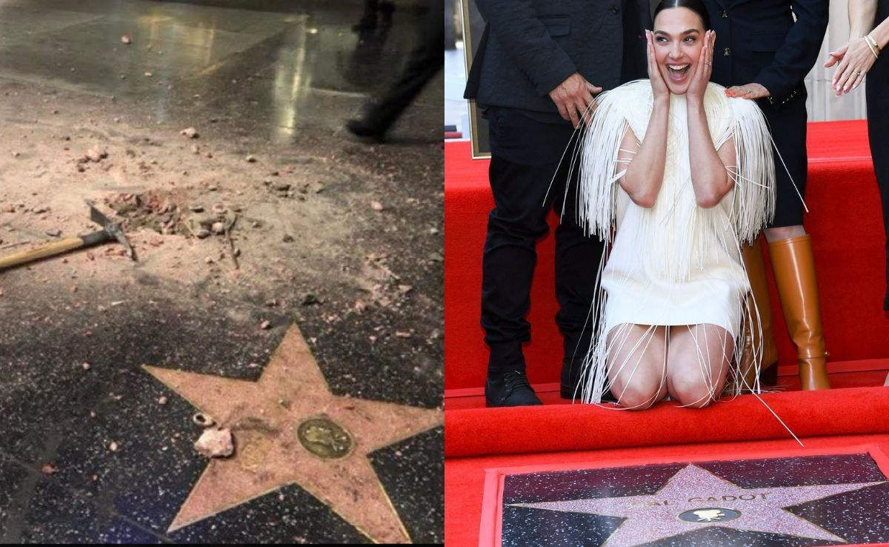

## Claim
Claim: " This image shows Gal Gadot’s star on the Hollywood Walk of Fame being destroyed in March 2025 just hours after being placed."

## Actions
```
image_search("Gal Gadot Hollywood Walk of Fame star damage")
web_search("Gal Gadot Hollywood Walk of Fame star vandalism")
```

## Evidence
### Evidence from `image_search`
The search results include an image of Gal Gadot's star on the Hollywood Walk of Fame being damaged . The Los Angeles Times published an article about Gal Gadot's star on the Hollywood Walk of Fame .

Sources:
*   [https://www.ndtv.com/world-news/gal-gadots-hollywood-walk-of-fame-star-smashed-amid-pro-palestinian-protests-photo-is-viral-7966341](https://www.ndtv.com/world-news/gal-gadots-hollywood-walk-of-fame-star-smashed-amid-pro-palestinian-protests-photo-is-viral-7966341)
*   [https://ew.com/fact-check-was-gal-gadot-s-hollywood-star-destroyed-11700747?srsltid=AfmBOopi5B\_4SFyMzbFXffAmqa\_7xa\_aZ2Vfvsn4yz9Ml3DFGpY9xM1O](https://ew.com/fact-check-was-gal-gadot-s-hollywood-star-destroyed-11700747?srsltid=AfmBOopi5B_4SFyMzbFXffAmqa_7xa_aZ2Vfvsn4yz9Ml3DFGpY9xM1O)
*   [https://www.latimes.com/entertainment-arts/story/2025-03-18/gal-gadot-walk-of-fame-pro-palestine-pro-israel-protesters-snow-white](https://www.latimes.com/entertainment-arts/story/2025-03-18/gal-gadot-walk-of-fame-pro-palestine-pro-israel-protesters-snow-white)


## Elaboration
The image search results confirm that Gal Gadot's star on the Hollywood Walk of Fame was damaged. The Los Angeles Times published an article about the star. The provided evidence does not mention the exact date when the star was damaged. The claim states that the damage occurred in March 2025, but this information is not explicitly confirmed by the evidence.

The evidence includes a link to an article from the Los Angeles Times, which could potentially contain the date of the incident. However, without reviewing the article, it is impossible to verify the claim's date.

Therefore, the claim's veracity cannot be fully determined without additional information. Specifically, the date of the damage needs to be verified.


## Actions
```
web_search("Gal Gadot Hollywood Walk of Fame star damage date")
```

## Evidence
### Evidence from `web_search`
Entertainment Weekly reports that Gal Gadot's Hollywood Walk of Fame star ceremony took place on March 18, 2025, and was disrupted by protestors. The Logical Indian debunked the claim that Gal Gadot's star was damaged, stating that the photo circulating online actually depicts damage to Donald Trump’s star from an incident in 2018. Yahoo also reports that Gal Gadot received her star on March 18, 2025, and that an image hinting at the star being destroyed went viral, but has not been verified. , , , 

*   [https://ew.com/fact-check-was-gal-gadot-s-hollywood-star-destroyed-11700747?srsltid=AfmBOopT0yFnScU7IaqK2jEgMeN47liwGjl9qSlO0HrjDlZY1vIfCpJY](https://ew.com/fact-check-was-gal-gadot-s-hollywood-star-destroyed-11700747?srsltid=AfmBOopT0yFnScU7IaqK2jEgMeN47liwGjl9qSlO0HrjDlZY1vIfCpJY)
*   [https://thelogicalindian.com/debunking-the-viral-photo-gal-gadots-star-wasnt-damaged-in-2025/](https://thelogicalindian.com/debunking-the-viral-photo-gal-gadots-star-wasnt-damaged-in-2025/)
*   [https://www.yahoo.com/entertainment/gal-gadot-walk-fame-star-093000872.html](https://www.yahoo.com/entertainment/gal-gadot-walk-fame-star-093000872.html)


## Elaboration
The evidence indicates that Gal Gadot received her star on the Hollywood Walk of Fame on March 18, 2025. However, the claim that her star was destroyed is false. The Logical Indian debunked the claim, stating that the photo circulating online actually depicts damage to Donald Trump’s star from an incident in 2018.


## Final Judgement
The initial search revealed that Gal Gadot received her star on the Hollywood Walk of Fame, and the image search showed a damaged star. However, further investigation revealed that the image of the damaged star was not Gadot's, but rather Donald Trump's star from a 2018 incident. Therefore, the claim that Gal Gadot's star was destroyed is false.

`false`

### Verdict: FALSE

### Justification
The claim is false. While Gal Gadot received her star on the Hollywood Walk of Fame on March 18, 2025, the image of the damaged star circulating online is actually of Donald Trump's star from a 2018 incident, as reported by [The Logical Indian](https://thelogicalindian.com/debunking-the-viral-photo-gal-gadots-star-wasnt-damaged-in-2025/).
