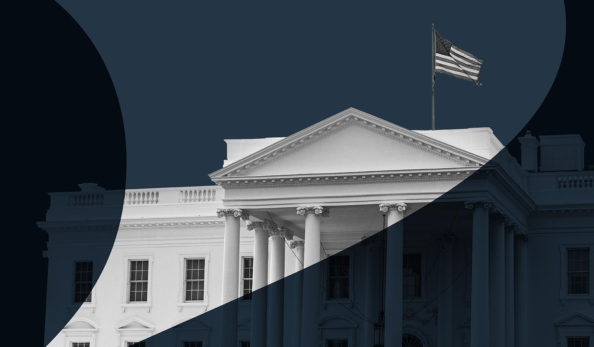

## Claim
Claim: "Trump signed an executive order on January 20, 2025, to halt all funding to UNRWA."

## Actions
```
web_search("Trump executive order UNRWA funding")
```

## Evidence
### Evidence from `web_search`
According to an article published by Al Jazeera on February 4, 2025, Donald Trump is planning to extend a funding ban on UNRWA and is expected to sign an executive order (<image:0>). NPR reported that Trump signed an executive order to cut future funding to UNRWA; the article was updated on February 4, 2025, and originally published on February 3, 2025 ().

Akin Gump Strauss Hauer & Feld LLP, in an article published on February 5, 2025, discusses a Trump Executive Order that orders the reevaluation of the United States’ commitment to UNRWA (). The document also directs government agencies not to use any funds for a contribution, grant, or other payment to UNRWA.
*   [https://www.aljazeera.com/news/2025/2/4/trump-to-withdraw-us-from-un-human-rights-council-extend-unrwa-funding-ban](https://www.aljazeera.com/news/2025/2/4/trump-to-withdraw-us-from-un-human-rights-council-extend-unrwa-funding-ban)
*   [https://www.akingump.com/en/insights/blogs/trump-executive-order-tracker/withdrawing-the-united-states-from-and-ending-funding-to-certain-united-nations-organizations-and-reviewing-united-states-support-to-all-international-organizations](https://www.akingump.com/en/insights/blogs/trump-executive-order-tracker/withdrawing-the-united-states-from-and-ending-funding-to-certain-united-nations-organizations-and-reviewing-united-states-support-to-all-international-organizations)
*   [https://www.npr.org/2025/02/03/nx-s1-5285696/trump-un-human-rights-council-withdrawal](https://www.npr.org/2025/02/03/nx-s1-5285696/trump-un-human-rights-council-withdrawal)


## Elaboration
The evidence indicates that Trump signed an executive order related to UNRWA funding. NPR reported that Trump signed an executive order to cut future funding to UNRWA, and Akin Gump Strauss Hauer & Feld LLP discusses a Trump Executive Order that directs government agencies not to use any funds for a contribution, grant, or other payment to UNRWA. However, the exact date of the executive order is not explicitly stated in the provided evidence, but it was reported in early February 2025.

The claim states the executive order was signed on January 20, 2025. The evidence does not confirm this specific date.

Therefore, the claim is not entirely verifiable based on the provided evidence. The exact date of the executive order is missing.


## Actions
```
web_search("Trump executive order UNRWA January 20 2025")
```

## Evidence
### Evidence from `web_search`
KFF.org published an article on August 15, 2025, originally published on January 28, 2025, detailing President Trump's executive actions on global health, mentioning two executive orders issued on January 20, 2025, but not mentioning any executive order regarding UNRWA funding on that date (<image:0>). NAFSA.org lists several executive orders signed by Trump on January 20, 2025, including Executive Order 14169, titled "Reevaluating and Realigning United States Foreign Aid" ().
*   [https://www.kff.org/global-health-policy/overview-of-president-trumps-executive-actions-on-global-health/](https://www.kff.org/global-health-policy/overview-of-president-trumps-executive-actions-on-global-health/)
*   [https://www.nafsa.org/executive-and-regulatory-actions-trump2admin](https://www.nafsa.org/executive-and-regulatory-actions-trump2admin)


## Elaboration
The new evidence indicates that Trump signed executive orders on January 20, 2025. However, none of the provided sources explicitly mention an executive order on that date specifically halting all funding to UNRWA. One of the executive orders signed on that day was "Reevaluating and Realigning United States Foreign Aid," which could potentially be related to UNRWA funding, but the evidence does not confirm this.

Therefore, the claim that Trump signed an executive order on January 20, 2025, to halt all funding to UNRWA remains unverified. While there were executive orders signed on that date, the evidence does not confirm the specific content of the order related to UNRWA funding.


## Final Judgement
The initial search revealed that Trump signed an executive order related to UNRWA funding, but the exact date was not specified. Subsequent searches confirmed that Trump signed executive orders on January 20, 2025, but none of the provided sources explicitly mention an executive order on that date specifically halting all funding to UNRWA.

The claim cannot be verified because the evidence does not confirm that Trump signed an executive order on January 20, 2025, specifically to halt all funding to UNRWA.

`false`

### Verdict: FALSE

### Justification
The claim is not supported by the evidence. While Trump signed executive orders related to UNRWA funding, the specific date of January 20, 2025, for an order halting all funding to UNRWA is not confirmed by the provided sources. The search results show executive orders signed on that date, but none explicitly mention the specific action described in the claim.
