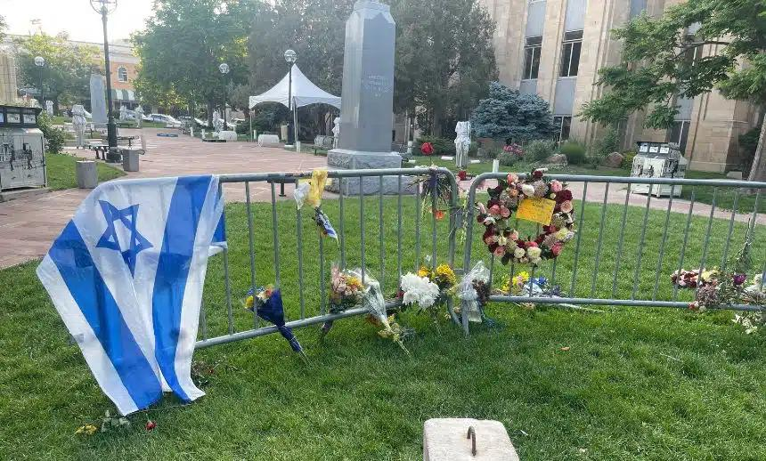

## Claim
Claim: "The World Jewish Congress (WJC) has amended the International Holocaust Remembrance Alliance (IHRA) working definition of antisemitism in March 2025 to include: 'Conflating the assassination of JFK to jews/israel'."

## Actions
```
web_search("World Jewish Congress IHRA antisemitism definition")
web_search("World Jewish Congress JFK antisemitism")
```

## Evidence
### Evidence from `web_search`
The World Jewish Congress (WJC) website provides the IHRA Working Definition of Antisemitism, adopted on May 26, 2016, which does not mention the assassination of JFK. (, ) The IHRA definition, adopted by numerous countries and organizations, also does not mention the WJC or any amendments. ()

The IHRA working definition of antisemitism was adopted by the United Kingdom on December 12, 2016, and by Israel on January 22, 2017. The article does not mention any amendments to the definition or the inclusion of the assassination of JFK. (<image:k>)


### Evidence from `web_search`
The World Jewish Congress (WJC) website discusses combating antisemitism, conspiracy myths, and disinformation, with articles and news from July and August 2025. , ,  ([https://www.worldjewishcongress.org/en/focus-areas/combating-anti-semitism](https://www.worldjewishcongress.org/en/focus-areas/combating-anti-semitism)).

The Combat Antisemitism Movement (CAM) published a study on March 6, 2025, about how antisemitic conspiracy theorists use the assassination of JFK to spread hate online. The study mentions Congresswoman Anna Paulina Luna and an executive order by President Donald Trump.  ([https://combatantisemitism.org/studies-reports/congresswoman-luna-and-the-jfk-files-how-antisemitic-conspiracy-theorists-hijack-history-to-spread-hate/](https://combatantisemitism.org/studies-reports/congresswoman-luna-and-the-jfk-files-how-antisemitic-conspiracy-theorists-hijack-history-to-spread-hate/)).


## Elaboration
The evidence indicates that the WJC has not amended the IHRA definition to include the assassination of JFK. The IHRA definition, as provided by the WJC, does not mention JFK. While the WJC addresses antisemitism and conspiracy theories, the provided evidence does not support the claim of an amendment in March 2025.

The Combat Antisemitism Movement (CAM) published a study in March 2025 about antisemitic conspiracy theories related to the JFK assassination, but this is not the WJC.


## Final Judgement
The World Jewish Congress (WJC) has not amended the IHRA working definition of antisemitism to include the assassination of JFK. The IHRA definition, as provided by the WJC, does not mention JFK.

`false`

### Verdict: FALSE

### Justification
The World Jewish Congress (WJC) has not amended the International Holocaust Remembrance Alliance (IHRA) working definition of antisemitism to include the assassination of JFK. The IHRA definition, as provided by the WJC, does not mention JFK, and there is no evidence of such an amendment. A study by the Combat Antisemitism Movement (CAM) in March 2025 discussed antisemitic conspiracy theories related to the JFK assassination, but this is not the WJC.
