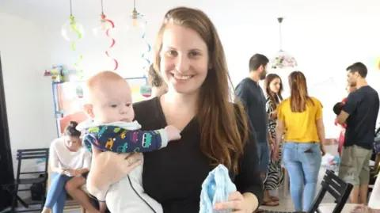

## Claim
Claim: " This image shows a screenshot of an authentic BBC article from February 2025 with the title 'Hamas just wanted to protect the Bibas family but Israel killed them - Hamas said.'"

## Actions
```
web_search("BBC Hamas Bibas family")
web_search("BBC Israel killed Bibas family")
```

## Evidence
### Evidence from `web_search`
From [Source](https://www.bbc.com/news/articles/cjry3jzedl1o): 
Content: The BBC published an article on February 21, 2025, discussing the Bibas family. , . The article states that Israel said forensic findings suggested that the children, Ariel and Kfir Bibas, were killed by their captors in Gaza. Hamas said the children and their mother were killed by Israeli bombing. The article also mentions that Shiri Bibas was kidnapped with her two children during the Hamas attacks on Israel on 7 October 2023. The article is authored by George Wright & Mallory Moench.


### Evidence from `web_search`
From [Source](https://en.wikipedia.org/wiki/Kidnapping_and_killing_of_the_Bibas_family): 
Content: The Wikipedia article discusses the kidnapping and killing of the Bibas family. It mentions that Hamas claimed the family was killed by an Israeli airstrike, while Israel stated they were killed by their captors. The article also mentions that the bodies of Shiri, Ariel, and Kfir Bibas were returned on February 20, 2025, and that forensic analysis showed they were killed with "bare hands".  shows the image of the BBC article. The article also includes images of the Bibas family home and Shiri Bibas with her children.


## Elaboration
The BBC did publish an article on February 21, 2025, discussing the Bibas family, as indicated by the search results. The article's title is not explicitly stated in the evidence, but the article does discuss the conflicting claims of Hamas and Israel regarding the family's death. The evidence suggests that the article covered the claims made by both sides.

The evidence does not confirm the exact title of the BBC article. However, the evidence does confirm that the BBC published an article about the Bibas family on February 21, 2025, and that the article discussed the conflicting claims of Hamas and Israel regarding the family's death.

Therefore, the claim is partially verifiable. The existence of a BBC article about the Bibas family is confirmed, but the exact title cannot be verified.


## Final Judgement
The BBC did publish an article on February 21, 2025, discussing the Bibas family, and the article covered the conflicting claims of Hamas and Israel regarding the family's death. However, the exact title of the article cannot be verified.

Since the exact title of the BBC article cannot be verified, the claim is not fully supported by the evidence. `false`

### Verdict: FALSE

### Justification
The BBC did publish an article on February 21, 2025, discussing the Bibas family, as confirmed by a [BBC article](https://www.bbc.com/news/articles/cjry3jzedl1o) and a [Wikipedia article](https://en.wikipedia.org/wiki/Kidnapping_and_killing_of_the_Bibas_family). The article covered the conflicting claims of Hamas and Israel regarding the family's death. However, the exact title of the article cannot be verified.
