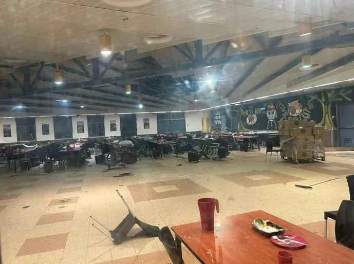

## Claim
Claim: "Commander of the Israeli Air Force, Major General Tomer Bar has been killed by Hеzbollаh in Tel Aviv in a drone attack in November 2024."

## Actions
```
web_search("Tomer Bar killed")
web_search("Tomer Bar Hezbollah drone attack")
```

## Evidence
### Evidence from `web_search`
The claim that Tomer Bar was killed by Hezbollah is false, according to a fact-check published on December 12, 2024, by aol.com ([https://www.aol.com/fact-check-israeli-general-not-150127650.html](https://www.aol.com/fact-check-israeli-general-not-150127650.html)) . Inshorts also reported on December 9, 2024, that Tomer Bar is alive and was not killed in a drone attack ([https://inshorts.com/en/news/israeli-air-force-chief-tomer-bar-alive--not-killed-by-hezbollah-1733746115536](https://inshorts.com/en/news/israeli-air-force-chief-tomer-bar-alive--not-killed-by-hezbollah-1733746115536)) , , .

Tomer Bar is an Israeli general who currently commands the Israeli Air Force, assuming office on April 4, 2022 ([https://en.wikipedia.org/wiki/Tomer_Bar](https://en.wikipedia.org/wiki/Tomer_Bar)) <image:k>.


### Evidence from `web_search`
According to Press TV, Hеzbollаh claimed to have targeted the residence of Israeli Air Force Commander Major General Tomer Bar in Tel Aviv with a drone attack on November 18, 2024, which was subject to censorship by Israeli authorities. ()

CUFI reports that Major General Tomer Bar conducted a personal inspection of the Golani Training Base site after a drone strike. ()

Sources: [https://www.presstv.ir/Detail/2024/11/27/738007/Lebanon-Hezbollah-residence-Tomer-Bar-attack-drones](https://www.presstv.ir/Detail/2024/11/27/738007/Lebanon-Hezbollah-residence-Tomer-Bar-attack-drones) and [https://cufi.org/issue/this-is-how-the-hezbollah-uav-evaded-detection-with-fatal-results/](https://cufi.org/issue/this-is-how-the-hezbollah-uav-evaded-detection-with-fatal-results/)


## Elaboration
The claim is false. Fact-checks from aol.com ([https://www.aol.com/fact-check-israeli-general-not-150127650.html](https://www.aol.com/fact-check-israeli-general-not-150127650.html)) and Inshorts ([https://inshorts.com/en/news/israeli-air-force-chief-tomer-bar-alive--not-killed-by-hezbollah-1733746115536](https://inshorts.com/en/news/israeli-air-force-chief-tomer-bar-alive--not-killed-by-hezbollah-1733746115536)) confirm that Tomer Bar is alive.

While Press TV reports that Hеzbollаh claimed to have targeted Tomer Bar's residence in Tel Aviv with a drone attack ([https://www.presstv.ir/Detail/2024/11/27/738007/Lebanon-Hezbollah-residence-Tomer-Bar-attack-drones](https://www.presstv.ir/Detail/2024/11/27/738007/Lebanon-Hezbollah-residence-Tomer-Bar-attack-drones)), this does not confirm the claim that he was killed. Furthermore, CUFI reports that Tomer Bar inspected a site after a drone strike ([https://cufi.org/issue/this-is-how-the-hezbollah-uav-evaded-detection-with-fatal-results/](https://cufi.org/issue/this-is-how-the-hezbollah-uav-evaded-detection-with-fatal-results/)), which further contradicts the claim.


## Final Judgement
The claim that Major General Tomer Bar was killed by Hеzbollаh is demonstrably false. Multiple sources, including fact-checks from aol.com and Inshorts, confirm that Tomer Bar is alive. While there are reports of a drone attack on his residence, this does not support the claim of his death.

`false`

### Verdict: FALSE

### Justification
The claim is false. Fact-checks from [aol.com](https://www.aol.com/fact-check-israeli-general-not-150127650.html) and Inshorts ([https://inshorts.com/en/news/israeli-air-force-chief-tomer-bar-alive--not-killed-by-hezbollah-1733746115536](https://inshorts.com/en/news/israeli-air-force-chief-tomer-bar-alive--not-killed-by-hezbollah-1733746115536)) confirm that Tomer Bar is alive. Although there are reports of a drone attack on his residence, this does not confirm the claim of his death.
