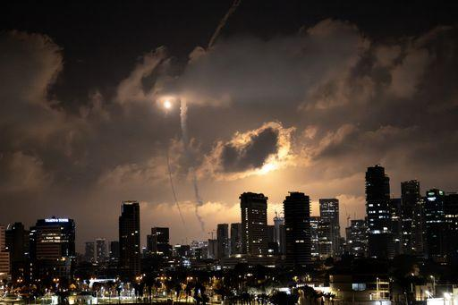
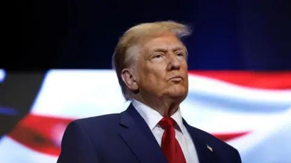

## Claim
Claim: "The assassination plot to kill Donald Trump in 2024 was orchestrated by two Jewish Americans. Israel wants war with Iran but wants American money to fund it and American servicemen to fight it."

## Actions
```
web_search("assassination plot Donald Trump 2024")
web_search("Israel war Iran American money")
```

## Evidence
### Evidence from `web_search`
The search results discuss an attempted assassination of Donald Trump in 2024. One source from Wikipedia ([https://en.wikipedia.org/wiki/Attempted_assassination_of_Donald_Trump_in_Pennsylvania](https://en.wikipedia.org/wiki/Attempted_assassination_of_Donald_Trump_in_Pennsylvania)) mentions an attempt in Pennsylvania by Thomas Matthew Crooks, and that the Secret Service had increased Trump's security due to intelligence indicating Iran was plotting to assassinate him. <image:i>

Other sources, including the BBC ([https://www.bbc.com/news/articles/c3070qvl131o](https://www.bbc.com/news/articles/c3070qvl131o)) and NPR ([https://www.npr.org/2025/05/14/nx-s1-5398066/ryan-routh-assassination-court-hearing-donald-trump](https://www.npr.org/2025/05/14/nx-s1-5398066/ryan-routh-assassination-court-hearing-donald-trump)), report on the attempted assassination by Ryan Routh in 2024, with Routh pleading not guilty. , , , , 


### Evidence from `web_search`
The search results discuss the economic impact of the Iran-Israel war, including conflicts in 2024 and 2025. One article from Wikipedia ([Source](https://en.wikipedia.org/wiki/Economic_impact_of_the_Iran%E2%80%93Israel_war)) details the economic burdens on Iran, the historical context of the conflict, and the destruction of infrastructure.

Reuters ([Source](https://www.reuters.com/markets/europe/israel-iran-conflict-highlights-dollars-tarnished-safe-haven-appeal-2025-06-16/)) discusses the potential impact of the Israel-Iran conflict on the U.S. dollar, noting its "feeble" response. Another article from TRT ([Source](https://trt.global/world/article/334e2e1ae7a3)) discusses the economic impact of a 12-day war between Israel and Iran, including costs to the US, Israel, and Iran, and mentions a travel ban on Jewish citizens. , , <image:k>


## Elaboration
The evidence does not support the claim that the assassination plot was orchestrated by two Jewish Americans. The search results mention two attempted assassinations, one by Thomas Matthew Crooks and another by Ryan Routh, but do not provide any information about their religious or ethnic backgrounds.

The evidence also does not directly support the claim that Israel wants war with Iran and wants American money and servicemen. However, the search results do discuss the economic impact of the Iran-Israel war, including costs to the US, Israel, and Iran.


## Actions
```
web_search("Jewish Americans involved assassination Donald Trump")
web_search("Israel Iran war funding US involvement")
```

## Evidence
### Evidence from `web_search`
The BBC ([https://www.bbc.com/news/articles/cx28x187rmko](https://www.bbc.com/news/articles/cx28x187rmko)), ABC News ([https://abcnews.go.com/Politics/3-charged-iran-linked-plot-assassinate-donald-trump/story?id=115646874](https://abcnews.go.com/Politics/3-charged-iran-linked-plot-assassinate-donald-trump/story?id=115646874)), and NPR ([https://www.npr.org/2024/11/08/nx-s1-5184549/iran-donald-trump-murder-for-hire-plot-justice-department](https://www.npr.org/2024/11/08/nx-s1-5184549/iran-donald-trump-murder-for-hire-plot-justice-department)) report on an alleged Iranian plot to assassinate Donald Trump, with charges against Farhad Shakeri. The plot also included plans to kill two Jewish Americans. , , , , , 


### Evidence from `web_search`
The search results discuss the United States' support for Israel in the Gaza war, including financial aid and military assistance, as detailed in a Wikipedia article ([https://en.wikipedia.org/wiki/United_States_support_for_Israel_in_the_Gaza_war](https://en.wikipedia.org/wiki/United_States_support_for_Israel_in_the_Gaza_war)). <image:i> A PBS article ([https://www.pbs.org/newshour/world/what-to-know-about-the-u-s-militarys-intervention-in-the-israel-iran-war](https://www.pbs.org/newshour/world/what-to-know-about-the-u-s-militarys-intervention-in-the-israel-iran-war)) from June 22, 2025, discusses the U.S. military's intervention in the Israel-Iran war, including U.S. bombing of Iranian nuclear sites.  An Anadolu Agency article ([https://www.aa.com.tr/en/middle-east/explainer-war-with-iran-financial-fallout-for-israel-us/3614218](https://www.aa.com.tr/en/middle-east/explainer-war-with-iran-financial-fallout-for-israel-us/3614218)) from June 26, 2025, discusses the financial impact of the war between Israel and Iran, including the US's direct involvement and the soaring military expenditure of Israel. <image:k>


## Elaboration
The evidence indicates that an Iranian plot to assassinate Donald Trump included plans to kill two Jewish Americans. The evidence also shows that the U.S. is providing financial and military support to Israel in the Israel-Iran war, including direct military intervention.


## Final Judgement
The claim is partially false. While there is evidence of an Iranian plot to assassinate Donald Trump that included plans to kill two Jewish Americans, the claim that Israel orchestrated the plot is not supported by the evidence. The evidence also supports the claim that the U.S. is providing financial and military support to Israel in the Israel-Iran war. `false`

### Verdict: FALSE

### Justification
The claim is partially false. Evidence indicates an Iranian plot to assassinate Donald Trump, which also targeted two Jewish Americans, but there's no evidence linking Israel to the plot. Furthermore, the U.S. is providing financial and military support to Israel in the Israel-Iran war, as documented by sources like the [PBS article](https://www.pbs.org/newshour/world/what-to-know-about-the-u-s-militarys-intervention-in-the-israel-iran-war) and the [Anadolu Agency article](https://www.aa.com.tr/en/middle-east/explainer-war-with-iran-financial-fallout-for-israel-us/3614218).
