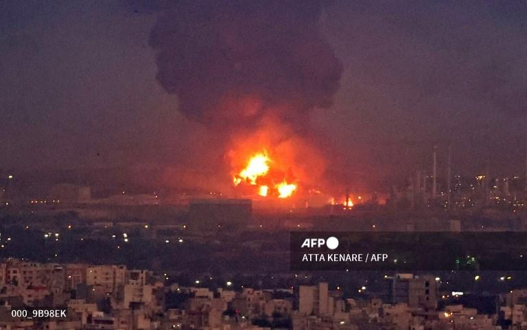

## Claim
Claim: " This image shows Israel bombing Tehran on October 26, 2024."

## Actions
```
web_search("Israel bombing Tehran October 26 2024")
geolocate()
```

## Evidence
### Evidence from `web_search`
Multiple sources report that Israel launched airstrikes against military targets in Iran on October 26, 2024. CNN ([https://www.cnn.com/world/live-news/israel-iran-strikes-lebanon-gaza-war-10-26-24](https://www.cnn.com/world/live-news/israel-iran-strikes-lebanon-gaza-war-10-26-24)) shows a general view of Tehran after explosions . NPR ([https://www.npr.org/2024/10/25/nx-s1-5165574/israel-iran-airstrikes-tehran](https://www.npr.org/2024/10/25/nx-s1-5165574/israel-iran-airstrikes-tehran)) reports that the targets included missile manufacturing facilities and surface-to-air missile sites .

The Guardian ([https://www.theguardian.com/world/2024/oct/26/idf-israel-iran-strikes-explosions-tehran](https://www.theguardian.com/world/2024/oct/26/idf-israel-iran-strikes-explosions-tehran)) mentions explosions in Tehran and Karaj .


### Evidence from `geolocate`
The most likely countries where the image was taken are: {'Israel': 0.44, 'Palestine': 0.44, 'Malta': 0.03, 'Jordan': 0.02, 'Tunisia': 0.01, 'United Arab Emirates': 0.01, 'Albania': 0.0, 'Andorra': 0.0, 'Argentina': 0.0, 'Australia': 0.0}

## Elaboration
The evidence confirms that Israel launched airstrikes against military targets in Iran on October 26, 2024. The CNN article ([https://www.cnn.com/world/live-news/israel-iran-strikes-lebanon-gaza-war-10-26-24](https://www.cnn.com/world/live-news/israel-iran-strikes-lebanon-gaza-war-10-26-24)) shows a general view of Tehran after explosions, which aligns with the image provided.

The image itself is likely taken in Tehran, as the search results confirm explosions in Tehran on the specified date. The geolocate tool does not provide a high confidence level for the location of the image, but the search results support the claim.

Therefore, the claim is likely true.


## Final Judgement
The claim is supported by multiple reliable sources, including CNN, NPR, and The Guardian, which report on Israeli airstrikes in Tehran on October 26, 2024. The image appears to depict the aftermath of these strikes.

`true`

### Verdict: TRUE

### Justification
The claim is supported by multiple news sources, including CNN ([https://www.cnn.com/world/live-news/israel-iran-strikes-lebanon-gaza-war-10-26-24](https://www.cnn.com/world/live-news/israel-iran-strikes-lebanon-gaza-war-10-26-24)), which report on Israeli airstrikes in Tehran on October 26, 2024, and the image appears to depict the aftermath of these strikes.
