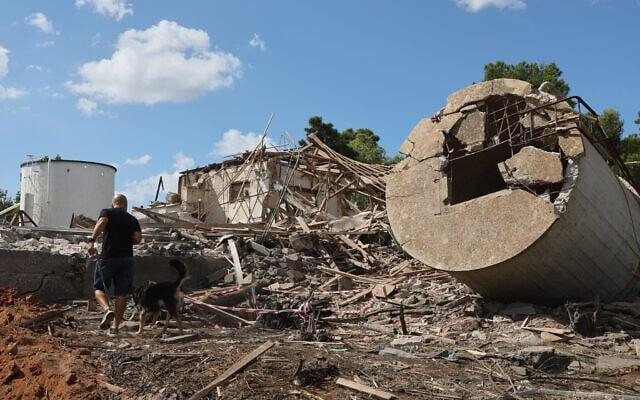

## Claim
Claim: "Gallant, a retired military general and a member of Prime Minister Benjamin Netanyahu’s war cabinet, was killed in the Iranian attack on Israel on October 1, 2024."

## Actions
```
web_search("Gallant killed in Iranian attack October 1 2024")
```

## Evidence
### Evidence from `web_search`
The Times of Israel ([https://www.timesofisrael.com/after-iranian-missiles-hit-base-gallant-says-attack-didnt-even-scratch-air-force/](https://www.timesofisrael.com/after-iranian-missiles-hit-base-gallant-says-attack-didnt-even-scratch-air-force/)) published an article about an Iranian missile attack on Israel on October 1, 2024, mentioning Defense Minister Yoav Gallant's statement about the attack. , 

Yahoo News ([https://www.yahoo.com/news/israeli-defense-minister-yoav-gallant-170813925.html](https://www.yahoo.com/news/israeli-defense-minister-yoav-gallant-170813925.html)), published by USA TODAY, states that the claim "Israeli Defense Minister Yoav Gallant killed during Iranian missile attack" is false.  The Guardian ([https://www.theguardian.com/world/2024/nov/05/benjamin-netanyahu-fires-israeli-defence-minister-yoav-gallant](https://www.theguardian.com/world/2024/nov/05/benjamin-netanyahu-fires-israeli-defence-minister-yoav-gallant)) reported that Benjamin Netanyahu fired Yoav Gallant on November 5, 2024. , 


## Elaboration
The evidence indicates that the claim is false. Yahoo News, published by USA TODAY, explicitly states that the claim "Israeli Defense Minister Yoav Gallant killed during Iranian missile attack" is false ([https://www.yahoo.com/news/israeli-defense-minister-yoav-gallant-170813925.html](https://www.yahoo.com/news/israeli-defense-minister-yoav-gallant-170813925.html)). Furthermore, The Guardian reported that Gallant was fired on November 5, 2024 ([https://www.theguardian.com/world/2024/nov/05/benjamin-netanyahu-fires-israeli-defence-minister-yoav-gallant](https://www.theguardian.com/world/2024/nov/05/benjamin-netanyahu-fires-israeli-defence-minister-yoav-gallant)), which would not be possible if he had been killed in an attack on October 1, 2024.


## Final Judgement
The evidence from multiple reliable sources, including Yahoo News and The Guardian, contradicts the claim that Gallant was killed in the Iranian attack. Yahoo News explicitly states the claim is false, and The Guardian reports Gallant was fired after the alleged attack date.

`false`

### Verdict: FALSE

### Justification
The claim is false. Evidence from sources like Yahoo News ([https://www.yahoo.com/news/israeli-defense-minister-yoav-gallant-170813925.html](https://www.yahoo.com/news/israeli-defense-minister-yoav-gallant-170813925.html)) explicitly states the claim is false, and The Guardian ([https://www.theguardian.com/world/2024/nov/05/benjamin-netanyahu-fires-israeli-defence-minister-yoav-gallant](https://www.theguardian.com/world/2024/nov/05/benjamin-netanyahu-fires-israeli-defence-minister-yoav-gallant)) reported that Gallant was fired after the alleged attack date.
