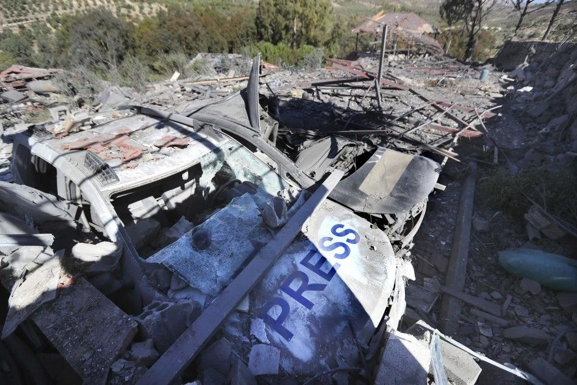

## Claim
Claim: " This image shows an Israeli helicopter shot down by Hezbollah amid clashes in Southern Lebanon on November 23, 2024."

## Actions
```
image_search("Israeli helicopter shot down Lebanon November 2024")
```

## Evidence
### Evidence from `image_search`
ABC News published an article about Hezbollah drone attacks, which includes an image of an Israeli helicopter (). Human Rights Watch published an article on November 25, 2024, about an Israeli strike in Lebanon (). CNN published an article about the conflict between Israel and Hezbollah, which includes an image of an Israeli helicopter ().

The articles can be found at the following URLs: [https://www.abc.net.au/news/2024-10-14/hezbollah-drone-attack-kills-four-israeli-soldiers/104469176](https://www.abc.net.au/news/2024-10-14/hezbollah-drone-attack-kills-four-israeli-soldiers/104469176), [https://www.hrw.org/news/2024/11/25/lebanon-us-arms-used-israeli-strike-journalists](https://www.hrw.org/news/2024/11/25/lebanon-us-arms-used-israeli-strike-journalists), and [https://www.cnn.com/2024/12/03/middleeast/israel-threatens-hezbollah-lebanon-ceasefire-intl](https://www.cnn.com/2024/12/03/middleeast/israel-threatens-hezbollah-lebanon-ceasefire-intl).


## Elaboration
The evidence includes articles from ABC News, Human Rights Watch, and CNN, all discussing the conflict between Israel and Hezbollah. However, none of the provided articles or images confirm that an Israeli helicopter was shot down by Hezbollah on November 23, 2024. The evidence does show images of Israeli helicopters, but not in the context of being shot down.

The claim's veracity cannot be determined with the provided evidence. Additional information is needed to verify the claim, such as reports or images specifically documenting the alleged incident.


## Final Judgement
The search results provide articles about the conflict between Israel and Hezbollah, including images of Israeli helicopters. However, none of the provided evidence confirms that an Israeli helicopter was shot down by Hezbollah on November 23, 2024.

The claim is not supported by the provided evidence. There is no information to confirm the event described in the claim.

`false`

### Verdict: FALSE

### Justification
The claim is not supported by the provided evidence. While the search results from ABC News, Human Rights Watch, and CNN ([https://www.abc.net.au/news/2024-10-14/hezbollah-drone-attack-kills-four-israeli-soldiers/104469176](https://www.abc.net.au/news/2024-10-14/hezbollah-drone-attack-kills-four-israeli-soldiers/104469176), [https://www.hrw.org/news/2024/11/25/lebanon-us-arms-used-israeli-strike-journalists](https://www.hrw.org/news/2024/11/25/lebanon-us-arms-used-israeli-strike-journalists), and [https://www.cnn.com/2024/12/03/middleeast/israel-threatens-hezbollah-lebanon-ceasefire-intl](https://www.cnn.com/2024/12/03/middleeast/israel-threatens-hezbollah-lebanon-ceasefire-intl)) discuss the conflict between Israel and Hezbollah and include images of Israeli helicopters, none of them confirm that an Israeli helicopter was shot down by Hezbollah on November 23, 2024.
