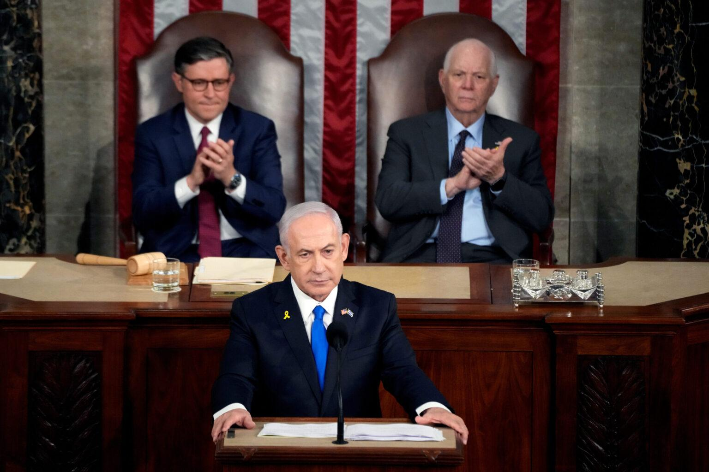

## Claim
Claim: "President Donald Trump posted on Truth Social on July 25, 2024, as a reaction to the attempted assasination of him on July 13, 2024, 'I hope that America obliterates Israel.'"

## Actions
```
web_search("Donald Trump Truth Social July 25 2024 Israel")
web_search("Donald Trump attempted assassination July 13 2024")
```

## Evidence
### Evidence from `web_search`
On July 26, 2024, CNN ([https://www.cnn.com/2024/07/26/politics/trump-netanyahu-meeting-mar-a-lago](https://www.cnn.com/2024/07/26/politics/trump-netanyahu-meeting-mar-a-lago)) reported on a meeting between Donald Trump and Benjamin Netanyahu at Mar-a-Lago, mentioning Trump's Truth Social posts about the meeting and an assassination attempt on Trump . The Voice of America ([https://www.voanews.com/a/harris-trump-condemn-pro-hamas-protest-near-us-capitol/7713095.html](https://www.voanews.com/a/harris-trump-condemn-pro-hamas-protest-near-us-capitol/7713095.html)) reported on July 25, 2024, that Trump posted on Truth Social, condemning pro-Hamas protests .

The Tennessee Lookout ([https://tennesseelookout.com/2024/07/25/in-capitol-address-israeli-leader-calls-for-u-s-backing-to-defeat-hamas/](https://tennesseelookout.com/2024/07/25/in-capitol-address-israeli-leader-calls-for-u-s-backing-to-defeat-hamas/)) reported on July 25, 2024, that Trump said on Truth Social he would welcome Netanyahu to Mar-a-Lago .


### Evidence from `web_search`
On July 13, 2024, an attempted assassination of Donald Trump occurred at a rally in Butler, Pennsylvania. The shooter, Thomas Matthew Crooks, was killed by Secret Service agents. Trump was shot in the ear and was rushed off stage. President Biden urged people to let the FBI investigate. Trump posted on Truth Social that he is going to Milwaukee, Wisconsin, on Sunday as scheduled. The event is covered by CNN ([https://www.cnn.com/politics/live-news/election-biden-trump-07-13-24](https://www.cnn.com/politics/live-news/election-biden-trump-07-13-24)) and C-SPAN ([https://www.c-span.org/liveEvent/?Trump-Rally-Shooting](https://www.c-span.org/liveEvent/?Trump-Rally-Shooting)).

Wikipedia ([https://en.wikipedia.org/wiki/Attempted_assassination_of_Donald_Trump_in_Pennsylvania](https://en.wikipedia.org/wiki/Attempted_assassination_of_Donald_Trump_in_Pennsylvania)) also discusses the event, mentioning the date, location, and perpetrator. The Secret Service faced criticism. The event occurred during Trump's campaign for the 2024 presidential election.


## Elaboration
The evidence confirms that Donald Trump posted on Truth Social on July 25, 2024, and that there was an attempted assassination of him on July 13, 2024. However, the provided evidence does not contain any information about Trump posting "I hope that America obliterates Israel" on Truth Social.

Therefore, the claim cannot be verified based on the provided evidence.


## Final Judgement
The search results confirm that Donald Trump posted on Truth Social on July 25, 2024, and that there was an attempted assassination of him on July 13, 2024. However, the evidence does not contain any information about Trump posting "I hope that America obliterates Israel" on Truth Social.

The claim is `false`.

### Verdict: FALSE

### Justification
The claim is false. While Donald Trump did post on Truth Social on July 25, 2024, and there was an attempted assassination of him on July 13, 2024, the provided evidence from sources like [CNN](https://www.cnn.com/2024/07/26/politics/trump-netanyahu-meeting-mar-a-lago) and [The Voice of America](https://www.voanews.com/a/harris-trump-condemn-pro-hamas-protest-near-us-capitol/7713095.html) does not support the statement "I hope that America obliterates Israel."
