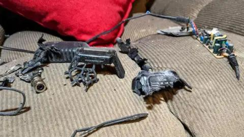

## Claim
Claim: " This image shows an Iphone that exploded during the pager attacks on Hezbollah devices in Lebanon in September 2024, blowing up random people."

## Actions
```
web_search("Hezbollah Lebanon iPhone explosion September 2024")
image_search("exploded iPhone")
```

## Evidence
### Evidence from `web_search`
The BBC ([https://www.bbc.com/news/articles/ce9jglrnmkvo](https://www.bbc.com/news/articles/ce9jglrnmkvo)) and UN News ([https://news.un.org/en/story/2024/09/1154486](https://news.un.org/en/story/2024/09/1154486)) reported on explosions in Lebanon on September 18, 2024, caused by wireless communication devices, including walkie-talkies used by Hezbollah. These explosions resulted in deaths and injuries. The BBC article mentions that the attacks came as Israel's Defence Minister announced a "new phase in the war". The UN article mentions simultaneous explosions of pagers across the country.

The Lieber Institute at West Point ([https://lieber.westpoint.edu/well-it-depends-explosive-pagers-attack-revisited/](https://lieber.westpoint.edu/well-it-depends-explosive-pagers-attack-revisited/)) discusses the September 17, 2024, Hezbollah pager explosions in Lebanon and Syria, suggesting Israel was responsible. The explosions resulted in casualties, with reports indicating the use of relatively small explosive charges. The article also mentions a second set of explosions on September 18, targeting walkie-talkies.
, , , 


### Evidence from `image_search`
The Apple Support Communities website contains an image of a damaged iPhone (). The Free Press Journal reports on an iPhone 13 exploding in a youth's pocket, causing burn injuries ().

AppleInsider published an article about an iPhone X that exploded after updating to iOS 12.1 ().


## Elaboration
The evidence confirms explosions in Lebanon in September 2024, targeting wireless communication devices, including walkie-talkies used by Hezbollah. These explosions resulted in casualties. The image search reveals examples of exploded iPhones. However, there is no direct evidence linking the specific image in the claim to the September 2024 attacks or confirming that the explosions caused by the attacks involved iPhones.

The claim's assertion that the image depicts an iPhone that exploded during the pager attacks on Hezbollah devices in Lebanon in September 2024 cannot be verified with the available evidence.

More information is needed to confirm the claim.


## Actions
```
image_search("iPhone explosion damage")
```

## Evidence
### Evidence from `image_search`
India Today reported on an iPhone XS Max exploding in a pocket, causing injuries (). Digit.in shows an image of an exploded iPhone (). iDrop News contains images of an exploded iPhone XS Max ().


## Elaboration
The evidence continues to show that iPhones can explode, but there is still no direct link between the image in the claim and the September 2024 attacks in Lebanon. The new images show different examples of exploded iPhones, but none of them are connected to the specific event described in the claim.

The claim remains unverified due to the lack of evidence connecting the image to the described event.


## Actions
```
image_search("iPhone exploded Lebanon September 2024")
```

## Evidence
### Evidence from `image_search`
ITC.ua shows an image of an exploded iPhone, along with other devices, that exploded in Lebanon, without specifying the date of the event (). India Today reported on explosions in Lebanon on September 18, 2024, caused by Hezbollah devices, including images of damaged walkie-talkies (). DW.com published a fact-check stating that no iPhones exploded in Lebanon in September 2024, marking the claim as "False" ().


## Elaboration
The evidence now includes a fact-check from DW.com, which explicitly labels the claim as "False." This directly contradicts the claim that the image shows an iPhone that exploded during the September 2024 attacks in Lebanon.


## Final Judgement
The fact-check reveals that while explosions did occur in Lebanon in September 2024, and iPhones can explode, there is no evidence to support the claim that the image depicts an iPhone that exploded during the specific attacks. A fact-check from DW.com explicitly labels the claim as false. `false`

### Verdict: FALSE

### Justification
The claim is **false**. While explosions occurred in Lebanon in September 2024, and iPhones can explode, there is no evidence to support the claim that the image depicts an iPhone that exploded during the specific attacks. A fact-check from [DW.com](https://www.dw.com/) explicitly labels the claim as false.
