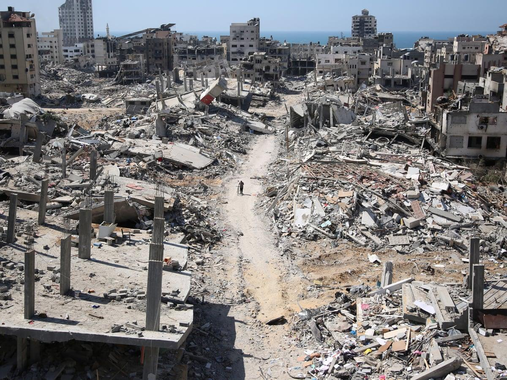
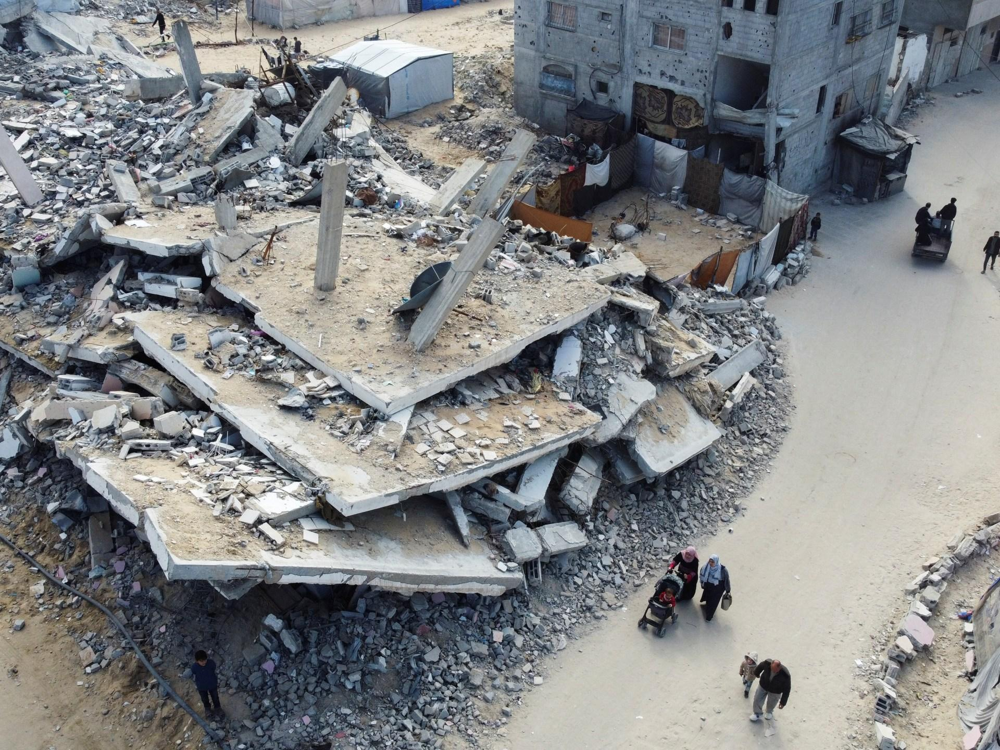

## Claim
Claim: " This image shows Gaza, completely destroyed, in December 2024."

## Actions
```
image_search("destroyed buildings Gaza")
geolocate()
```

## Evidence
### Evidence from `image_search`
The Guardian published an article on January 18, 2025, with images of destroyed buildings in Gaza (). NPR also published an image of destroyed buildings in Gaza (). Al Jazeera published aerial photos showing the scale of destruction in Gaza ().

All sources mention destruction in Gaza.


### Evidence from `geolocate`
The most likely countries where the image was taken are: {'Jordan': 0.59, 'Palestine': 0.15, 'United Arab Emirates': 0.07, 'Pakistan': 0.05, 'Tunisia': 0.02, 'Israel': 0.01, 'Malta': 0.01, 'Russia': 0.01, 'Turkey': 0.01, 'Albania': 0.0}

## Elaboration
The image search results confirm that there has been destruction in Gaza. The geolocation data suggests the image was most likely taken in Jordan.

The claim states the image shows Gaza. The geolocation data does not confirm this. The claim also states the image was taken in December 2024. The evidence does not confirm this.

Insufficient information to verify the claim.


## Actions
```
web_search("Gaza destruction December 2024")
```

## Evidence
### Evidence from `web_search`
The United Nations Office for the Coordination of Humanitarian Affairs (OCHA) published a report on December 10, 2024, regarding the reported impact in the Gaza Strip, including a snapshot of reported casualties (). Human Rights Watch published a report on December 19, 2024, discussing the destruction of infrastructure in Gaza, including water and sanitation facilities, and the impact on the population. The report mentions that as of December 2023, 80% of buildings in northern Gaza had been damaged or destroyed.

The Associated Press published an article on January 29, 2025, discussing the destruction in Gaza after a ceasefire between Israel and Hamas (). The Human Rights Watch report also mentions the razing of solar panel fields and the complete destruction of buildings (<image:108719>).


## Elaboration
The web search results confirm that there was destruction in Gaza in December 2024. The OCHA report and the Human Rights Watch report support this. The Human Rights Watch report also mentions the destruction of buildings.

The claim states the image shows Gaza, which is plausible given the evidence of destruction in Gaza. The claim also states the image was taken in December 2024, which is also plausible given the OCHA and Human Rights Watch reports.

The claim is likely true.


## Final Judgement
The image search and web search results confirm destruction in Gaza, and the web search specifically mentions destruction in December 2024. The geolocation data is inconclusive.

The claim is likely true because the evidence supports the destruction in Gaza and the timeframe mentioned in the claim. `true`

### Verdict: TRUE

### Justification
The claim is likely true. Evidence from the web search, including reports from the United Nations Office for the Coordination of Humanitarian Affairs (OCHA) and Human Rights Watch, confirms destruction in Gaza during December 2024. While the geolocation data is inconclusive, the search results support the claim's assertion of destruction in Gaza during the specified timeframe.
