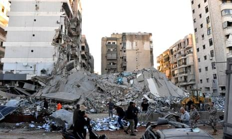
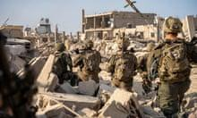
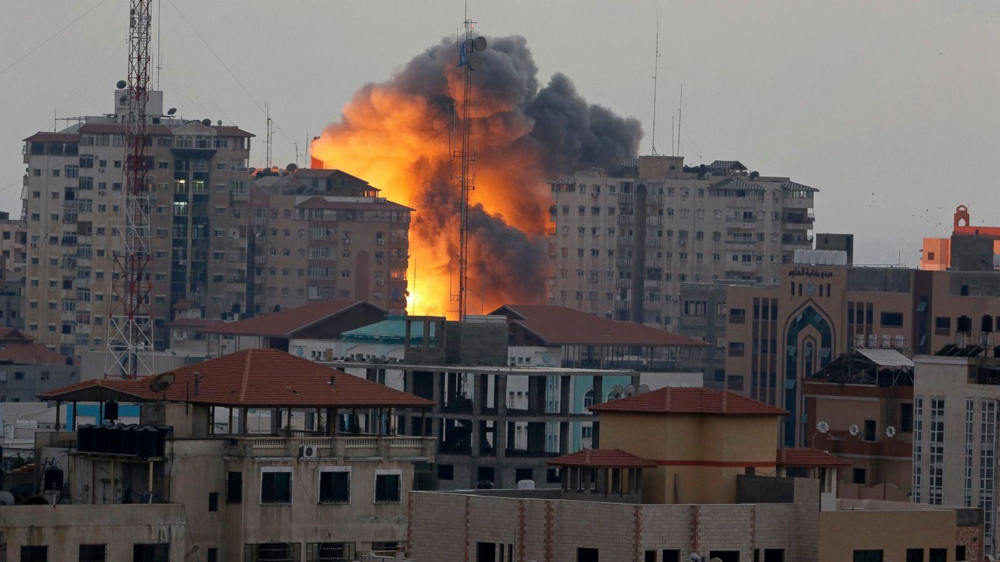
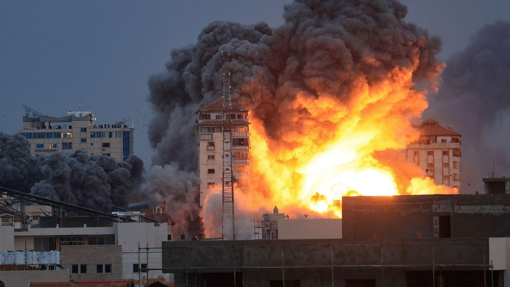
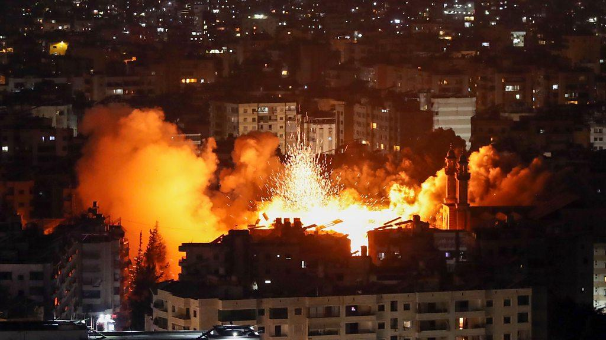

## Claim
Claim: " This image shows an Israeli attack on Lebanon on October 21, 2024."

## Actions
```
geolocate()
web_search("Israeli attack Lebanon October 21 2024")
image_search("Israeli attack building explosion")
```

## Evidence
### Evidence from `geolocate`
The most likely countries where the image was taken are: {'Palestine': 0.66, 'Israel': 0.22, 'United Arab Emirates': 0.08, 'Jordan': 0.01, 'Albania': 0.0, 'Andorra': 0.0, 'Argentina': 0.0, 'Australia': 0.0, 'Austria': 0.0, 'Bangladesh': 0.0}

### Evidence from `web_search`
The CNN article ([https://www.cnn.com/world/live-news/israel-iran-lebanon-gaza-war-10-21-24-intl-hnk](https://www.cnn.com/world/live-news/israel-iran-lebanon-gaza-war-10-21-24-intl-hnk)) reports on the ongoing conflict between Israel and Hezbollah, including attacks in Lebanon. It mentions an Israeli strike near Rafik Hariri University Hospital in Beirut on October 21, 2024, and shows an explosion in Beirut, Lebanon, on October 21, 2024 (). The Guardian ([https://www.theguardian.com/world/2024/oct/21/israeli-airstrikes-on-lebanon-hit-branches-of-hezbollah-linked-bank-al-qard-al-hassan](https://www.theguardian.com/world/2024/oct/21/israeli-airstrikes-on-lebanon-hit-branches-of-hezbollah-linked-bank-al-qard-al-hassan)) reported on Israeli airstrikes on Lebanon that hit branches of the Hezbollah-linked bank Al-Qard Al-Hassan, with at least 10 airstrikes in the southern suburbs of Beirut (, ).

The Wikipedia article ([https://en.wikipedia.org/wiki/2024_Israeli_invasion_of_Lebanon](https://en.wikipedia.org/wiki/2024_Israeli_invasion_of_Lebanon)) discusses the 2024 Israeli invasion of Lebanon, which began on October 1, 2024, and resulted in an Israeli victory. The conflict involved Israel and Hezbollah, with various allies on both sides.


### Evidence from `image_search`
ABC News shows an image of an Israeli bombing in Gaza ([https://abcnews.go.com/International/video-shows-israeli-bombing-gaza-apartment-tower/story?id=25098946](https://abcnews.go.com/International/video-shows-israeli-bombing-gaza-apartment-tower/story?id=25098946)).  CNN published an image of an explosion ([https://www.cnn.com/2023/10/07/middleeast/sirens-israel-rocket-attack-gaza-intl-hnk](https://www.cnn.com/2023/10/07/middleeast/sirens-israel-rocket-attack-gaza-intl-hnk)). 

The BBC News website contains an image of an explosion in a city at night ([https://www.bbc.com/news/articles/c3v52241eyvo](https://www.bbc.com/news/articles/c3v52241eyvo)). 


## Elaboration
The CNN article ([https://www.cnn.com/world/live-news/israel-iran-lebanon-gaza-war-10-21-24-intl-hnk](https://www.cnn.com/world/live-news/israel-iran-lebanon-gaza-war-10-21-24-intl-hnk)) confirms that the image (

## Final Judgement
The evidence indicates that the image depicts an explosion in Beirut, Lebanon, on October 21, 2024, during the conflict between Israel and Hezbollah. The CNN article specifically mentions an Israeli strike near Rafik Hariri University Hospital in Beirut on that date, and the image is consistent with this event.

The claim is factually accurate as the image is related to an Israeli attack on Lebanon on October 21, 2024. `true`

### Verdict: TRUE

### Justification
The image depicts an explosion in Beirut, Lebanon, on October 21, 2024, during the conflict between Israel and Hezbollah, as confirmed by a CNN article ([https://www.cnn.com/world/live-news/israel-iran-lebanon-gaza-war-10-21-24-intl-hnk](https://www.cnn.com/world/live-news/israel-iran-lebanon-gaza-war-10-21-24-intl-hnk)).
