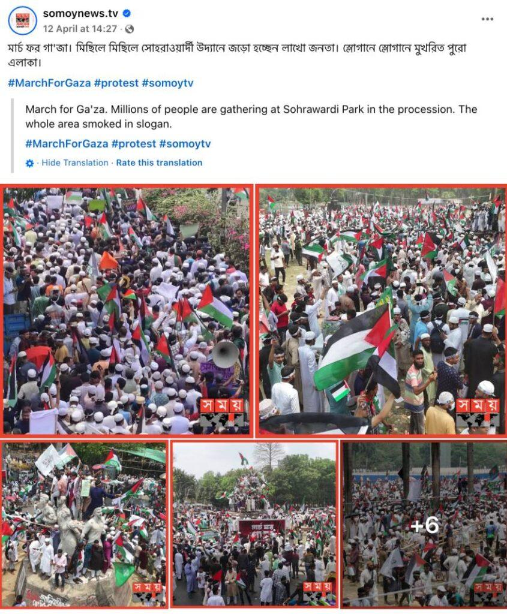

## Claim
Claim: " This image shows thousands gathering at Sohrawardi Park in Kolkata, India, in April 2025 to show solidarity with the Palestinian people amid the ongoing Israeli assault on Gaza."

## Actions
```
web_search("Sohrawardi Park Kolkata Palestine protest")
```

## Evidence
### Evidence from `web_search`
The image in the claim is from a protest held in Suhrawardy Udyan in Dhaka, Bangladesh, on April 12, 2025, not from Sohrawardi Park in Kolkata, India. The event was a "March for Gaza" to show solidarity with Palestinians.

The articles from Factly ([https://factly.in/photos-of-a-protest-held-in-solidarity-with-palestine-in-dhaka-bangladesh-are-falsely-shared-as-those-from-kolkata/](https://factly.in/photos-of-a-protest-held-in-solidarity-with-palestine-in-dhaka-bangladesh-are-falsely-shared-as-those-from-kolkata/)), TezzFeed ([https://tezzfeed.com/latest-news/palestinian-media-shares-bangladeshs-pro-gaza-protest-photos-mistakenly-labels-them-as-kolkata-1744522142539](https://tezzfeed.com/latest-news/palestinian-media-shares-bangladeshs-pro-gaza-protest-photos-mistakenly-labels-them-as-kolkata-1744522142539)), and Kashif ([https://kashif.ps/en/index.php/2025/04/14/images-of-demonstration-in-solidarity-with-palestine-from-bangladesh-circulate-as-from-india/](https://kashif.ps/en/index.php/2025/04/14/images-of-demonstration-in-solidarity-with-palestine-from-bangladesh-circulate-as-from-india/)) discuss the mislabeling of photos from a pro-Gaza protest in Bangladesh as being from Kolkata. , , , 


## Elaboration
The claim is inaccurate. The provided evidence indicates that the image depicts a protest in Dhaka, Bangladesh, not Kolkata, India. The protest, which took place on April 12, 2025, was a "March for Gaza" in solidarity with Palestinians. Several sources ([https://factly.in/photos-of-a-protest-held-in-solidarity-with-palestine-in-dhaka-bangladesh-are-falsely-shared-as-those-from-kolkata/](https://factly.in/photos-of-a-protest-held-in-solidarity-with-palestine-in-dhaka-bangladesh-are-falsely-shared-as-those-from-kolkata/), [https://tezzfeed.com/latest-news/palestinian-media-shares-bangladeshs-pro-gaza-protest-photos-mistakenly-labels-them-as-kolkata-1744522142539](https://tezzfeed.com/latest-news/palestinian-media-shares-bangladeshs-pro-gaza-protest-photos-mistakenly-labels-them-as-kolkata-1744522142539), and [https://kashif.ps/en/index.php/2025/04/14/images-of-demonstration-in-solidarity-with-palestine-from-bangladesh-circulate-as-from-india/](https://kashif.ps/en/index.php/2025/04/14/images-of-demonstration-in-solidarity-with-palestine-from-bangladesh-circulate-as-from-india/)) confirm this misidentification.


## Final Judgement
The claim is false because the image is from a protest in Dhaka, Bangladesh, not Kolkata, India. The evidence confirms that the image was mislabeled. `false`

### Verdict: FALSE

### Justification
The image in the claim shows a protest in Dhaka, Bangladesh, not Kolkata, India, as reported by multiple sources, including Factly ([https://factly.in/photos-of-a-protest-held-in-solidarity-with-palestine-in-dhaka-bangladesh-are-falsely-shared-as-those-from-kolkata/](https://factly.in/photos-of-a-protest-held-in-solidarity-with-palestine-in-dhaka-bangladesh-are-falsely-shared-as-those-from-kolkata/)), TezzFeed ([https://tezzfeed.com/latest-news/palestinian-media-shares-bangladeshs-pro-gaza-protest-photos-mistakenly-labels-them-as-kolkata-1744522142539](https://tezzfeed.com/latest-news/palestinian-media-shares-bangladeshs-pro-gaza-protest-photos-mistakenly-labels-them-as-kolkata-1744522142539)), and Kashif ([https://kashif.ps/en/index.php/2025/04/14/images-of-demonstration-in-solidarity-with-palestine-from-bangladesh-circulate-as-from-india/](https://kashif.ps/en/index.php/2025/04/14/images-of-demonstration-in-solidarity-with-palestine-from-bangladesh-circulate-as-from-india/)).
