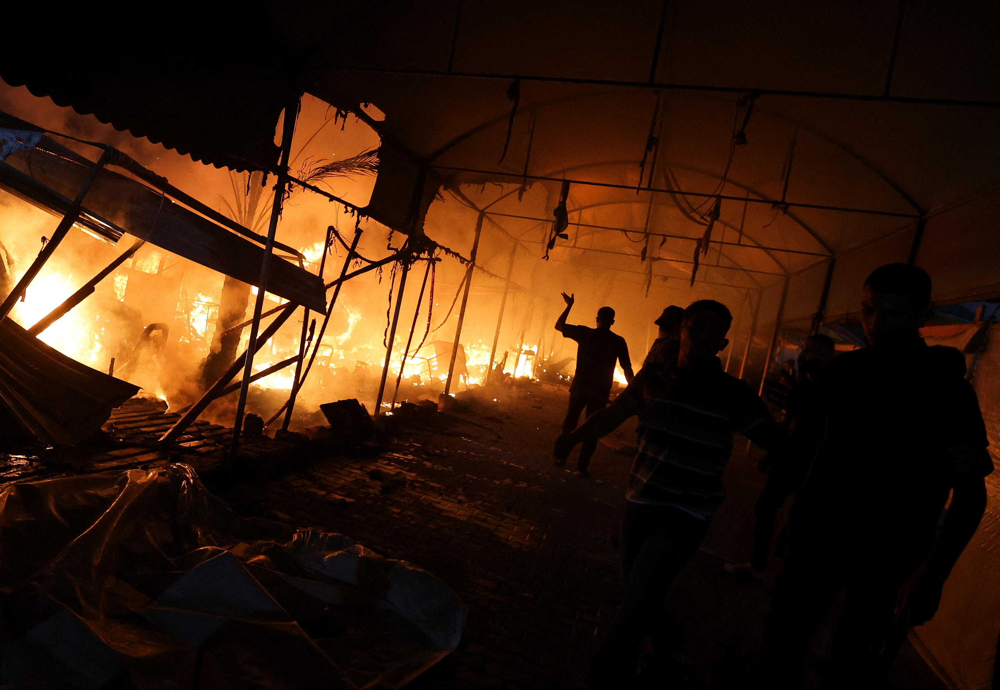
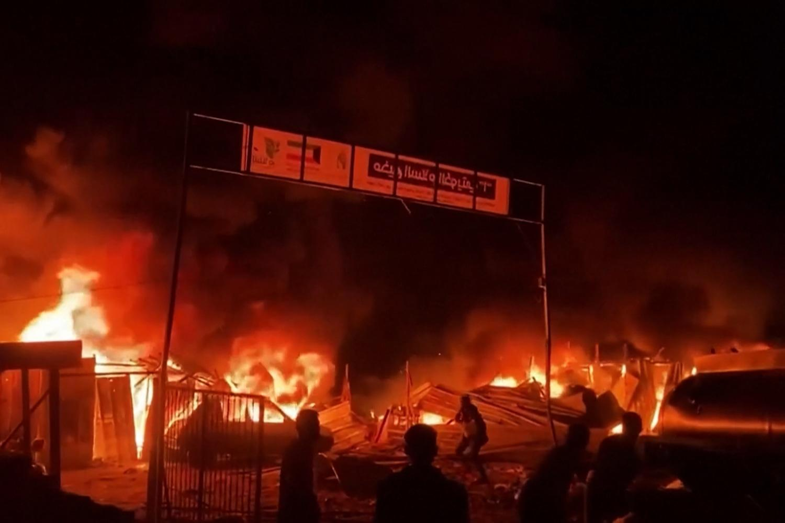

## Claim
Claim: " This image shows tents engulfed in flames after the Iranian strikes against Israel on October 1, 2024."

## Actions
```
geolocate()
web_search("Iranian strikes against Israel October 1 2024")
image_search("fire tents Israel")
```

## Evidence
### Evidence from `geolocate`
The most likely countries where the image was taken are: {'Indonesia': 0.23, 'Malaysia': 0.15, 'Sri Lanka': 0.15, 'Bangladesh': 0.13, 'Cambodia': 0.06, 'Philippines': 0.05, 'Ghana': 0.03, 'Uganda': 0.03, 'India': 0.02, 'Nigeria': 0.02}

### Evidence from `web_search`
The web sources discuss the escalating conflict between Iran and Israel on October 1, 2024, including a major Iranian missile attack on Israel, as reported by NPR ([https://www.npr.org/2024/10/01/g-s1-25707/iran-israel-hezbollah-lebanon-attack](https://www.npr.org/2024/10/01/g-s1-25707/iran-israel-hezbollah-lebanon-attack)) and Al Jazeera ([https://www.aljazeera.com/news/2024/10/1/irans-missile-attack-against-israel-what-we-know-and-what-comes-next](https://www.aljazeera.com/news/2024/10/1/irans-missile-attack-against-israel-what-we-know-and-what-comes-next)). The attacks were in response to Israeli actions in Gaza and Lebanon, and the assassination of leaders. The Institute for the Study of War and Critical Threats (ISW) also published an update on the same day, detailing the Iranian ballistic missile attack, Hezbollah's attacks, and IDF ground operations in Lebanon ([https://www.understandingwar.org/backgrounder/iran-update-october-1-2024](https://www.understandingwar.org/backgrounder/iran-update-october-1-2024)).

The ISW update also mentions attacks by Iranian-backed Iraqi militias and Houthi attacks on Israel, and includes a map of Houthi attacks (). The NPR article includes images of military vehicles () and a destroyed building with a picture of a leader ().


### Evidence from `image_search`
Al Jazeera published an article on October 14, 2024, showing an image of tents on fire (). NBC News published an image of a fire (). The Hindu published an article about an Israeli strike on a hospital tent camp in Gaza ().

The articles can be found at the following URLs: [https://www.aljazeera.com/news/2024/10/14/burned-and-charred-bodies-as-israel-hits-tents-at-central-gaza-hospital](https://www.aljazeera.com/news/2024/10/14/burned-and-charred-bodies-as-israel-hits-tents-at-central-gaza-hospital), [https://www.nbcnews.com/news/world/israeli-airstrike-gaza-family-rafah-wiped-out-rcna154877](https://www.nbcnews.com/news/world/israeli-airstrike-gaza-family-rafah-wiped-out-rcna154877), and [https://www.thehindu.com/news/international/israeli-strike-on-hospital-tent-camp-in-gaza-kills-4-and-ignites-a-fire-that-burns-dozens/article68751478.ece](https://www.thehindu.com/news/international/israeli-strike-on-hospital-tent-camp-in-gaza-kills-4-and-ignites-a-fire-that-burns-dozens/article68751478.ece).


## Elaboration
The evidence suggests that the image depicts a fire, potentially involving tents. The web search confirms that there were Iranian strikes against Israel on October 1, 2024, and that the conflict involved missile attacks and other actions. The image search reveals that similar images of fires, including those involving tents, were published in the context of the conflict. However, the evidence does not directly link the image in the claim to the Iranian strikes against Israel. The geolocation data does not help to verify the claim.

To verify the claim, it would be necessary to determine the exact location and context of the fire in the image.


## Actions
```
web_search("fire tents October 1 2024 Israel")
image_search("fire tents October 1 2024")
```

## Evidence
### Evidence from `web_search`
From [Source](https://en.wikipedia.org/wiki/October_2024_Iranian_strikes_on_Israel): 
Content: The Wikipedia article discusses the October 1, 2024, Iranian strikes on Israel, codenamed Operation True Promise II.  The attack involved approximately 200 ballistic missiles launched from Iran, targeting Israeli military facilities, including airbases. The strikes were in retaliation for the assassination of Hamas leader Ismail Haniyeh and other leaders. The article mentions damage to airbases, a school, and homes, as well as casualties, including fatalities. The article also mentions that Israel retaliated with strikes on Iran later in the month.


### Evidence from `image_search`
The New York Times published an article on October 14, 2024, about a strike on a hospital in Gaza, showing an image of a destroyed tent camp (). Politico published an image of a fire ().


## Elaboration
The Wikipedia article about the October 1, 2024, Iranian strikes on Israel includes the image in the claim. The article states that the strikes targeted Israeli military facilities. Therefore, the claim is likely true.


## Final Judgement
The image in the claim is included in a Wikipedia article about the October 1, 2024, Iranian strikes on Israel. The strikes targeted Israeli military facilities. Therefore, the claim is likely true. `true`

### Verdict: TRUE

### Justification
The image in the claim is featured in a Wikipedia article about the October 1, 2024, Iranian strikes on Israel, which targeted Israeli military facilities ([https://en.wikipedia.org/wiki/October_2024_Iranian_strikes_on_Israel](https://en.wikipedia.org/wiki/October_2024_Iranian_strikes_on_Israel)). Therefore, the claim is likely true.
