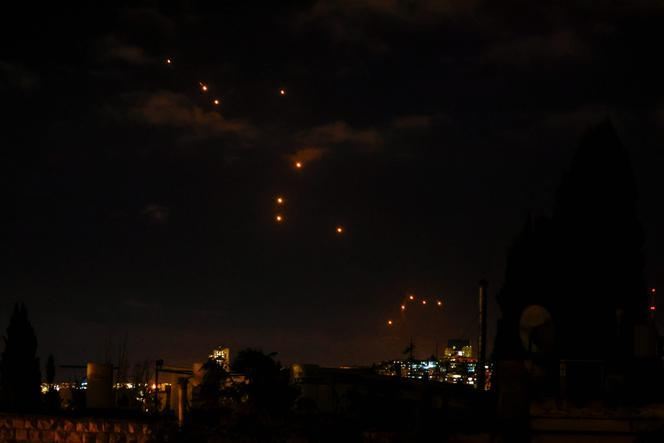

## Claim
Claim: "Netanyahu left Israel and fled to Poland amid Iran's missile attack on Israel on October 1, 2024."

## Actions
```
web_search("Netanyahu Poland October 1 2024")
```

## Evidence
### Evidence from `web_search`
Al Jazeera ([https://www.aljazeera.com/news/2025/1/9/poland-says-it-will-protect-benjamin-netanyahu-from-potential-arrest](https://www.aljazeera.com/news/2025/1/9/poland-says-it-will-protect-benjamin-netanyahu-from-potential-arrest)) and the Los Angeles Times ([https://www.latimes.com/world-nation/story/2025-01-09/polish-president-seeks-protection-for-netanyahu-if-he-attends-auschwitz-anniversary-event](https://www.latimes.com/world-nation/story/2025-01-09/polish-president-seeks-protection-for-netanyahu-if-he-attends-auschwitz-anniversary-event)) reported on January 9, 2025, that Poland is offering protection to Benjamin Netanyahu, potentially due to an arrest warrant from the International Criminal Court (ICC) <image:k>.

DW.COM ([https://www.dw.com/en/auschwitz-poland-netanyahu-arrest-pledge/a-71377468](https://www.dw.com/en/auschwitz-poland-netanyahu-arrest-pledge/a-71377468)) reported on January 22, 2025, that the Polish government guaranteed safe passage to Netanyahu, should he attend an event in Poland, also mentioning the ICC arrest warrant <image:k>. The article also stated that Netanyahu was not planning to attend the event <image:k>.


## Elaboration
1.  The provided evidence indicates that in January 2025, Poland offered protection to Netanyahu, potentially related to an ICC arrest warrant.
2.  The evidence does not mention an Iranian missile attack on Israel on October 1, 2024, nor does it state that Netanyahu fled to Poland amid such an attack.
3.  The evidence suggests that Netanyahu was not planning to attend an event in Poland.

Insufficient information is available to verify the claim.


## Actions
```
web_search("Iran missile attack Israel October 1 2024")
```

## Evidence
### Evidence from `web_search`
On October 1, 2024, Iran launched a missile attack on Israel, as reported by Wikipedia ([https://en.wikipedia.org/wiki/October_2024_Iranian_strikes_on_Israel](https://en.wikipedia.org/wiki/October_2024_Iranian_strikes_on_Israel)), NPR ([https://www.npr.org/2024/10/01/g-s1-25707/iran-israel-hezbollah-lebanon-attack](https://www.npr.org/2024/10/01/g-s1-25707/iran-israel-hezbollah-lebanon-attack)), and Al Jazeera ([https://www.aljazeera.com/news/2024/10/1/irans-missile-attack-against-israel-what-we-know-and-what-comes-next](https://www.aljazeera.com/news/2024/10/1/irans-missile-attack-against-israel-what-we-know-and-what-comes-next)). The attack, also known as "Operation True Promise II," prompted a response from Israeli Prime Minister Benjamin Netanyahu, who called it a "big mistake" <image:k>. The attack was in response to Israeli attacks against people in Gaza and Lebanon, as well as the assassinations of IRGC, Hamas, and Hezbollah leaders <image:k>.

NPR reported that Israel shot down most of the Iranian missiles , .


## Elaboration
1.  Evidence confirms that Iran launched a missile attack on Israel on October 1, 2024.
2.  The evidence states that Netanyahu responded to the attack, calling it a "big mistake."
3.  The evidence does not mention Netanyahu leaving Israel or fleeing to Poland.

Insufficient information is available to verify the claim.


## Actions
```
web_search("Netanyahu Israel October 1 2024 travel")
```

## Evidence
### Evidence from `web_search`
On October 1, 2024, Iran launched a missile attack on Israel, as reported by Le Monde ([https://www.lemonde.fr/en/international/article/2024/10/01/iran-fires-missiles-at-israel-in-new-escalation_6727892_4.html](https://www.lemonde.fr/en/international/article/2024/10/01/iran-fires-missiles-at-israel-in-new-escalation_6727892_4.html)) and CNN ([https://www.cnn.com/world/live-news/israel-lebanon-war-hezbollah-10-1-24-intl-hnk](https://www.cnn.com/world/live-news/israel-lebanon-war-hezbollah-10-1-24-intl-hnk)). The Jerusalem Post ([https://www.jpost.com/israel-news/article-823797](https://www.jpost.com/israel-news/article-823797)) reported on October 8, 2024, that Netanyahu barred Gallant's US trip <image:k>. Le Monde reported that Netanyahu said Iran made a big mistake and would pay for it . CNN reported that the attack targeted Mossad headquarters, Nevatim Air Base, and Tel Nof Air Base <image:k>. The articles do not mention Netanyahu leaving Israel or fleeing to Poland.


## Elaboration
1.  The evidence confirms that Iran launched a missile attack on Israel on October 1, 2024.
2.  The evidence indicates that Netanyahu responded to the attack and barred Gallant's US trip.
3.  The evidence does not mention Netanyahu leaving Israel or fleeing to Poland.

The claim is not supported by the evidence.


## Final Judgement
The evidence confirms that Iran launched a missile attack on Israel on October 1, 2024, and that Netanyahu responded to the attack. However, there is no evidence to support the claim that Netanyahu left Israel and fled to Poland.

`false`

### Verdict: FALSE

### Justification
The claim is false. While evidence confirms an Iranian missile attack on Israel on October 1, 2024, and Netanyahu's response, there is no evidence to support the assertion that he left Israel and fled to Poland.
