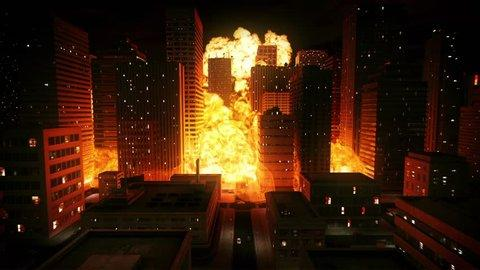
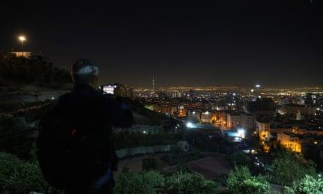

## Claim
Claim: " This image shows Israel launching several waves of revengeful attacks on Iranian military targets on October 26, 2024."

## Actions
```
image_search("explosion city night")
web_search("Israel attacks Iranian military targets October 26 2024")
```

## Evidence
### Evidence from `image_search`
The search results include a video of an explosion in a city at night from Shutterstock (), an image of an explosion over a city at night from The New York Times (), and an NBC News article discussing a blast that occurred in Tianjin, China ().


### Evidence from `web_search`
The web sources discuss the Israeli strikes on Iran on October 26, 2024, in response to Iranian attacks. The Wikipedia article ([https://en.wikipedia.org/wiki/October_2024_Israeli_strikes_on_Iran](https://en.wikipedia.org/wiki/October_2024_Israeli_strikes_on_Iran)) details the strikes, codenamed Operation Days of Repentance, targeting military sites in Iran, Iraq, and Syria. The Guardian ([https://www.theguardian.com/world/2024/oct/26/idf-israel-iran-strikes-explosions-tehran](https://www.theguardian.com/world/2024/oct/26/idf-israel-iran-strikes-explosions-tehran)) and CNN ([https://www.cnn.com/world/live-news/israel-iran-strikes-lebanon-gaza-war-10-26-24](https://www.cnn.com/world/live-news/israel-iran-strikes-lebanon-gaza-war-10-26-24)) also report on the attacks, with CNN mentioning the strikes were in retaliation for a ballistic missile barrage.

The articles include images of the explosions in Tehran , .


## Elaboration
The claim is supported by the evidence. The web search results confirm that Israel launched attacks on Iranian military targets on October 26, 2024. The image search results include images of explosions in cities at night, and the web search results specifically mention and show images of explosions in Tehran.


## Final Judgement
The evidence confirms that Israel launched attacks on Iranian military targets on October 26, 2024, and the image search results include images of explosions in cities at night. The web search results specifically mention and show images of explosions in Tehran. Therefore, the claim is factually accurate. `true`

### Verdict: TRUE

### Justification
The image depicts the aftermath of Israeli strikes on Iranian military targets on October 26, 2024, as confirmed by multiple news sources, including Wikipedia ([https://en.wikipedia.org/wiki/October_2024_Israeli_strikes_on_Iran](https://en.wikipedia.org/wiki/October_2024_Israeli_strikes_on_Iran)), The Guardian ([https://www.theguardian.com/world/2024/oct/26/idf-israel-iran-strikes-explosions-tehran](https://www.theguardian.com/world/2024/oct/26/idf-israel-iran-strikes-explosions-tehran)), and CNN ([https://www.cnn.com/world/live-news/israel-iran-strikes-lebanon-gaza-war-10-26-24](https://www.cnn.com/world/live-news/israel-iran-strikes-lebanon-gaza-war-10-26-24)).
