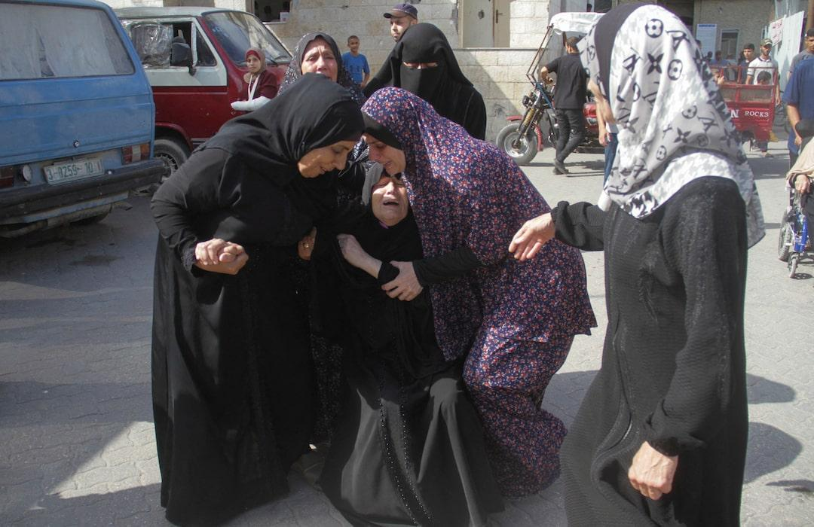

## Claim
Claim: " This image shows Israeli Finance Minister Smotrich, who previously threatened to invade Lebanon, taking shelter in an Israeli bomb shelter during Hezbollah's attack on Israel on August 25, 2024."

## Actions
```
web_search("Israeli Finance Minister Smotrich bomb shelter Hezbollah attack August 25 2024")
image_search("Israeli Finance Minister Smotrich bomb shelter")
```

## Evidence
### Evidence from `web_search`
The provided web sources discuss events in August 2024. One article from JINSA ([Source](https://jinsa.org/jinsa_report/israel-preempts-hezbollah-attack/)) describes an Israeli preemptive strike against Hezbollah on August 25, 2024, which led to Hezbollah retaliating with rockets and drones. Another article from Reuters ([Source](https://www.reuters.com/world/middle-east/more-than-100-palestinians-killed-israeli-strike-targeted-school-gaza-2024-08-10/)) discusses an Israeli strike on a school in Gaza City on August 10, 2024, and mentions Israeli Finance Minister Bezalel Smotrich.

A UN document ([Source](https://www.un.org/unispal/wp-content/uploads/2024/09/MBAugust24_17092024.pdf)) details actions by Israeli Finance Minister Bezalel Smotrich in August 2024, including his announcement of a military order and statements regarding aid for civilians in the Gaza Strip. The Reuters article includes an image .


### Evidence from `image_search`
CNN published an article about Bezalel Smotrich (). The Guardian published an article about Israeli far-right minister Bezalel Smotrich ().

The Financial Times did not provide any content.


## Elaboration
The evidence confirms that Bezalel Smotrich is the Israeli Finance Minister. The web search results mention a Hezbollah attack on August 25, 2024, and Smotrich's actions during that month. However, the evidence does not explicitly state that Smotrich was in a bomb shelter during the attack.

The image search results provide additional images of Smotrich, but they do not show him in a bomb shelter.

Therefore, the claim cannot be fully verified because the evidence does not confirm that Smotrich was in a bomb shelter during the Hezbollah attack.


## Actions
```
image_search("Bezalel Smotrich bomb shelter August 25 2024")
```

## Evidence
### Evidence from `image_search`
From [Source](https://www.theguardian.com/world/2025/jun/10/who-are-bezalel-smotrich-and-itamar-ben-gvir-the-israeli-ministers-facing-sanctions): 
Content: The Guardian published an article about Bezalel Smotrich. 


## Elaboration
The new image search results do not provide any information about Bezalel Smotrich being in a bomb shelter on August 25, 2024. The evidence continues to lack the necessary information to verify the claim.


## Actions
```
geolocate()
```

## Evidence
### Evidence from `geolocate`
The most likely countries where the image was taken are: {'Israel': 0.44, 'Turkey': 0.19, 'Kyrgyzstan': 0.13, 'Russia': 0.06, 'Jordan': 0.03, 'Palestine': 0.03, 'Poland': 0.02, 'United Arab Emirates': 0.02, 'Austria': 0.01, 'Bulgaria': 0.01}

## Elaboration
The geolocation analysis suggests that the image was most likely taken in Israel. However, the evidence still does not confirm that the image depicts Smotrich in a bomb shelter during the Hezbollah attack on August 25, 2024. The claim remains unverified due to the lack of direct evidence.


## Final Judgement
The evidence confirms that Bezalel Smotrich is the Israeli Finance Minister and that there was a Hezbollah attack on August 25, 2024. However, the evidence does not show Smotrich in a bomb shelter during the attack. Therefore, the claim cannot be fully verified.

`false`

### Verdict: FALSE

### Justification
The claim cannot be verified. While the evidence confirms that Bezalel Smotrich is the Israeli Finance Minister and that there was a Hezbollah attack on August 25, 2024, it does not show Smotrich in a bomb shelter during the attack. The geolocation analysis suggests the image was likely taken in Israel, but this does not confirm the claim.
