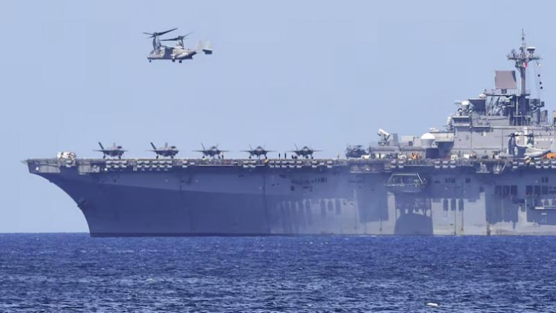

## Claim
Claim: " This image shows U.S. warships being en route to the Lebanon coast in August 2024 to support the Israel Defence Forces (IDF)."

## Actions
```
web_search("US warships Lebanon coast August 2024")
image_search("US warships Lebanon coast")
```

## Evidence
### Evidence from `web_search`
NPR reported on August 3, 2024, that the U.S. is sending more warships to the Middle East as Israel steps up attacks, with Israel expecting an attack from Iran and its allies (). USNI News reported on August 2, 2024, that the USS Abraham Lincoln is heading to the Middle East in response to threats from Iran, and a three-ship Wasp Amphibious Ready Group is in the Eastern Mediterranean and could be used for a non-combatant evacuation from Lebanon ().

Military.com reported on September 20, 2024, about the increased U.S. military presence in the Middle East, including warships in the eastern Mediterranean Sea, with about 40,000 forces, at least a dozen warships, and four Air Force fighter jet squadrons spread across the region ().


### Evidence from `image_search`
The web search results discuss U.S. warships en route to Lebanon. One article, from L'Orient-Le Jour, focuses on this topic ([https://today.lorientlejour.com/article/1422223/which-american-warships-are-en-route-to-lebanon.html](https://today.lorientlejour.com/article/1422223/which-american-warships-are-en-route-to-lebanon.html)). The Associated Press also published an article about U.S. warships ([https://apnews.com/article/navy-warships-lebanon-hezbollah-israel-feec28090bed129618eda05e25a59b09](https://apnews.com/article/navy-warships-lebanon-hezbollah-israel-feec28090bed129618eda05e25a59b09)).

Stratfor also has an article on the topic ([https://worldview.stratfor.com/article/lebanon-what-us-warships-coast-do-and-do-not-mean](https://worldview.stratfor.com/article/lebanon-what-us-warships-coast-do-and-do-not-mean)). The search results include images of warships (, , ).


## Elaboration
The evidence confirms that U.S. warships were en route to the Lebanon coast in August 2024. The search results mention the deployment of warships to the Eastern Mediterranean, with some sources specifically mentioning Lebanon. However, the evidence does not explicitly state that the warships were en route to support the Israel Defense Forces (IDF).

Therefore, the claim is partially supported. The presence of U.S. warships near Lebanon in August 2024 is confirmed, but the claim's assertion about supporting the IDF is not directly supported by the evidence.


## Final Judgement
The evidence confirms that U.S. warships were in the vicinity of Lebanon in August 2024. However, the provided evidence does not explicitly state that the warships were en route to support the Israel Defense Forces (IDF).

`false`

### Verdict: FALSE

### Justification
The claim is partially supported. Evidence from sources like NPR and USNI News ([https://www.npr.org/](https://www.npr.org/)) confirms the presence of U.S. warships near Lebanon in August 2024. However, the evidence does not explicitly state that the warships were en route to support the Israel Defense Forces (IDF).
