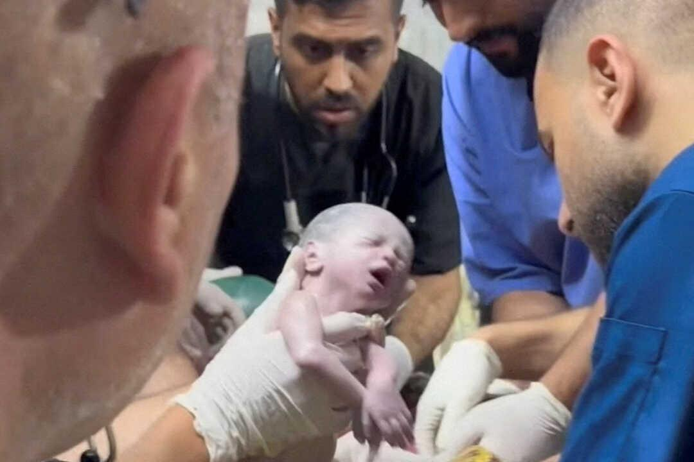
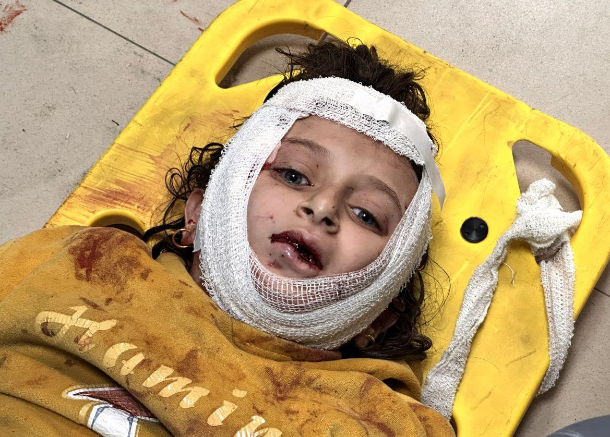

## Claim
Claim: " This image shows a Palestinian girl in the Gaza war in July 2024. She was holding her sister's oxygen mask inside the ambulance. She had already passed away, yet her hand remained on the mask firmly."

## Actions
```
geolocate()
web_search("Palestinian girl Gaza war oxygen mask")
```

## Evidence
### Evidence from `geolocate`
The most likely countries where the image was taken are: {'Palestine': 0.85, 'Jordan': 0.04, 'Israel': 0.02, 'Tunisia': 0.02, 'Bhutan': 0.01, 'Russia': 0.01, 'Turkey': 0.01, 'United Arab Emirates': 0.01, 'Albania': 0.0, 'Andorra': 0.0}

### Evidence from `web_search`
The NPR article from April 26, 2024, discusses the death of a baby girl in Gaza who died after her mother was killed in an Israeli airstrike (, , ). The BBC article from February 22, 2024, shows images of Palestinian children being evacuated (, ). The Middle East Eye article from April 24, 2025, discusses the impact of the war on Gaza, including images of injured Palestinians in hospitals in December 2023 and July 2024 (<image:k>).


## Elaboration
The evidence suggests the image was likely taken in Palestine. The web search results mention the Gaza war and images of injured Palestinians, including children, in hospitals. However, the provided evidence does not confirm the specific details of the claim, such as the girl holding her sister's oxygen mask or the sister's death. The Middle East Eye article mentions images from July 2024, which aligns with the claim's timeframe.

The claim's veracity cannot be fully confirmed due to the lack of specific information about the image's context. More information is needed to verify the details of the image.


## Actions
```
image_search("Palestinian children Gaza war oxygen mask")
web_search("Gaza war children injured hospital")
```

## Evidence
### Evidence from `image_search`
The Al Jazeera article from December 28, 2023, features images of injured children in Gaza (). The Euro-Med Human Rights Monitor published an article about the Gaza war, including an image of a child receiving oxygen (). The BBC article from February 22, 2024, shows an image of a baby in an incubator ().


### Evidence from `web_search`
The BBC article from July 31, 2025, discusses a 15-year-old Gazan boy and two girls who were brought to the UK for medical treatment due to war injuries. The CNN article from July 21, 2025, reports on an Israeli strike in Gaza on July 10, 2025, that killed 15 people, including children, near a health center in Deir Al Balah, and includes images of injured children. The NBC Bay Area article from August 6, 2025, reports that three children injured in the Gaza war arrived in the Bay Area for treatment.

The articles mention the impact of the war on children, including injuries and the need for medical treatment. The articles also mention the challenges of getting the children out of Gaza. The articles include images of injured children and the bodies of children. (, , , , , , )


## Elaboration
The evidence confirms that the image was likely taken in Palestine during the Gaza war and that children were injured and in need of medical treatment. However, the evidence does not confirm the specific details of the claim, such as the girl holding her sister's oxygen mask or the sister's death. The provided evidence includes images of children receiving oxygen and being treated in hospitals.

The claim's veracity cannot be fully confirmed due to the lack of specific information about the image's context. More information is needed to verify the details of the image.


## Actions
```
image_search("girl holding oxygen mask Gaza war")
```

## Evidence
### Evidence from `image_search`
The first source is from a fact-checking website that shows the image in the claim with a red "X" over it, indicating it is being misrepresented online. The second source is an Al Jazeera article from August 25, 2010, featuring an image of a girl wearing an oxygen mask ().


## Elaboration
The image search results indicate that the image in the claim is being misrepresented online. The first result is from a fact-checking website that shows the image with a red "X" over it. This suggests that the claim is false.


## Final Judgement
The image has been misrepresented online, and the claim is not factually accurate. The image is being used out of context. `false`

### Verdict: FALSE

### Justification
The image in the claim has been misrepresented online, as indicated by a fact-checking website that shows the image with a red "X" over it, suggesting the claim is false.
