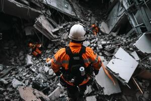

## Claim
Claim: " This image shows a man from Gaza holding the hand of his son killed in an Israeli bombing in July, 2024."

## Actions
```
geolocate()
image_search("man orange jacket rubble")
image_search("earthquake rubble man")
```

## Evidence
### Evidence from `geolocate`
The most likely countries where the image was taken are: {'Turkey': 0.8, 'Italy': 0.09, 'Albania': 0.01, 'Bulgaria': 0.01, 'France': 0.01, 'Netherlands': 0.01, 'Ukraine': 0.01, 'Andorra': 0.0, 'Argentina': 0.0, 'Australia': 0.0}

### Evidence from `image_search`
The image search results show images of people in orange jackets in rubble. One image from [Source](https://www.komu.com/news/nationworld/i-couldnt-save-my-daughter-behind-the-defining-image-of-the-turkey-earthquake/article_4f2535b7-4c55-5ecd-a894-03eecbcea3cf.html) shows a man in an orange jacket in rubble . Another result from [Source](https://www.freepik.com/premium-ai-image/three-men-orange-jackets-are-standing-rubble-area_270908906.htm) shows three men in orange jackets in a rubble area .

Additionally, [Source](https://www.vecteezy.com/photo/69778534-a-man-in-an-orange-jacket-walking-his-dog-through-a-destroyed-area) contains an image of a person in an orange jacket in a destroyed area .


### Evidence from `image_search`
The image shows a man in an orange jacket sitting in rubble (). Another source contains an image of a man in rubble (). ABC News published an article about people surviving days in earthquake rubble ().

The first source is from [SBS](https://www.sbs.com.au/news/article/the-story-behind-this-turkey-earthquake-photo-that-many-will-never-forget/2ijedstvo). The second source is from [Slate.com](https://slate.com/news-and-politics/2015/05/101-year-old-man-found-in-nepal-earthquake-rubble.html). The third source is from [ABC News](https://abcnews.go.com/Health/people-survive-days-earthquake-rubble-survivors-found-turkey/story?id=97035249).


## Elaboration
The evidence suggests the image was taken in Turkey, not Gaza. The geolocation data indicates a high probability of the image being taken in Turkey. The image search results show similar images of people in orange jackets in rubble, with one source specifically mentioning the Turkey earthquake.

The claim that the image depicts a man from Gaza holding the hand of his son killed in an Israeli bombing in July 2024 is not supported by the evidence. The evidence points to the image being related to the Turkey earthquake.

The claim is therefore false.


## Final Judgement
The image is likely from the Turkey earthquake, not Gaza. The geolocation data and image search results support this, while the claim's context is not supported. `false`

### Verdict: FALSE

### Justification
The image depicts a man in an orange jacket in rubble, likely from the Turkey earthquake, as indicated by geolocation data and image search results, which contradicts the claim that it shows a man from Gaza. The image was likely taken in Turkey, as indicated by the [geolocation](https://www.komu.com/news/nationworld/i-couldnt-save-my-daughter-behind-the-defining-image-of-the-turkey-earthquake/article_4f2535b7-4c55-5ecd-a894-03eecbcea3cf.html) and [image search](https://www.sbs.com.au/news/article/the-story-behind-this-turkey-earthquake-photo-that-many-will-never-forget/2ijedstvo) results.
