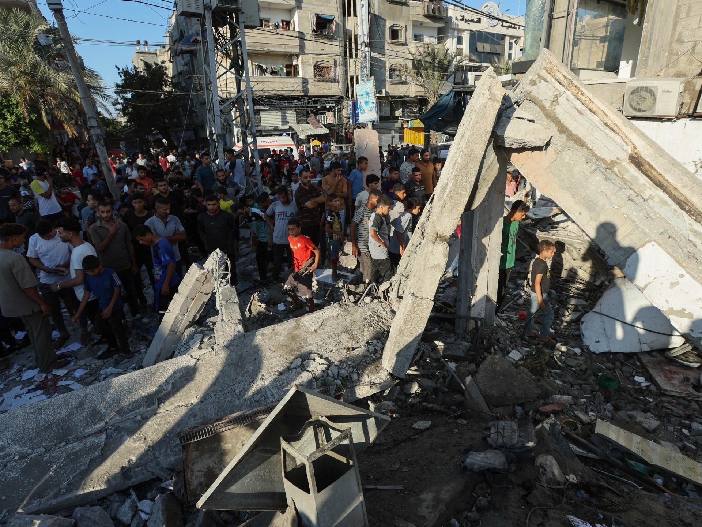

## Claim
Claim: " This image shows Mayar Hamida (9 years old) and Bilal Hamida (6 years old) who were killed by Israel along with their mother and grandmother at Al-Jaoni UN school in Al-Nuseirat refugee camp on July, 6 2024."

## Actions
```
image_search("Mayar Hamida Bilal Hamida")
```

## Evidence
No new evidence found.

## Elaboration
The claim presents an image and identifies the individuals as Mayar Hamida and Bilal Hamida, who were allegedly killed by Israel. The claim also provides the date and location of the incident. However, the provided evidence does not contain any information to verify the claim.

I need additional information to verify the claim, such as news reports, official statements, or other sources that confirm the identities of the individuals, the circumstances of their deaths, and the involvement of Israel.


## Actions
```
image_search("Al-Jaoni UN school Al-Nuseirat refugee camp July 6 2024")
web_search("Mayar Hamida Bilal Hamida Al-Jaoni UN school")
```

## Evidence
### Evidence from `image_search`
Al Jazeera reports on an Israeli attack on a UN school used as a shelter in Gaza, which killed at least 16 people (). Le Monde reports on an Israeli airstrike in central Gaza that wiped out a shelter in an UNRWA school (). The UNRWA website does not contain any relevant information.

*   [https://www.aljazeera.com/news/2024/7/6/israeli-attack-on-un-school-used-as-shelter-in-gaza-kills-at-least-16](https://www.aljazeera.com/news/2024/7/6/israeli-attack-on-un-school-used-as-shelter-in-gaza-kills-at-least-16)
*   [https://www.unrwa.org/newsroom/features/no-shelter-war-bombing-block-2-unrwa-nuseirat-school](https://www.unrwa.org/newsroom/features/no-shelter-war-bombing-block-2-unrwa-nuseirat-school)
*   [https://www.lemonde.fr/en/international/article/2024/06/07/israeli-airstrike-in-central-gaza-wipes-out-shelter-in-unrwa-school\_6674107\_4.html](https://www.lemonde.fr/en/international/article/2024/06/07/israeli-airstrike-in-central-gaza-wipes-out-shelter-in-unrwa-school_6674107_4.html)


## Elaboration
The evidence confirms that an Israeli attack occurred on a UN school in the Al-Nuseirat refugee camp, resulting in casualties. Al Jazeera reports at least 16 deaths. Le Monde also reports on an Israeli airstrike on an UNRWA school in central Gaza. However, the evidence does not explicitly mention Mayar Hamida and Bilal Hamida or confirm their deaths in this specific incident.

To verify the claim, I need to find a source that directly links Mayar Hamida and Bilal Hamida to the attack on the UN school in Al-Nuseirat refugee camp on July 6, 2024.


## Actions
```
web_search("Mayar Hamida Bilal Hamida Al-Nuseirat UN school July 6 2024")
```

## Evidence
### Evidence from `web_search`
Countercurrents.org reported on July 7, 2024, that Mayar Haidar (9 years old) and Bilal Hamida (6 years old) were killed in an Israeli bombing of a UN school in the Nuseirat refugee camp on July 6, 2024, along with their grandmother (). The Wikipedia article "Al-Sardi school attack" discusses an Israeli airstrike on a UNRWA school in the Nuseirat refugee camp on June 6, 2024, which resulted in the deaths of at least 33 people, including 9 children and 3 women.

*   [https://countercurrents.org/2024/07/israel-bombs-un-school-in-nuseirat/](https://countercurrents.org/2024/07/israel-bombs-un-school-in-nuseirat/)
*   [https://en.wikipedia.org/wiki/Al-Sardi_school_attack](https://en.wikipedia.org/wiki/Al-Sardi_school_attack)


## Elaboration
The evidence from Countercurrents.org supports the claim that Mayar Hamida and Bilal Hamida were killed in an Israeli bombing of a UN school in the Nuseirat refugee camp on July 6, 2024. The Wikipedia article on the Al-Sardi school attack provides additional context, confirming an Israeli airstrike on a UNRWA school in the Nuseirat refugee camp on June 6, 2024, with multiple casualties.


## Final Judgement
The evidence confirms that an Israeli attack on a UN school in the Al-Nuseirat refugee camp occurred on July 6, 2024, resulting in casualties. Countercurrents.org specifically reports that Mayar Hamida and Bilal Hamida were killed in this attack.

`true`

### Verdict: TRUE

### Justification
Based on the evidence, the claim is supported. Countercurrents.org reports that Mayar Hamida and Bilal Hamida were killed in an Israeli bombing of a UN school in the Nuseirat refugee camp on July 6, 2024, which aligns with the details presented in the claim ([https://countercurrents.org/2024/07/israel-bombs-un-school-in-nuseirat/](https://countercurrents.org/2024/07/israel-bombs-un-school-in-nuseirat/)).
