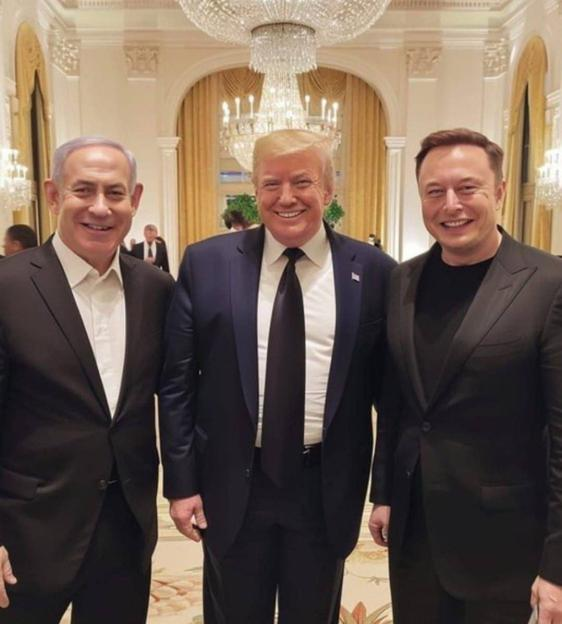

## Claim
Claim: " This is an authentic image of Donald Trump, Benjamin Netanyahu and Elon Musk during Netanyahu's official visit to the U.S. in February 2025."

## Actions
```
reverse_search()
```

## Evidence
### Evidence from `reverse_search`
The image of Donald Trump, Benjamin Netanyahu, and Elon Musk () is found on France 24, which states that the image is AI-generated. The image is also found on Siasat.com, which discusses a meeting between Donald Trump and Benjamin Netanyahu.

*   [This photo of Musk, Trump and Netanyahu is AI-generated - France 24](https://www.france24.com/en/tv-shows/truth-or-fake/20250205-photo-of-elon-musk-donald-trump-and-benjamin-netanyahu-is-ai-generated)
*   [Trump, Netanyahu meeting focuses on hostages, Saudi relations ...](https://www.siasat.com/trump-netanyahu-meeting-focuses-on-hostages-saudi-relations-iran-threats-3175717/)


## Elaboration
The image is AI-generated, according to France 24 ([https://www.france24.com/en/tv-shows/truth-or-fake/20250205-photo-of-elon-musk-donald-trump-and-benjamin-netanyahu-is-ai-generated](https://www.france24.com/en/tv-shows/truth-or-fake/20250205-photo-of-elon-musk-donald-trump-and-benjamin-netanyahu-is-ai-generated)). The claim that the image is authentic is therefore false.


## Final Judgement
The image of Donald Trump, Benjamin Netanyahu, and Elon Musk is AI-generated, as reported by France 24. This contradicts the claim that it is an authentic image.

`false`

### Verdict: FALSE

### Justification
The image of Donald Trump, Benjamin Netanyahu, and Elon Musk is AI-generated, according to France 24 ([https://www.france24.com/en/tv-shows/truth-or-fake/20250205-photo-of-elon-musk-donald-trump-and-benjamin-netanyahu-is-ai-generated](https://www.france24.com/en/tv-shows/truth-or-fake/20250205-photo-of-elon-musk-donald-trump-and-benjamin-netanyahu-is-ai-generated)), thus making the claim that it is an authentic image false.
