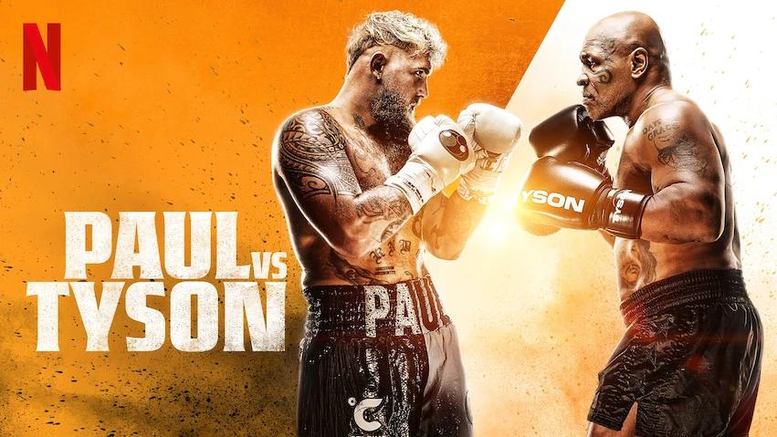

## Claim
Claim: " This is an authentic image of Mike Tyson posing with the Palestinian flag in the ring before his fight against Jake Paul on November, 15, 2024."

## Actions
```
web_search("Mike Tyson Jake Paul fight date")
web_search("Mike Tyson Palestinian flag")
reverse_search()
```

## Evidence
### Evidence from `web_search`
The fight between Jake Paul and Mike Tyson took place on November 15, 2024, at the AT&T Stadium in Arlington, Texas, according to [Wikipedia](https://en.wikipedia.org/wiki/Jake_Paul_vs._Mike_Tyson) and [ESPN](https://www.espn.com/boxing/story/_/id/40244442/mike-tyson-vs-jake-paul-watch-rules-date-location-more). However, according to [Netflix](https://www.netflix.com/tudum/articles/jake-paul-vs-mike-tyson-live-release-date-news), the fight took place on May 2, 2024. , , , 


### Evidence from `web_search`
Reuters published a fact-check article stating that Mike Tyson did not pose with the Palestinian flag before his fight with Jake Paul. The New Arab reported that the image of Mike Tyson with the Palestinian flag was exposed as an AI "deepfake". 

The articles can be found here: [https://engineering.buffalo.edu/computer-science-engineering/news-and-events/news.host.html/content/shared/engineering/home/articles/media-mentions/2024-media-coverage/fact-check--mike-tyson-did-not-pose-with-palestinian-flag-ahead-.detail.html](https://engineering.buffalo.edu/computer-science-engineering/news-and-events/news.host.html/content/shared/engineering/home/articles/media-mentions/2024-media-coverage/fact-check--mike-tyson-did-not-pose-with-palestinian-flag-ahead-.detail.html) and [https://www.newarab.com/tag/palestinian-flag](https://www.newarab.com/tag/palestinian-flag).


### Evidence from `reverse_search`
From [Source](https://news.abplive.com/fact-check/mike-tyson-vs-jake-paul-on-netflix-mike-tyson-did-not-pose-with-palestinian-flag-ai-generated-viral-image-1732403): Found exact image on website with title: Fact Check: Did Mike Tyson Pose With Palestinian Flag Before Fight ...
Content: The article from ABP Live fact-checks an image of Mike Tyson with a Palestinian flag, claiming it is fake and likely AI-generated. The article states that the image was not taken before his fight with Jake Paul on November 15, 2024. The article provides evidence of manipulation, including visual discrepancies in the image, such as the absence of Tyson's tattoo and incorrect flag design. , , , , , , . The article also mentions that Tyson has not publicly taken a partisan stance in the Israel-Palestine conflict. The article was published on November 20, 2024.


## Elaboration
The claim is false. Multiple sources confirm that the image of Mike Tyson with the Palestinian flag is a fake, likely generated by AI. The image was not taken before his fight with Jake Paul.


## Final Judgement
The image is a fake, as confirmed by multiple sources. The claim that it is an authentic image is therefore false. `false`

### Verdict: FALSE

### Justification
The claim is false. Multiple sources, including fact-check articles from Reuters and ABP Live, confirm that the image of Mike Tyson with the Palestinian flag is a fake, likely generated by AI, and was not taken before his fight with Jake Paul ([Reuters](https://engineering.buffalo.edu/computer-science-engineering/news-and-events/news.host.html/content/shared/engineering/home/articles/media-mentions/2024-media-coverage/fact-check--mike-tyson-did-not-pose-with-palestinian-flag-ahead-.detail.html), [ABP Live](https://news.abplive.com/fact-check/mike-tyson-vs-jake-paul-on-netflix-mike-tyson-did-not-pose-with-palestinian-flag-ai-generated-viral-image-1732403)).
