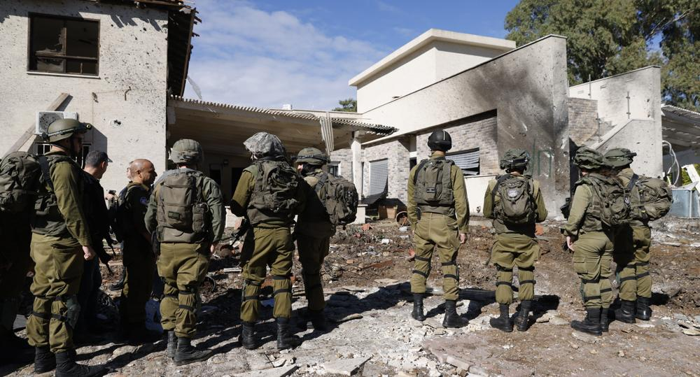

## Claim
Claim: "Commander of the Israeli Air Force, Major General Tomer Bar has been killed by Hеzbollаh in Tel Aviv in a drone attack in November 2024."

## Actions
```
web_search("Tomer Bar killed")
web_search("Tomer Bar Hezbollah drone attack")
```

## Evidence
### Evidence from `web_search`
The claim that Major General Tomer Bar was killed by Hezbollah in a drone strike is false, according to an AOL fact-check published on December 12, 2024, which states there are no media reports confirming his death (). Inshorts also reported on December 9, 2024, that Tomer Bar is alive and was not killed in a November drone attack, with the false claim circulating after a ceasefire was announced (, , ). Tomer Bar is an Israeli general who currently commands the Israeli Air Force, assuming office on April 4, 2022 (<image:k>).

Sources: [https://www.aol.com/fact-check-israeli-general-not-150127650.html](https://www.aol.com/fact-check-israeli-general-not-150127650.html), [https://en.wikipedia.org/wiki/Tomer_Bar](https://en.wikipedia.org/wiki/Tomer_Bar), [https://inshorts.com/en/news/israeli-air-force-chief-tomer-bar-alive--not-killed-by-hezbollah-1733746115536](https://inshorts.com/en/news/israeli-air-force-chief-tomer-bar-alive--not-killed-by-hezbollah-1733746115536).


### Evidence from `web_search`
From [Source](https://www.presstv.ir/Detail/2024/11/27/738007/Lebanon-Hezbollah-residence-Tomer-Bar-attack-drones): 
Content: Press TV reports that Hezbollah claimed to have targeted the residence of Israeli Air Force Commander Major General Tomer Bar in Tel Aviv with a drone attack on November 18, 2024. . The article mentions that the attack was subject to censorship by Israeli authorities.


## Elaboration
The claim is false. Fact-checks from AOL and Inshorts confirm that Major General Tomer Bar is alive and was not killed in a drone attack.

However, Press TV reports that Hezbollah claimed to have targeted Tomer Bar's residence in Tel Aviv with a drone attack on November 18, 2024. The article also mentions that the attack was subject to censorship by Israeli authorities.

Therefore, while the claim of his death is false, there is evidence of an attack on his residence.


## Final Judgement
The claim that Major General Tomer Bar was killed is demonstrably false, as confirmed by multiple sources. While there are reports of an attack on his residence, the claim of his death is not supported by evidence.

`false`

### Verdict: FALSE

### Justification
The claim that Major General Tomer Bar was killed by Hezbollah is false. Fact-checks from sources like [AOL](https://www.aol.com/fact-check-israeli-general-not-150127650.html) and Inshorts confirm that he is alive. However, there are reports from Press TV that Hezbollah claimed to have targeted his residence in Tel Aviv with a drone attack.
