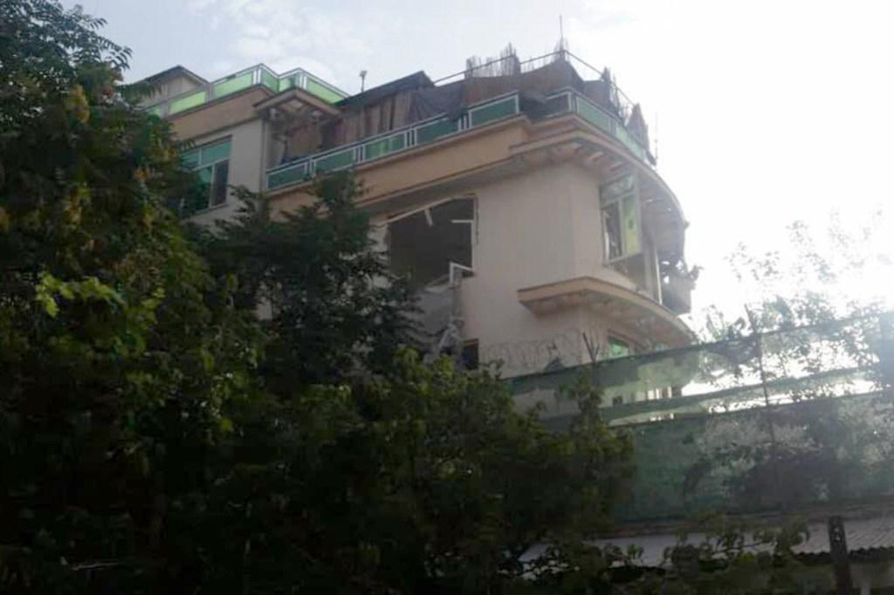
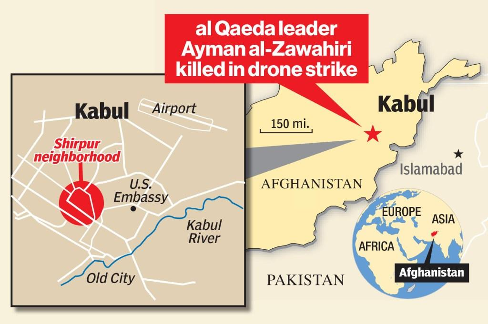
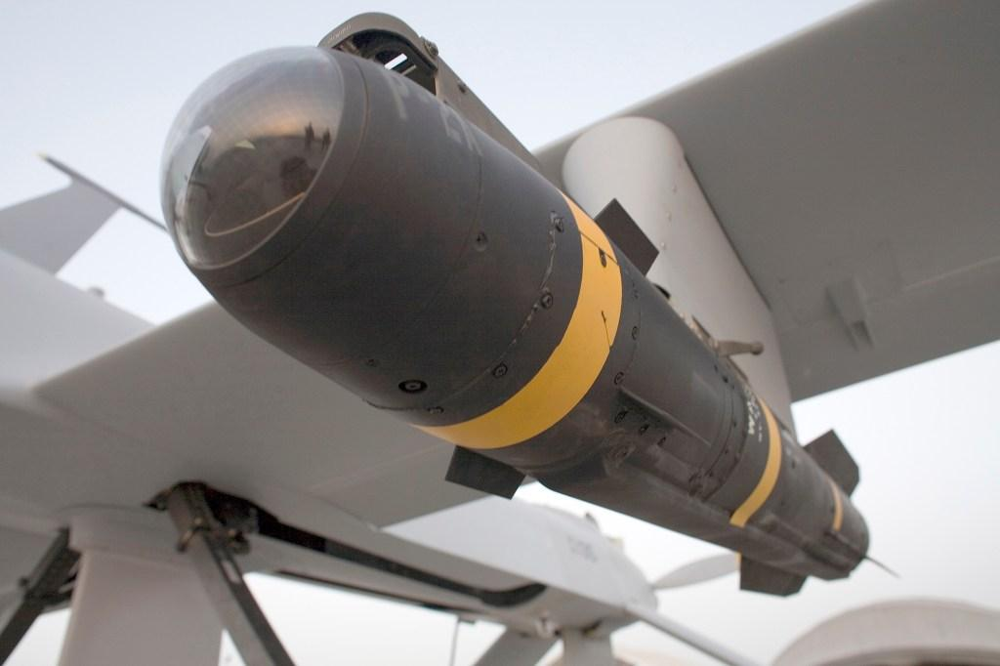
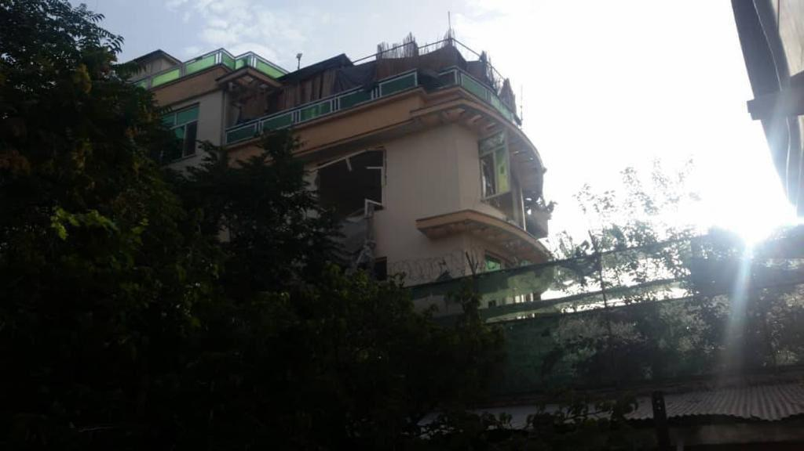
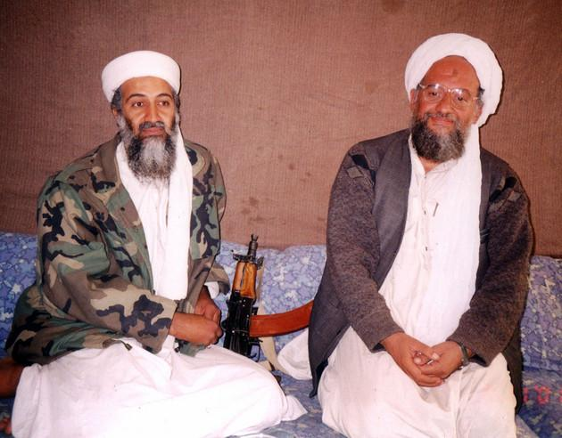
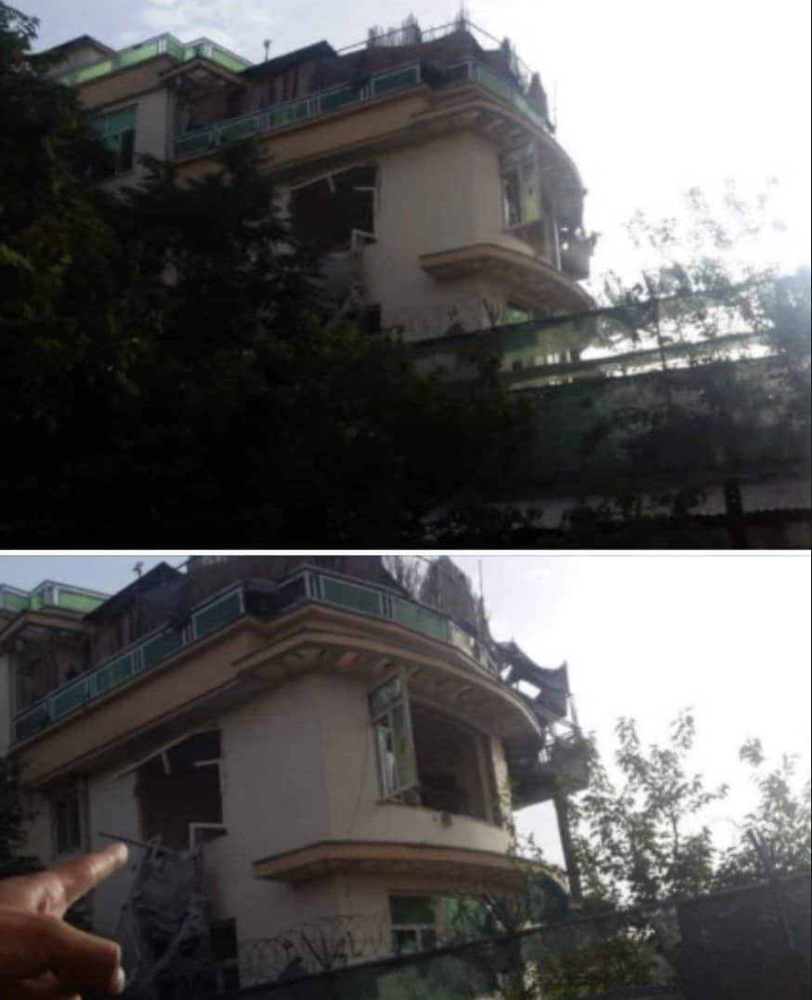
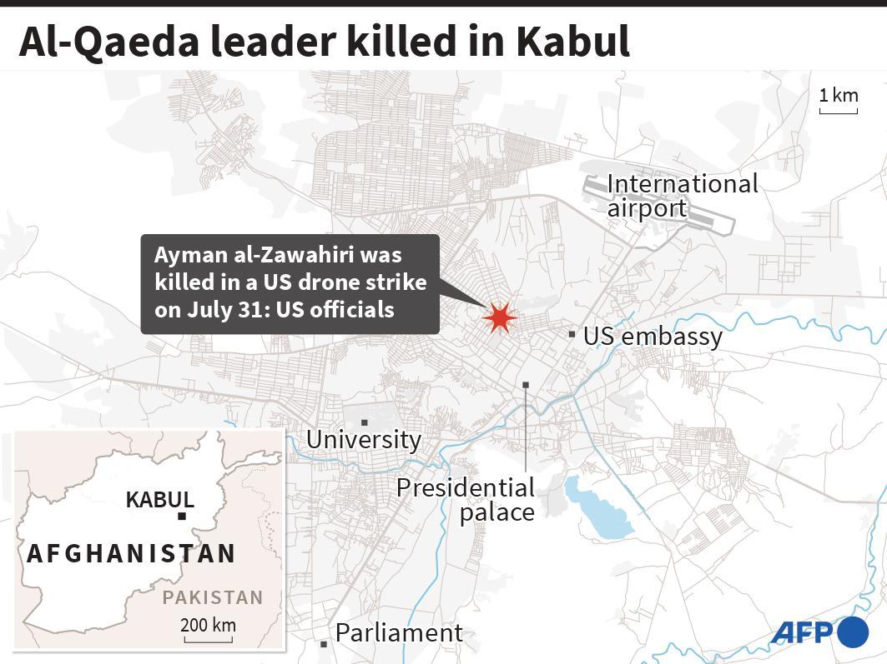

## Claim
Claim: " This image shows the assassination of Hamas leader Ismail Haniyeh on July 31st, 2024. This is how a precision strike looks like: a single missile through the window, and only Haniyeh and his bodyguard are dead. Nobody else in the building is even injured."

## Actions
```
reverse_search()
geolocate()
```

## Evidence
### Evidence from `reverse_search`
The image () is associated with a US drone strike that killed al-Qaeda leader Ayman al-Zawahiri in Kabul, Afghanistan, on July 31, 2022. The New York Post ([https://nypost.com/2022/08/01/biden-to-speak-after-us-takes-out-al-qaeda-target-in-afghanistan/](https://nypost.com/2022/08/01/biden-to-speak-after-us-takes-out-al-qaeda-target-in-afghanistan/)) and ISWNews ([https://english.iswnews.com/24517/ayman-al-zawahiri-the-leader-of-al-qaeda-was-killed-what-will-be-the-possible-consequences-of-this-assassination/](https://english.iswnews.com/24517/ayman-al-zawahiri-the-leader-of-al-qaeda-was-killed-what-will-be-the-possible-consequences-of-this-assassination/)) also feature the image. News18.com ([https://www.news18.com/news/world/al-zawahiri-liked-sitting-outside-on-his-balcony-the-cia-watched-for-months-before-killing-him-5671915.html](https://www.news18.com/news/world/al-zawahiri-liked-sitting-outside-on-his-balcony-the-cia-watched-for-months-before-killing-him-5671915.html)) also uses the image and states that the strike was a precision strike.

The New York Post article includes a map of the drone strike, a photo of al-Zawahiri, and a photo of the Hellfire missile used in the strike. The ISWNews article includes images of Ayman al-Zawahiri. The News18.com article also includes additional images of the building and a map. (, , , , , , , , , , )


### Evidence from `geolocate`
The most likely countries where the image was taken are: {'Cambodia': 0.35, 'Pakistan': 0.1, 'Bangladesh': 0.07, 'Ghana': 0.07, 'Bhutan': 0.06, 'China': 0.05, 'Sri Lanka': 0.04, 'Albania': 0.03, 'Kyrgyzstan': 0.02, 'Laos': 0.02}

## Elaboration
The image (

## Final Judgement
The image in the claim is associated with a US drone strike that killed al-Qaeda leader Ayman al-Zawahiri in Kabul, Afghanistan, on July 31, 2022, not the assassination of Hamas leader Ismail Haniyeh. The claim misrepresents the context of the image.

`false`

### Verdict: FALSE

### Justification
The image in the claim is from a US drone strike that killed al-Qaeda leader Ayman al-Zawahiri in Kabul, Afghanistan, on July 31, 2022, as reported by the New York Post ([https://nypost.com/2022/08/01/biden-to-speak-after-us-takes-out-al-qaeda-target-in-afghanistan/](https://nypost.com/2022/08/01/biden-to-speak-after-us-takes-out-al-qaeda-target-in-afghanistan/)) and ISWNews ([https://english.iswnews.com/24517/ayman-al-zawahiri-the-leader-of-al-qaeda-was-killed-what-will-be-the-possible-consequences-of-this-assassination/](https://english.iswnews.com/24517/ayman-al-zawahiri-the-leader-of-al-qaeda-was-killed-what-will-be-the-possible-consequences-of-this-assassination/)). The claim incorrectly identifies the event and the individuals involved.
