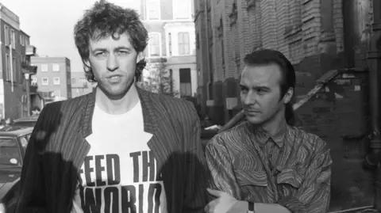

## Claim
Claim: "In November 2024, rock band U2 and singer Bob Geldof announced a multi-stadium tour to aid the Israeli army."

## Actions
```
web_search("U2 Bob Geldof Israeli army tour November 2024")
```

## Evidence
### Evidence from `web_search`
The Wikipedia article on Bob Geldof mentions his work with U2's Bono on debt relief and a new Band Aid project announced in November 2014. The article includes photos of Geldof performing in 1987 <image:0> and 2007 . The Dublin Live article from November 3, 2024, discusses criticism of Bono and Bob Geldof for their silence on the situation in Gaza, contrasting it with their activism during Live Aid. The BBC published an article on November 24, 2024, discussing the 40th anniversary of Band Aid, mentioning Bob Geldof and Bono , .

Sources: [https://en.wikipedia.org/wiki/Bob_Geldof](https://en.wikipedia.org/wiki/Bob_Geldof), [https://www.dublinlive.ie/news/celebs/music-legend-hits-out-bono-30287394](https://www.dublinlive.ie/news/celebs/music-legend-hits-out-bono-30287394), [https://www.bbc.com/news/articles/c9dl22gz3vlo](https://www.bbc.com/news/articles/c9dl22gz3vlo).


## Elaboration
The evidence indicates that in November 2024, Bono and Bob Geldof were involved in discussions and events related to the 40th anniversary of Band Aid and faced criticism for their silence on the situation in Gaza. However, there is no mention of a multi-stadium tour to aid the Israeli army.

The Dublin Live article specifically criticizes Bono and Geldof for their silence on the situation in Gaza, which contradicts the claim that they were organizing a tour to aid the Israeli army.

Therefore, the claim is not supported by the evidence.


## Final Judgement
The search results show that in November 2024, Bob Geldof and Bono were involved in the 40th anniversary of Band Aid and faced criticism for their silence on the situation in Gaza. There is no evidence of a multi-stadium tour to aid the Israeli army.

The claim is demonstrably false because the evidence contradicts the claim. `false`


### Verdict: FALSE

### Justification
The claim is demonstrably false. While Bob Geldof and Bono were involved in the 40th anniversary of Band Aid in November 2024, and faced criticism regarding their silence on the situation in Gaza, there is no evidence of a multi-stadium tour to aid the Israeli army, as indicated by the search results from [Wikipedia](https://en.wikipedia.org/wiki/Bob_Geldof), [Dublin Live](https://www.dublinlive.ie/news/celebs/music-legend-hits-out-bono-30287394), and the [BBC](https://www.bbc.com/news/articles/c9dl22gz3vlo).
